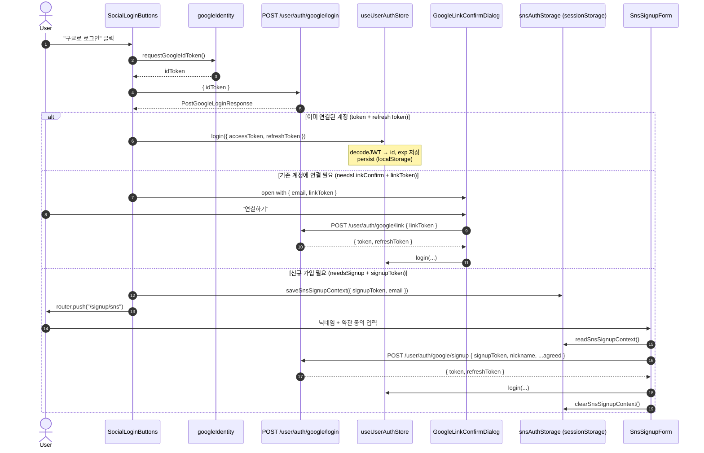

# SNS 로그인 / 가입 플로우

`apps/web`의 SNS(소셜) 로그인·가입 동작을 한 곳에서 추적하기 위한 참조 문서. 코드의 정답은 아니며, 의도와 구조를 빠르게 파악하기 위한 지도다. 라인 번호는 작성 시점 기준이므로 어긋날 수 있다 — 함수명을 anchor로 보면 된다.

---

## 1. 개요

- **현재 구현된 provider**: Google **only**. Apple/Kakao/Naver 등은 미구현.
- **명명 규칙**: 외부 노출 라우트(`/signup/sns`)와 일부 내부 식별자(`snsAuthStorage`, `SnsSignupPage`, `SnsSignupForm`)는 SNS-generic 이름을 쓰고, 실제 OAuth/API 통신 계층은 `google*` 이름을 유지한다. 즉 "공통 가입 화면" + "Google 전용 통신 계층"이 결합된 구조다.
- **백엔드 엔드포인트 prefix**: `/user/auth/google/*` — 1) `login` 2) `link` 3) `signup` 의 3-step.

---

## 2. 시퀀스 (응답에 따른 3분기)



---

## 3. 모듈별 책임

### 3.1 Google Identity Services 초기화

`apps/web/src/features/login/lib/googleIdentity.ts`

| 함수/심볼 | 역할 |
| --- | --- |
| `waitForGoogle()` (L21) | `window.google.accounts.id` 가 로드될 때까지 폴링. 5초 안에 안 뜨면 `GoogleSignInUnavailableError`. |
| `ensureInitialized()` (L47) | `NEXT_PUBLIC_GOOGLE_CLIENT_ID` 로 `google.accounts.id.initialize()` 1회 실행. `ux_mode: "popup"`, FedCM 사용. |
| `requestGoogleIdToken()` (L73) | `prompt()` 트리거 → 사용자 동의 시 credential(idToken) resolve. 닫힘/스킵/미표시는 `GoogleSignInCancelledError` reject. |
| `GoogleSignInCancelledError` (L7) / `GoogleSignInUnavailableError` (L14) | 호출자가 분기 처리할 수 있도록 분리된 에러 클래스. |

모듈 스코프 변수 `initialized`, `pendingResolve`, `pendingReject` 로 prompt 중복을 방지한다 — 새 요청이 들어오면 이전 요청은 cancel로 reject된다.

### 3.2 SNS 가입 임시 저장소

`apps/web/src/features/login/lib/snsAuthStorage.ts`

- 키: `sns:signupToken`, `sns:signupEmail` (sessionStorage)
- 함수: `saveSnsSignupContext`, `readSnsSignupContext`, `clearSnsSignupContext`
- 수명: 탭이 닫히거나 `clearSnsSignupContext()` 호출 시까지 (signupToken JWT 자체는 10분 만료)

### 3.3 Mutation 훅 3개

`apps/web/src/features/login/api/`

| 훅 | 엔드포인트 | 성공 시 동작 |
| --- | --- | --- |
| `useGoogleLoginMutation` | `POST /user/auth/google/login` | 응답을 콜백으로만 전달 — 분기 처리/login 호출은 호출부(SocialLoginButtons) 책임. |
| `useGoogleLinkMutation` | `POST /user/auth/google/link` | 훅 내부에서 `useUserAuthStore.login()` 자동 호출 후 콜백. |
| `useGoogleSignupMutation` | `POST /user/auth/google/signup` | 훅 내부에서 `login()` 자동 호출 + `toastOnError: true`. |

⚠️ 세 훅의 패턴이 일관되지 않다 — 로그인은 호출부에서, 링크/가입은 훅에서 `login()`을 호출한다. ([§7 정리 후보](#7-알려진-정리-후보) 참고)

### 3.4 진입점 — `SocialLoginButtons`

`apps/web/src/features/login/ui/SocialLoginButtons.tsx`

- `handleGoogleClick` (L58): `requestGoogleIdToken()` → `googleLoginMutation.mutate({ idToken })`. `GoogleSignInCancelledError` 는 무음 처리, 그 외는 toast.
- `onSuccess` (L34): `PostGoogleLoginResponse` 의 3분기를 if 체인으로 처리.
  - `token && refreshToken` → `login()`
  - `needsLinkConfirm && linkToken && email` → `setLinkPrompt(...)` (다이얼로그 오픈)
  - `needsSignup && signupToken && email` → `saveSnsSignupContext()` + `router.push("/signup/sns")`
  - 그 외 → toast `"Google 로그인 응답을 처리할 수 없습니다."`
- `linkPrompt` state로 `GoogleLinkConfirmDialog` 의 open 여부를 직접 보유.

### 3.5 계정 연결 다이얼로그 — `GoogleLinkConfirmDialog`

`apps/web/src/features/login/ui/GoogleLinkConfirmDialog.tsx`

- props: `{ open, email, linkToken, onOpenChange, onLinked? }`
- "연결하기" 클릭 시 `useGoogleLinkMutation.mutate({ linkToken })`.
- 에러 시 toast `"Google 계정 연결에 실패했습니다."` 후 close.
- 텍스트는 한국어 하드코딩 — i18n 적용 안 됨.

### 3.6 신규 가입 폼 — `SnsSignupPage` / `SnsSignupForm`

- 라우트: `apps/web/src/app/[locale]/signup/sns/page.tsx` → `SnsSignupPage` (`views/signup/ui/SnsSignupPage.tsx`)
- 페이지는 `GuestOnly` 가드 + 제목/설명만, 실제 폼은 `apps/web/src/features/signup/ui/SnsSignupForm.tsx`.
- 마운트 시 `readSnsSignupContext()`. 없으면 토스트 후 `/login` 으로 replace.
- 입력: 닉네임(검증: `useNicknameValidate`) + 마케팅 약관 3종 (`MarketingConsent`).
- 제출 시 `useGoogleSignupMutation.mutate({ signupToken, nickname, ...agreed })`.
- 성공 시 `clearSnsSignupContext()` + 토스트. **자동 라우팅 없음** — 사용자가 헤더로 직접 이동해야 함.

---

## 4. API 계약

`apps/web/src/shared/services/auth.ts`

### Payload

```ts
PostGoogleLoginPayload  = { idToken: string }
PostGoogleLinkPayload   = { linkToken: string }
PostGoogleSignupPayload = {
  signupToken: string;
  nickname: string;
  newProductAgreed?: boolean;
  adAgreed?: boolean;
  recommendAgreed?: boolean;
}
```

### Response

```ts
// 로그인 분기 응답
PostGoogleLoginResponse = {
  needsLinkConfirm: boolean;     // 분기 A
  needsSignup?: boolean;         // 분기 B
  email?: string;                // 분기 A/B 공통 표시용
  linkToken?: string;            // 분기 A — 5분 만료
  signupToken?: string;          // 분기 B — 10분 만료
  token?: string;                // 분기 C — access (이미 연결된 계정)
  refreshToken?: string;         // 분기 C — refresh
}

// 링크/가입 응답 (이메일 로그인과 동일)
UserLoginResponse = { token: string; refreshToken: string }
```

### 함수

| 함수 | 메서드 + 경로 |
| --- | --- |
| `postGoogleLogin` | `POST user/auth/google/login` |
| `postGoogleLink`  | `POST user/auth/google/link`  |
| `postGoogleSignup`| `POST user/auth/google/signup`|

응답 `token` 은 호출부에서 `useUserAuthStore.login({ accessToken: token, refreshToken })` 로 흡수된다. store 내부에서 `decodeJWT` (`apps/web/src/shared/lib/utils.ts`)로 JWT payload의 `id`, `exp` 를 추출해 함께 저장한다.

---

## 5. 토큰 / 상태 매트릭스

| 데이터 | 위치 | 수명 | 비고 |
| --- | --- | --- | --- |
| `accessToken`, `refreshToken` | `useUserAuthStore` → localStorage (persist) | 로그아웃까지 | refresh 시 `updateAccessToken()`이 새 토큰의 `id/exp`도 재추출. |
| `id`, `exp` (JWT claims) | `useUserAuthStore` (persist 대상) | accessToken과 동일 | mypage `useGet*Query` 의 queryKey 스코핑에 사용. |
| `signupToken` + `email` | `snsAuthStorage` → sessionStorage | 탭 종료 / `clearSnsSignupContext()` | JWT 자체는 10분 만료. |
| `linkToken` + `email` | `SocialLoginButtons` 컴포넌트 state (`linkPrompt`) | 다이얼로그 닫힘 / 컴포넌트 unmount | sessionStorage에는 저장하지 않음. |

---

## 6. 에러 / 취소 / 토스트

| 위치 | 케이스 | 처리 |
| --- | --- | --- |
| `googleIdentity.ts` L86 | prompt가 표시되지 않거나 사용자가 닫음 | `GoogleSignInCancelledError` reject |
| `googleIdentity.ts` L33 | GIS 스크립트 5초 내 미로드 | `GoogleSignInUnavailableError` reject |
| `SocialLoginButtons` L68 | `GoogleSignInCancelledError` | 무음(toast 없음) — 정상 취소이므로 |
| `SocialLoginButtons` L51 | 응답이 어떤 분기에도 매칭 안 됨 | toast `"Google 로그인 응답을 처리할 수 없습니다."` |
| `SocialLoginButtons` L54 | login mutation 자체 실패 | toast `"Google 로그인에 실패했습니다."` |
| `GoogleLinkConfirmDialog` L39 | link mutation 실패 | toast + close |
| `SnsSignupForm` L34 | sessionStorage 컨텍스트 없음 | toast + `/login` replace |
| `useGoogleSignupMutation` | mutation 실패 | `toastOnError: true` (글로벌 핸들러가 서버 message 표시) |
| `useGoogleLinkMutation` / `useGoogleLoginMutation` | mutation 실패 | `toastOnError` 미사용 — 호출부에서 onError로 처리 |

---

## 7. 환경 설정

| 항목 | 값/위치 |
| --- | --- |
| Google Client ID | `process.env.NEXT_PUBLIC_GOOGLE_CLIENT_ID` (`apps/web/.env`) |
| GIS 스크립트 | 글로벌 `window.google` 사용 — 로딩 위치는 페이지 단의 next/script (또는 GIS auto-load) |
| 라우트 (가입) | `/[locale]/signup/sns` |
| persist key | `user-auth` (localStorage) |
| sessionStorage keys | `sns:signupToken`, `sns:signupEmail` |

---

## 8. 알려진 정리 후보

리팩토링이 필요하지만 본 문서가 다루지 않는 항목들. 추후 작업 시 참고.

1. **`login()` 호출 위치 불일치** — `useGoogleLoginMutation`은 호출부에서, `useGoogleLink/SignupMutation`은 훅 내부에서 호출. 한 방향으로 통일하면 분기 처리가 더 직관적.
2. **`linkToken` vs `signupToken` 저장 위치 불일치** — 둘 다 단기 JWT인데 한쪽만 sessionStorage. 통일 시 새로고침 내성도 같아짐.
3. **Provider-specific 네이밍** — `useGoogleXxxMutation`, `postGoogleXxx`, `PostGoogleXxxPayload` 등. Apple/Kakao 추가 시 일반화(`useSnsLoginMutation({ provider })` 등) 필요.
4. **i18n 누락** — 모든 toast/다이얼로그/페이지 문구가 한국어 하드코딩. `messages/{ko,en,zh-TW}.json` 키 도입 필요.
5. **signup 성공 후 라우팅 부재** — `SnsSignupForm.onSuccess` 가 토스트만 띄움. 의도적이라면 명시, 아니라면 `/` 또는 `/mypage` 로 push.
6. **`SocialLoginButtons.tsx` L64 `console.log(idToken)`** — 디버그 잔여물. 토큰 노출이므로 제거 필요.
7. **미사용 `/public/login/line.png`** — LINE 버튼 없는데 이미지만 잔존.

---

## 9. 디버깅 팁

- **Google 버튼이 안 뜬다** → `NEXT_PUBLIC_GOOGLE_CLIENT_ID` 누락 확인. 또는 GIS 스크립트 미로드(브라우저 콘솔에서 `window.google?.accounts?.id` 체크).
- **로그인 후 무한 로딩** → `useUserAuthStore` rehydration 전(`hasHydrated: false`)에 보호된 컴포넌트가 렌더되는지 확인.
- **`/signup/sns` 진입 시 즉시 `/login` 으로 튕김** → sessionStorage에 `sns:signupToken` 이 없거나 다른 탭에서 만료됨.
- **링크 다이얼로그에서 새로고침 시 사라짐** — `linkToken` 이 state로만 있어 의도된 동작. 이 경우 다시 로그인 버튼 클릭 필요.
