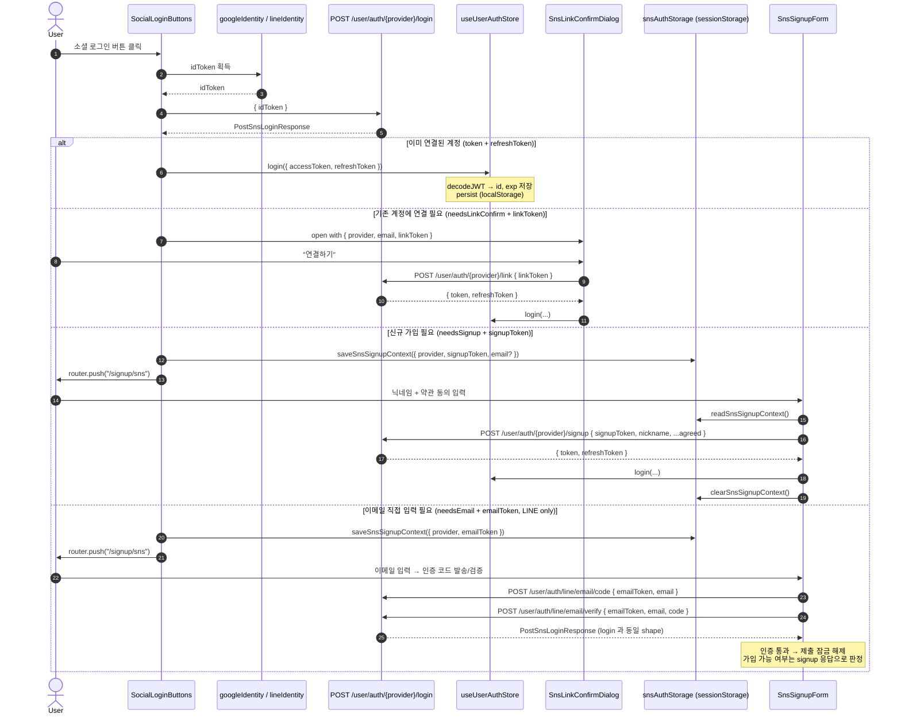

# SNS 로그인 / 가입 플로우

`apps/web`의 SNS(소셜) 로그인·가입 동작을 한 곳에서 추적하기 위한 참조 문서. 코드의 정답은 아니며, 의도와 구조를 빠르게 파악하기 위한 지도다. 라인 번호는 작성 시점 기준이므로 어긋날 수 있다 — 함수명을 anchor로 보면 된다.

---

## 1. 개요

- **구현된 provider**: **Google**, **LINE**. Apple/Kakao/Naver 등은 미구현.
- **백엔드 엔드포인트 prefix**: `/user/auth/{google,line}/*` — 1) `login` 2) `link` 3) `signup` 의 3-step. 두 provider의 요청·응답 shape이 **동일**하므로 `shared/services/auth.ts`가 `PostSns{Login,Link,Signup}*` 공통 타입을 정의하고 provider별 이름을 alias로 둔다.
- **LINE 전용 추가 엔드포인트**: `line/email/{code,verify}` — provider가 이메일을 주지 않은 경우 서비스가 직접 입력받아 인증하는 1-B 단계다(§7).
- **공통 vs provider별**: 응답 분기 처리, 가입 화면(`/signup/sns`), 임시 저장소(`snsAuthStorage`), 연결 확인 다이얼로그(`SnsLinkConfirmDialog`)는 provider 공통이다. **id_token을 획득하는 계층과 이메일 인증 단계만** provider별로 갈린다(`googleIdentity.ts` / `lineIdentity.ts`).

### Google과 LINE의 결정적 차이 — 팝업 vs 리다이렉트

| | Google (GIS) | LINE (LIFF) |
| --- | --- | --- |
| SDK | `accounts.google.com/gsi/client`, 루트 레이아웃에서 전역 `<Script>` | `@line/liff` npm 패키지, 로그인 시 **동적 import** |
| 인증 UX | `ux_mode: "popup"` — 페이지 유지 | `liff.login()` **리다이렉트** — 페이지 이탈 후 복귀 |
| 토큰 획득 | `requestGoogleIdToken(): Promise<string>` 단일 호출 | 복귀 후 `getValidLineIdToken()`으로 수령 |
| 이메일 | idToken에 항상 포함 | **없을 수 있음** (§7 참조) |
| 설정값 | `NEXT_PUBLIC_GOOGLE_CLIENT_ID` | `NEXT_PUBLIC_LINE_LIFF_ID` |

리다이렉트라서 LINE에는 "복귀를 이어받는" 단계가 하나 더 있다. §3.4 참조.

---

## 2. 시퀀스 (응답에 따른 4분기)

provider와 무관하게 동일하다. 아래는 Google 기준이며, LINE은 1번 단계(id_token 획득)만 §3.4로 대체된다. `needsEmail` 분기는 현재 LINE에서만 발생한다.


```mermaid
sequenceDiagram
    autonumber
    actor U as User
    participant SB as SocialLoginButtons
    participant ID as googleIdentity / lineIdentity
    participant API as POST /user/auth/{provider}/login
    participant Store as useUserAuthStore
    participant Dlg as SnsLinkConfirmDialog
    participant SS as snsAuthStorage (sessionStorage)
    participant Form as SnsSignupForm

    U->>SB: 소셜 로그인 버튼 클릭
    SB->>ID: idToken 획득
    ID-->>SB: idToken
    SB->>API: { idToken }
    API-->>SB: PostSnsLoginResponse

    alt 이미 연결된 계정 (token + refreshToken)
        SB->>Store: login({ accessToken, refreshToken })
        Note over Store: decodeJWT → id, exp 저장<br/>persist (localStorage)
    else 기존 계정에 연결 필요 (needsLinkConfirm + linkToken)
        SB->>Dlg: open with { provider, email, linkToken }
        U->>Dlg: "연결하기"
        Dlg->>API: POST /user/auth/{provider}/link { linkToken }
        API-->>Dlg: { token, refreshToken }
        Dlg->>Store: login(...)
    else 신규 가입 필요 (needsSignup + signupToken)
        SB->>SS: saveSnsSignupContext({ provider, signupToken, email? })
        SB->>U: router.push("/signup/sns")
        U->>Form: 닉네임 + 약관 동의 입력
        Form->>SS: readSnsSignupContext()
        Form->>API: POST /user/auth/{provider}/signup { signupToken, nickname, ...agreed }
        API-->>Form: { token, refreshToken }
        Form->>Store: login(...)
        Form->>SS: clearSnsSignupContext()
    else 이메일 직접 입력 필요 (needsEmail + emailToken, LINE only)
        SB->>SS: saveSnsSignupContext({ provider, emailToken })
        SB->>U: router.push("/signup/sns")
        U->>Form: 이메일 입력 → 인증 코드 발송/검증
        Form->>API: POST /user/auth/line/email/code { emailToken, email }
        Form->>API: POST /user/auth/line/email/verify { emailToken, email, code }
        API-->>Form: PostSnsLoginResponse (login 과 동일 shape)
        Note over Form: 인증 통과 → 제출 잠금 해제<br/>가입 가능 여부는 signup 응답으로 판정
    end
```

---

## 3. 모듈별 책임

### 3.1 Google Identity Services 초기화

`apps/web/src/features/login/lib/googleIdentity.ts`

| 함수/심볼 | 역할 |
| --- | --- |
| `waitForGoogle()` | `window.google.accounts.id` 가 로드될 때까지 폴링. 5초 안에 안 뜨면 `GoogleSignInUnavailableError`. |
| `ensureInitialized()` | `NEXT_PUBLIC_GOOGLE_CLIENT_ID` 로 `google.accounts.id.initialize()` 1회 실행. `ux_mode: "popup"`, FedCM 사용. |
| `requestGoogleIdToken()` | `prompt()` 트리거 → 사용자 동의 시 credential(idToken) resolve. 닫힘/스킵/미표시는 `GoogleSignInCancelledError` reject. |
| `GoogleSignInCancelledError` / `GoogleSignInUnavailableError` | 호출자가 분기 처리할 수 있도록 분리된 에러 클래스. |

모듈 스코프 변수 `initialized`, `pendingResolve`, `pendingReject` 로 prompt 중복을 방지한다 — 새 요청이 들어오면 이전 요청은 cancel로 reject된다.

### 3.2 LINE LIFF 초기화

`apps/web/src/features/login/lib/lineIdentity.ts`

| 함수/심볼 | 역할 |
| --- | --- |
| `isLineLoginConfigured()` | `NEXT_PUBLIC_LINE_LIFF_ID` 유무. **false면 LINE 버튼을 렌더하지 않는다.** |
| `ensureLiff()` (private) | `@line/liff` 를 동적 import 하고 `liff.init()` 1회 실행. init 실패는 캐시하지 않아 재시도가 가능하다. |
| `getValidLineIdToken()` | 바로 쓸 수 있는 id_token 반환. 세션이 없거나 **id_token이 만료됐으면 `null`**. |
| `startLineLogin()` | LINE 인증 화면으로 이동. 정상 동작 시 **반환되지 않는다.** |
| `clearLineSession()` | `liff.logout()`. 서버가 id_token을 거절했을 때 다음 시도를 새 토큰으로 시작시킨다. |
| `LineSignInUnavailableError` | env 누락 · SDK 로드/init 실패. |

**SDK를 동적 import 하는 이유**: Google GIS는 npm SDK가 없어 루트 레이아웃에서 전역 로드하지만, LIFF는 116KB짜리 패키지다. 동적 import로 로그인 상호작용 시점에만 받아오므로 어떤 페이지의 초기 번들에도 들어가지 않는다.

**⚠️ 토큰 수명 불일치 (핵심)**

| 토큰 | 유효 기간 |
| --- | --- |
| id_token (`getIDToken()`) | **1시간** |
| LIFF access token (= `isLoggedIn()` 유지 기간) | **12시간** |

즉 `liff.isLoggedIn()`이 true인데 `getIDToken()`은 **이미 만료된 토큰**을 돌려주는 구간이 11시간 존재한다. LIFF에는 id_token 갱신 API가 없고, 세션이 살아 있는 상태로 `liff.login()`을 불러도 만료 토큰이 그대로 남는다. 그래서:

- `getValidLineIdToken()`이 `decodeJWT`로 `exp`를 **미리 검사**해 만료 토큰을 서버로 보내지 않는다(30초 여유).
- `startLineLogin()`은 `liff.login()` 전에 `liff.logout()`을 호출해 새 토큰을 강제한다.

`liff.logout()`은 **우리 서비스 세션(`useUserAuthStore` → localStorage)과 LINE 앱 로그인을 건드리지 않는다.** 해당 LIFF 앱의 세션만 지운다.

### 3.3 SNS 가입 임시 저장소

`apps/web/src/features/login/lib/snsAuthStorage.ts`

- 키: `sns:provider`, `sns:signupToken`, `sns:signupEmail`, `sns:emailToken`, `sns:linePending` (모두 sessionStorage)
- 함수: `saveSnsSignupContext`, `readSnsSignupContext`, `clearSnsSignupContext`, `isSnsSignupReady`, `markLineLoginPending`, `readLineLoginPending`, `clearLineLoginPending`
- 수명: 탭이 닫히거나 `clearSnsSignupContext()` 호출 시까지 (토큰 JWT 자체는 10분 만료)

가입 컨텍스트는 **두 상태의 유니온**이다. 토큰이 하나도 없는 무효 상태를 타입으로 막기 위해 옵셔널 필드가 아니라 유니온으로 둔다.

```ts
type SnsSignupContext =
  | { provider; signupToken: string; email? }  // 가입 가능 (Ready)
  | { provider; emailToken: string };          // 이메일 인증 대기 (EmailPending)
```

- 좁히기는 `isSnsSignupReady(context)` 로 한다.
- **두 토큰은 배타적으로 저장된다** — `save`가 반대쪽 키를 지운다. 남겨두면 만료된 이전 단계 토큰으로 요청하게 된다.
- Ready 의 `email`은 여전히 옵셔널이다 — LINE 이 이메일을 준 적 없는 과거 세션이 남아 있을 수 있다.
- **`sns:provider`가 없는 세션은 `"google"`로 폴백한다** — LINE 도입 전에 가입을 시작한 사용자가 배포 시점에 튕기지 않게 하기 위함.
- 단위 테스트: `snsAuthStorage.test.ts`

**`snsToken.ts` — `isSnsTokenExpired(token)`**: 단기 토큰(email/link/signup)의 `exp`를 요청 전에 검사한다. 서버가 "토큰 만료"와 "인증 코드 불일치"에 **모두 401**을 주고 본문으로 구분할 수 없기 때문에, 선검사로 만료를 걸러내야 남은 401을 코드 불일치로 해석할 수 있다. 단위 테스트: `snsToken.test.ts`

### 3.4 LIFF 리다이렉트 복귀 처리

LIFF 로그인은 페이지를 떠났다가 돌아온다. `SocialLoginButtons`가 두 지점에서 처리한다.

1. **나갈 때** — `handleLineClick`이 `markLineLoginPending()`으로 `sns:linePending` 플래그(타임스탬프)를 심고 `startLineLogin()`을 호출한다. 리다이렉트가 실패하면 `clearLineLoginPending()`으로 되돌린다.
2. **돌아올 때** — 마운트 effect가 `readLineLoginPending()`이 true일 때만 `getValidLineIdToken()` → login mutation으로 이어받는다.

**플래그 없이 LIFF 세션 유무로 판단하면 안 된다.** 백엔드 테스트 페이지(`/line_oauth`)는 init 직후 `if (liff.isLoggedIn()) handleLogin()`으로 무조건 자동 로그인하지만, 실제 로그인 페이지에 그대로 옮기면 LIFF 세션이 남은 사용자가 **이메일로 로그인하려고 `/login`에 들어오기만 해도** LINE 플로우가 페이지를 낚아챈다.

**플래그는 읽을 때 소비하지 않는다.** 복귀 처리는 두 번 중단될 수 있다.

- StrictMode 는 effect 를 mount → cleanup → mount 로 이중 실행한다.
- LIFF 는 primary redirect URL 에서 인증 코드를 교환한 뒤 secondary URL 로 페이지를 다시 이동시킨다.

시작 시점에 플래그를 지우면, 플래그를 가져간 쪽이 곧 폐기되는 쪽이라 **아무도 로그인을 완료하지 못한다** (실제로 이 버그가 있었다). 그래서 제거는 종료 시점 — 로그인 발사 · 취소 확정 · 오류 — 에만 한다.

중복 실행은 대신 두 장치로 막는다.

- 진행 중인 토큰 조회를 `useRef` 에 담아, StrictMode 두 번째 실행이 **같은 작업에 합류**한다. StrictMode 이중 실행은 같은 컴포넌트 인스턴스에서 일어나므로 ref 가 유지되고, 실제 페이지 재로드에서는 초기화되어 새 시도가 자연스럽게 이어진다.
- `readLineLoginPending()` 은 **TTL 5분**을 적용한다. eager consume 를 없앤 대가로 방치된 플래그가 남을 수 있어, 나중 방문에서 갑작스러운 자동 로그인이 되지 않게 상한을 둔다.

`isLineRedirectPending()`(URL 에 `liffRedirectUri` 존재)이 true 인 로드에서는 토큰이 없어도 취소로 보지 않고 플래그를 남겨, secondary 로드가 이어받게 한다.

회귀 테스트: `SocialLoginButtons.test.tsx` (StrictMode 하에서 login mutation 이 정확히 1회 발사되는지)

복귀했는데 유효 토큰이 없으면(동의 화면 취소 등) **토스트 없이 조용히 종료한다** — 사용자가 의도한 중단일 수 있다.

복귀 처리 중에는 LINE 버튼 라벨이 진행 표시로 바뀌고 **두 소셜 버튼이 모두 잠긴다**(`isBusy`). 화면을 통째로 교체하지 않으므로 레이아웃이 튀지 않고, 두 provider 플로우가 겹치는 것도 막는다.

### 3.5 Mutation 훅 8개

`apps/web/src/features/login/api/`

| 훅 | 엔드포인트 | 성공 시 동작 |
| --- | --- | --- |
| `useGoogleLoginMutation` | `POST /user/auth/google/login` | 응답을 콜백으로만 전달 — 분기 처리/login 호출은 호출부 책임. |
| `useGoogleLinkMutation` | `POST /user/auth/google/link` | 훅 내부에서 `useUserAuthStore.login()` 자동 호출 후 콜백. |
| `useGoogleSignupMutation` | `POST /user/auth/google/signup` | 훅 내부에서 `login()` 자동 호출 + `toastOnError: true`. |
| `useLineLoginMutation` | `POST /user/auth/line/login` | Google과 동일 — 콜백으로만 전달. |
| `useLineLinkMutation` | `POST /user/auth/line/link` | 훅 내부에서 `login()` 자동 호출. |
| `useLineSignupMutation` | `POST /user/auth/line/signup` | 훅 내부에서 `login()` + `toastOnError: true`. |
| `useLineEmailCodeMutation` | `POST /user/auth/line/email/code` | 응답 본문 없음. `toastOnError: true`. |
| `useLineEmailVerifyMutation` | `POST /user/auth/line/email/verify` | login 과 같은 shape 을 콜백으로 전달 — 후처리는 호출부 책임. |

⚠️ 로그인은 호출부에서, 링크/가입은 훅에서 `login()`을 호출한다 — provider 양쪽 모두 동일하게 불일치한다. ([§9 정리 후보](#9-알려진-정리-후보) 참고)

### 3.6 진입점 — `SocialLoginButtons`

`apps/web/src/features/login/ui/SocialLoginButtons.tsx`

- `handleSnsLoginSuccess(provider, data)`: 응답 4분기를 provider 공통으로 처리한다.
  - `token && refreshToken` → `login()`
  - `needsEmail && emailToken` → `saveSnsSignupContext({ provider, emailToken })` + `router.push("/signup/sns")`. **`needsLinkConfirm` 검사보다 먼저** 온다 — 이메일이 없으면 연결·가입 판정 자체가 불가능하기 때문.
  - `needsLinkConfirm && linkToken && email` → `setLinkPrompt({ provider, ... })` (다이얼로그 오픈)
  - `needsSignup && signupToken` → `saveSnsSignupContext()` + `router.push("/signup/sns")`. **`email`을 요구하지 않는다** — LINE은 없을 수 있다.
  - 그 외 → provider별 `*_login_response_error` 토스트
- `handleGoogleClick`: `requestGoogleIdToken()` → mutate. `GoogleSignInCancelledError`는 무음, 그 외는 toast.
- `handleLineClick`: `getValidLineIdToken()`이 있으면 바로 mutate(리다이렉트 없음), 없으면 `markLineLoginPending()` + `startLineLogin()`.
- LINE login이 **401**이면 `clearLineSession()`을 호출해 다음 클릭이 새 토큰으로 시작되게 한다. 자동 재시도는 하지 않는다.
- LINE 버튼은 `isLineLoginConfigured()`가 true일 때만 렌더된다. `NEXT_PUBLIC_*`는 빌드 타임에 인라인되므로 SSR/CSR 값이 같아 hydration 불일치가 없다.

### 3.7 계정 연결 다이얼로그 — `SnsLinkConfirmDialog`

`apps/web/src/features/login/ui/SnsLinkConfirmDialog.tsx`

- props: `{ open, provider, email, linkToken, onOpenChange, onLinked?, onCancel? }`
- 훅은 조건부 호출이 불가하므로 Google/LINE link mutation을 **둘 다 생성**하고 `provider`로 골라 `mutate`한다. 요청을 보내는 쪽만 동작하므로 부작용은 없다.
- 문구는 `TEXT_KEYS[provider]`로 i18n 키를 분기한다.
- **`/login` 진입점에서만 쓴다.** 가입 화면의 이메일 인증 뒤에는 띄우지 않는다(§3.8).

### 3.8 신규 가입 폼 — `SnsSignupPage` / `SnsSignupForm`

- 라우트: `apps/web/src/app/[locale]/signup/sns/page.tsx` → `SnsSignupPage` (`views/signup/ui/SnsSignupPage.tsx`)
- 페이지는 `GuestOnly` 가드 + 제목/설명만, 실제 폼은 `apps/web/src/features/signup/ui/SnsSignupForm.tsx`.
- 마운트 시 `readSnsSignupContext()`. 없으면 토스트 후 `/login` 으로 replace. **emailToken 상태인데 provider가 LINE이 아니면** 같은 처리 — 만들어질 수 없는 세션이다.
- 입력: 닉네임(검증: `useNicknameValidate`) + 마케팅 약관 3종 (`MarketingConsent`).
- signup mutation을 **둘 다 생성**하고 `context.provider`로 골라 제출한다.
- 컨텍스트 상태에 따라 폼 상단이 갈린다.
  - **Ready** → `context.email`이 있으면 읽기 전용 "계정" 필드, 없으면 블록 자체를 렌더하지 않는다.
  - **EmailPending** → `SnsEmailVerification` 블록. 닉네임·약관은 그대로 보이고 **제출 버튼만 잠긴다.**
- 인증 성공(`handleEmailVerified`) 처리는 **분기하지 않는다.**
  - 인증을 통과하면 `isEmailVerified`로 제출 잠금을 푼다 — **인증한 이메일에 계정이 있는지 없는지로 여기서 막지 않는다.**
  - `signupToken` 이 함께 오면 컨텍스트를 Ready 로 교체 저장한다(새로고침 내성).
  - `token && refreshToken` 이면 방어적으로 즉시 로그인한다(`GuestOnly`가 홈으로 보낸다).
- **가입 가능 여부는 제출 응답으로 판정한다.** 이미 가입된 이메일이면 `line/signup` 이 409를 주고, `useLineSignupMutation` 의 `toastOnError` 가 서버 message 를 띄운다. 인증은 됐지만 서버가 `signupToken` 을 주지 않은 경우(= 그 이메일에 계정이 있어 연결이 정상 경로인 경우)도 그대로 제출해 응답으로 판정한다.
- **연결 확인 다이얼로그를 띄우지 않는다.** 인증 단계에서 계정 존재를 UI로 먼저 알리지 않는다는 결정이다. `/login` 진입점의 연결 플로우(§3.7)는 그대로 유지된다.

### 3.9 이메일 직접 입력 — `SnsEmailVerification`

`apps/web/src/features/signup/ui/SnsEmailVerification.tsx`

- props: `{ emailToken, onVerified(data, email), onExpired }` — 인증 결과의 후처리는 부모(`SnsSignupForm`)가 맡는다.
- 이메일 입력 / 코드 발송 / 재발송 카운트다운(`RESEND_INITIAL_SECONDS` 28초) / 코드 검증 / 인라인 메시지를 전부 소유한다. 스키마는 `model/snsEmailSchema.ts`.
- 인증 통과 판정은 서버가 주는 signupToken 이 하므로 스키마에 `isVerified` 같은 플래그를 두지 않는다(일반 `SignupForm`과 다른 점).
- 요청 전에 `isSnsTokenExpired(emailToken)`을 검사한다 → 만료면 `onExpired()`.
- **401 해석**: `email/code`의 401은 emailToken 만료뿐이라 `onExpired()`. `email/verify`의 401은 만료를 이미 걸러냈으므로 **코드 불일치**로 보고 인라인 표시(`code_not_match`).
- 이메일을 수정하면 발송·인증 상태를 초기화한다 — 이전 이메일로 받은 코드는 의미가 없다.
- 새 i18n 키가 없다. 일반 `SignupForm`의 이메일 인증 키를 그대로 재사용한다.

---

## 4. 통신 계층

`apps/web/src/shared/services/auth.ts`

### 타입

Google/LINE이 동일하므로 공통 타입 + provider별 alias 구조다.

```ts
PostSnsLoginPayload   // { idToken }
PostSnsLoginResponse  // { needsLinkConfirm, email?, linkToken?, needsSignup?, signupToken?,
                      //   name?, needsEmail?, emailToken?, token?, refreshToken? }
PostSnsLinkPayload    // { linkToken }
PostSnsSignupPayload  // { signupToken, nickname, newProductAgreed?, adAgreed?, recommendAgreed? }

export type PostGoogleLoginPayload = PostSnsLoginPayload;  // ... 8개 alias

// LINE 전용 (alias 없음 — google 에는 대응 엔드포인트가 없다)
PostLineEmailCodePayload    // { emailToken, email }
PostLineEmailVerifyPayload  // { emailToken, email, code }
```

`needsEmail`/`emailToken`은 두 provider의 스키마에 모두 있어 공통 타입에 두지만, 실제로 내려주는 쪽은 LINE 뿐이다.

`name`은 "닉네임 입력칸 기본값으로 쓰라"고 서버가 주는 SNS 표시 이름이다. **현재 UI에서 사용하지 않는다.**

### 함수

| 함수 | 메서드 + 경로 |
| --- | --- |
| `postGoogleLogin` | `POST user/auth/google/login` |
| `postGoogleLink`  | `POST user/auth/google/link`  |
| `postGoogleSignup`| `POST user/auth/google/signup`|
| `postLineLogin`   | `POST user/auth/line/login`   |
| `postLineLink`    | `POST user/auth/line/link`    |
| `postLineSignup`  | `POST user/auth/line/signup`  |
| `postLineEmailCode`   | `POST user/auth/line/email/code`   |
| `postLineEmailVerify` | `POST user/auth/line/email/verify` |

응답 `token` 은 `useUserAuthStore.login({ accessToken: token, refreshToken })` 로 흡수된다. store 내부에서 `decodeJWT` (`apps/web/src/shared/lib/utils.ts`)로 JWT payload의 `id`, `exp` 를 추출해 함께 저장한다.

---

## 5. 토큰 / 상태 매트릭스

| 데이터 | 위치 | 수명 | 비고 |
| --- | --- | --- | --- |
| `accessToken`, `refreshToken` | `useUserAuthStore` → localStorage (persist) | 로그아웃까지 | refresh 시 `updateAccessToken()`이 새 토큰의 `id/exp`도 재추출. |
| `id`, `exp` (JWT claims) | `useUserAuthStore` (persist 대상) | accessToken과 동일 | mypage `useGet*Query` 의 queryKey 스코핑에 사용. |
| `provider` + `signupToken` + `email?` | `snsAuthStorage` → sessionStorage | 탭 종료 / `clearSnsSignupContext()` | signupToken JWT는 10분 만료. |
| `provider` + `emailToken` | `snsAuthStorage` → sessionStorage | 탭 종료 / 인증 성공 시 signupToken 으로 교체 | emailToken JWT도 10분 만료. signupToken과 배타적. |
| `linkToken` + `email` | `SocialLoginButtons` 컴포넌트 state (`linkPrompt`) | 다이얼로그 닫힘 / 컴포넌트 unmount | sessionStorage에는 저장하지 않음. |
| `sns:linePending` | sessionStorage | 복귀 시 즉시 소비 | LIFF 리다이렉트 왕복 식별용. |
| LINE id_token | LIFF 내부 저장소 | **1시간** | 갱신 API 없음. 만료 시 logout → login. |
| LIFF access token | LIFF 내부 저장소 | **12시간** | `isLoggedIn()`의 근거. id_token보다 오래 산다. |

---

## 6. 에러 / 취소 / 토스트

| 위치 | 케이스 | 처리 |
| --- | --- | --- |
| `googleIdentity.requestGoogleIdToken` | prompt 미표시 / 사용자가 닫음 | `GoogleSignInCancelledError` reject |
| `googleIdentity.waitForGoogle` | GIS 스크립트 5초 내 미로드 | `GoogleSignInUnavailableError` reject |
| `lineIdentity.ensureLiff` | env 누락 / SDK 로드·init 실패 | `LineSignInUnavailableError` reject |
| `SocialLoginButtons.handleGoogleClick` | `GoogleSignInCancelledError` | 무음(toast 없음) — 정상 취소이므로 |
| `SocialLoginButtons.handleLineClick` | 리다이렉트 시작 실패 | pending 플래그 회수 + toast `line_login_start_error` |
| 복귀 effect | 유효 id_token 없음 (동의 취소 등) | **무음** — 의도된 중단일 수 있으므로 |
| `handleSnsLoginSuccess` | 응답이 어떤 분기에도 매칭 안 됨 | toast `{google,line}_login_response_error` |
| LINE login mutation | **401** | `clearLineSession()` + toast `line_login_failed`. 자동 재시도 없음. |
| Google login mutation | 실패 | toast `google_login_failed` |
| `SnsLinkConfirmDialog` | link mutation 실패 | toast `connect_{google,line}_failed` + close |
| `SnsSignupForm` | sessionStorage 컨텍스트 없음 | toast + `/login` replace |
| `SnsEmailVerification` | `emailToken` 만료 (선검사 또는 code 401) | toast `session_has_expired` + 컨텍스트 정리 + `/login` replace |
| `SnsEmailVerification` | `email/verify` 401 | 인라인 `code_not_match` — 만료는 선검사가 걸러냈으므로 코드 불일치로 본다 |
| `SnsSignupForm` | 이미 가입된 이메일로 제출 (`line/signup` 409 등) | `toastOnError` 가 서버 message 표시 — 인증 단계에서 미리 막지 않는다 |
| `use{Google,Line}SignupMutation` | mutation 실패 | `toastOnError: true` (글로벌 핸들러가 서버 message 표시) |
| link / login mutation | 실패 | `toastOnError` 미사용 — 호출부에서 onError로 처리 |

---

## 7. 이메일이 없을 수 있다 (LINE)

Google idToken은 항상 검증된 이메일을 실어 오지만, LINE은 세 가지 이유로 이메일을 주지 않을 수 있다.

1. **채널에 `email` scope 권한이 없다.** LINE Login의 `email` scope는 기본 제공이 아니라 LINE Developers Console에서 별도 신청·심사를 받아야 열린다. 백엔드 테스트 페이지는 scope를 `openid profile`로 안내한다.
2. **사용자가 이메일 동의를 거부했다.** 심사를 통과해도 동의 화면에서 거절 가능한 항목이다.
3. **LINE 계정에 이메일이 없다.** LINE은 전화번호만으로 계정을 만들 수 있다.

그래서 `PostSnsLoginResponse.email`은 옵셔널이다.

**서버 정책 (확정)**: 이메일 미동의로 로그인을 막지 않고, **서비스가 직접 이메일을 입력받아 인증한다**. 예전의 "미동의 시 401" / "placeholder 이메일로 가입" 동작은 모두 폐기됐다.

```
line/login { idToken }
  → { needsEmail: true, emailToken }          ← signupToken 이 없다
      → line/email/code   { emailToken, email }         인증 코드 발송 (5분 유효)
      → line/email/verify { emailToken, email, code }
          → { needsSignup, signupToken, email }   신규 → 2-B 가입
          → { needsLinkConfirm, linkToken, email } 기존 계정 → 2-A 연결
```

즉 **이메일 없이는 가입 토큰이 발급되지 않는다.** 클라이언트는 `/signup/sns` 가입 폼 안에서 인증을 진행한다(§3.8, §3.9).

일반 회원가입용 `email/code`와 달리 **이미 가입된 이메일에 409를 주지 않는다** — 기존 계정에 LINE을 연결하는 것이 정상 경로이기 때문이다.

이메일을 받아온 경우(Google 전체 + scope 승인된 LINE)는 종전대로 `needsSignup` 으로 바로 가입 화면에 간다. `SnsSignupContext` Ready 상태의 `email`이 옵셔널로 남아 있는 것은 그 이전에 시작된 세션 때문이다.

---

## 8. 환경 설정

| 항목 | 값/위치 |
| --- | --- |
| Google Client ID | `process.env.NEXT_PUBLIC_GOOGLE_CLIENT_ID` (`apps/web/.env`) |
| GIS 스크립트 | 루트 레이아웃 `app/[locale]/layout.tsx` 의 `<Script src="accounts.google.com/gsi/client">` |
| LINE LIFF ID | `process.env.NEXT_PUBLIC_LINE_LIFF_ID` — **없으면 LINE 버튼이 렌더되지 않는다** |
| LIFF SDK | `@line/liff` (동적 import) |
| 라우트 (가입) | `/[locale]/signup/sns` |
| persist key | `user-auth` (localStorage) |
| sessionStorage keys | `sns:provider`, `sns:signupToken`, `sns:signupEmail`, `sns:emailToken`, `sns:linePending` |
| 아이콘 | `/public/login/google.svg`, `/public/login/line.png` |

### LIFF 앱 등록 (LINE Developers Console)

1. 해당 LINE Login 채널 → **LIFF 탭** → LIFF 앱 추가
2. **Endpoint URL**: 우리 사이트 주소. `liff.login({ redirectUri })`의 redirectUri는 이 URL 하위여야 한다. 로그인 페이지가 `/{locale}/login`이므로 **사이트 루트**로 두는 것이 맞다. 개발 중에는 `http://localhost`도 허용된다.
3. **Scope**: `openid` + `profile`. `email` 권한을 신청·승인받으면 이메일 직접 입력 단계를 건너뛴다 — 없어도 가입은 가능하다(§7).
4. 발급된 LIFF ID를 `NEXT_PUBLIC_LINE_LIFF_ID`에 넣는다.

---

## 9. 알려진 정리 후보

리팩토링이 필요하지만 본 문서가 다루지 않는 항목들. 추후 작업 시 참고.

1. **`login()` 호출 위치 불일치** — `use{Google,Line}LoginMutation`은 호출부에서, link/signup 훅은 훅 내부에서 호출. 한 방향으로 통일하면 분기 처리가 더 직관적.
2. **`linkToken` vs `signupToken` 저장 위치 불일치** — 둘 다 단기 JWT인데 한쪽만 sessionStorage. 통일 시 새로고침 내성도 같아짐.
3. **Provider별 훅·함수 중복** — 통신 계층 타입은 `PostSns*`로 일반화됐지만 훅(`use{Google,Line}XxxMutation`)과 서비스 함수(`post{Google,Line}Xxx`)는 여전히 provider별이다. 다이얼로그/폼이 "훅 둘 다 생성하고 골라 쓰는" 패턴을 쓰는 것도 이 때문. 3번째 provider 추가 시 `useSnsLoginMutation({ provider })` 로 일반화 검토.
4. **signup 성공 후 라우팅** — `SnsSignupForm.onSuccess` 가 토스트 후 `/login` replace. 자동 로그인이 되어 있으므로 `/` 또는 `/mypage` 가 더 자연스러울 수 있음.
5. **`name` 필드 미사용** — 서버가 닉네임 기본값용으로 내려주는데 폼이 쓰지 않는다. 적용하면 Google 경로 동작도 함께 바뀌므로 별도 판단 필요.
6. **`line/email/*` 이 LINE 전용** — 다른 provider가 이메일을 안 주기 시작하면 `sns/email/*` 로 일반화가 필요하다. swagger 산문은 이미 `sns/email/code` 라고 부르고 있다.

---

## 10. 디버깅 팁

- **Google 버튼이 안 뜬다** → `NEXT_PUBLIC_GOOGLE_CLIENT_ID` 누락 확인. 또는 GIS 스크립트 미로드(브라우저 콘솔에서 `window.google?.accounts?.id` 체크).
- **LINE 버튼이 안 뜬다** → `NEXT_PUBLIC_LINE_LIFF_ID` 누락. 의도된 동작이다(env 없으면 렌더 자체를 안 함).
- **LINE 로그인이 계속 실패한다** → id_token 1시간 만료 문제일 수 있다. LIFF 세션(12시간)은 살아 있어도 토큰은 죽는다. `getValidLineIdToken()`이 `exp`를 선검사하지만, 서버가 다른 이유로 401을 주면 `clearLineSession()` 후 다시 클릭해야 한다.
- **LINE 인증 후 돌아왔는데 아무 일도 안 일어난다** → `sns:linePending` 플래그가 소비됐는지 확인. 리다이렉트 URL이 LIFF Endpoint URL 하위가 아니면 LIFF가 복귀를 처리하지 못한다.
- **`/login` 들어가자마자 LINE 플로우가 시작된다** → pending 플래그 없이 `isLoggedIn()`으로 복귀를 판단하는 코드가 들어갔는지 확인(§3.4).
- **로그인 후 무한 로딩** → `useUserAuthStore` rehydration 전(`hasHydrated: false`)에 보호된 컴포넌트가 렌더되는지 확인.
- **`/signup/sns` 진입 시 즉시 `/login` 으로 튕김** → sessionStorage에 `sns:signupToken`·`sns:emailToken` 이 둘 다 없거나 다른 탭에서 지워짐.
- **가입 화면에 계정 대신 이메일 입력칸이 보인다** → LINE에서 이메일이 안 내려와 `needsEmail` 분기를 탄 경우다(§7). 의도된 동작.
- **인증 코드를 넣었는데 계속 "일치하지 않습니다"** → 진짜 코드 불일치이거나, `emailToken` 이 만료됐는데 선검사를 통과한 경계 케이스다(서버가 양쪽에 401을 준다). 10분이 지났다면 LINE 로그인부터 다시 한다.
- **인증 직후 연결 다이얼로그가 뜬다** → 입력한 이메일로 이미 가입된 계정이 있다는 뜻이다(2-A 분기). 거부하면 다른 이메일로 다시 인증해야 한다.
- **링크 다이얼로그에서 새로고침 시 사라짐** — `linkToken` 이 state로만 있어 의도된 동작. 이 경우 다시 로그인 버튼 클릭 필요.

---

## 11. 백엔드 테스트 페이지

`GET https://api-dev.seoulmoment.com.tw/line_oauth` (`LineOauthTestController_serve`)

3-step 플로우를 브라우저에서 직접 검증하는 백엔드 제공 도구다. LIFF ID를 입력해 실제 LINE 로그인 → login/link/signup을 순서대로 눌러볼 수 있다. **우리 클라이언트 API 계층에는 포함하지 않는다** (테스트용 HTML 페이지이므로). Google 쪽에도 `/google_oauth` 가 있다.

프론트 구현이 백엔드 기대와 맞는지 대조할 때 이 페이지 소스를 참고하면 된다 — 단, 복귀 자동 로그인 처리는 그대로 옮기면 안 된다(§3.4).
