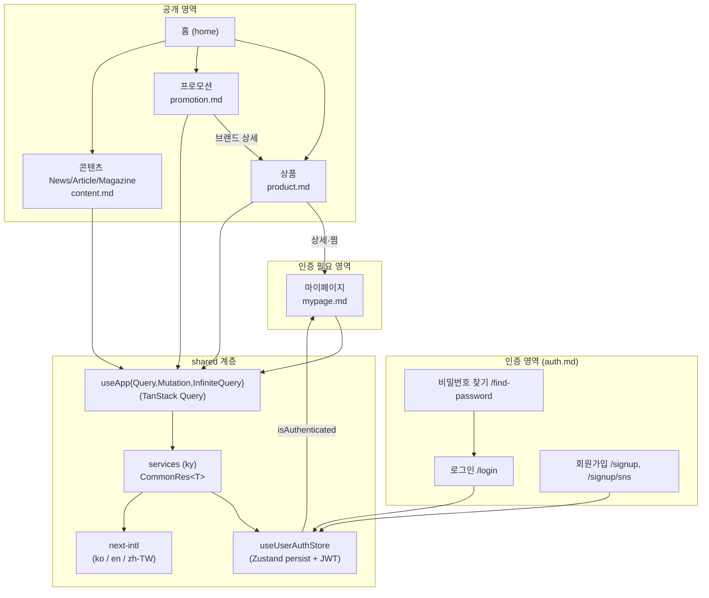

# apps/web 기능 문서

`@seoul-moment/web`(Next.js 15 App Router, Turbopack, 다국어 e-commerce/콘텐츠 플랫폼)의
도메인별 구현 문서 모음이다. 각 문서는 **개요 → 파일 구조 → 핵심 흐름(mermaid) → 주요 hook/service → 참고**
순서로 구성되며, FSD(Feature-Sliced Design) 레이어(`app → views → widgets → features → entities → shared`)를 따른다.

## 도메인 문서

| 문서 | 도메인 | 핵심 내용 |
| --- | --- | --- |
| [product.md](./product.md) | 상품 | 목록·필터(nuqs)·무한 스크롤(IntersectionObserver)·상세(Server Promise) |
| [auth.md](./auth.md) | 인증 | 로그인 · 회원가입(이메일 인증) · SNS Google 3-step · 토큰 갱신(401 refresh) |
| [mypage.md](./mypage.md) | 마이페이지 | 프로필 · 찜(상품/브랜드) · 최근 조회 · 사이즈(fit) 정보 |
| [promotion.md](./promotion.md) | 프로모션 | 중첩 동적 라우트 · 첫 브랜드 redirect · `use(promise)` + Suspense |
| [content.md](./content.md) | 콘텐츠 | News/Article/Magazine 상세 · SSG/ISR · 공유 `@widgets/detail` · Schema.org JSON-LD |

### 화면 단위 문서 (인증 UI)

`auth.md`가 인증 전반 흐름을 다루며, 아래 화면 문서는 레이아웃·컴포넌트 합성 등 UI 디테일을 보완한다.

| 문서 | 화면 |
| --- | --- |
| [login.md](./login.md) | 로그인 페이지 (`/login`) |
| [signup.md](./signup.md) | 회원가입 페이지 (`/signup`) |
| [find-password.md](./find-password.md) | 비밀번호 찾기 (`/find-password`) |
| [profile-image-crop.md](./profile-image-crop.md) | 프로필 이미지 크롭 (마이페이지 세부 기능) |

## 도메인 관계 한눈에 보기

> 모든 도메인은 `shared/services`(ky 클라이언트, `CommonRes<T>` 응답)와
> `useApp*` 쿼리 래퍼를 통해 서버 상태를 다루고, 인증 상태는 `useUserAuthStore`가 단일 출처로 관리한다.
> `auth.md`의 토큰 갱신 흐름(401 → `refreshAccessToken`)이 모든 인증 요청의 공통 기반이다.

## 참고

- 아키텍처·컨벤션 전반: [`apps/web/.claude/CLAUDE.md`](../.claude/CLAUDE.md)
- SNS(Google) 인증 플로우 레퍼런스: [`.claude/references/sns-auth-flow.md`](../../../.claude/references/sns-auth-flow.md)
- 모노레포 전반: [루트 `CLAUDE.md`](../../../.claude/CLAUDE.md)
