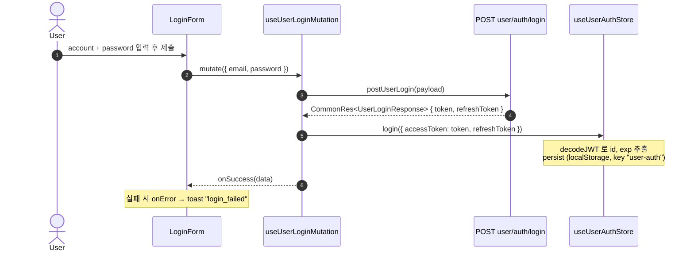
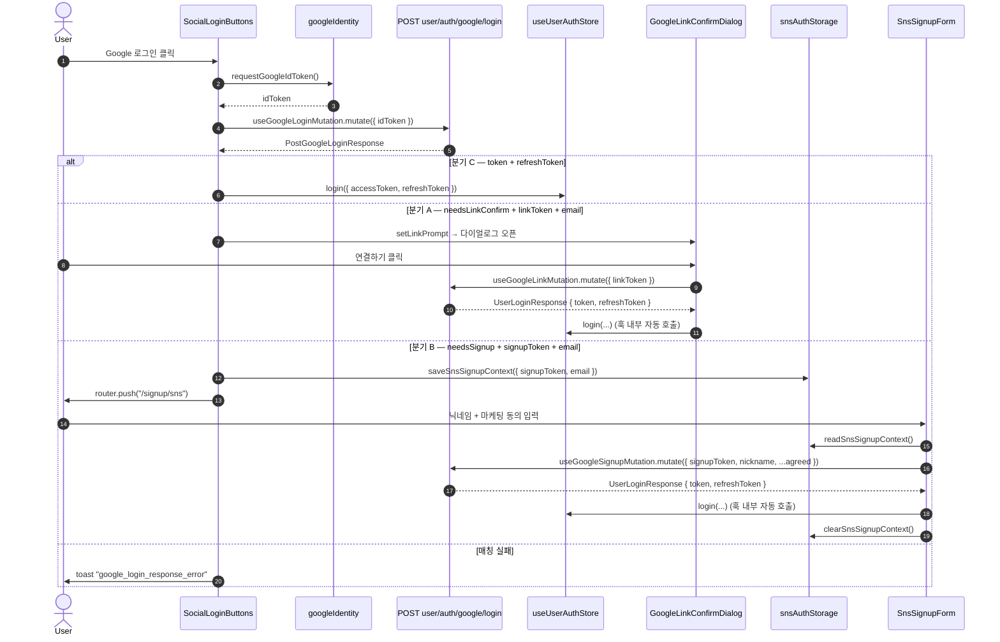
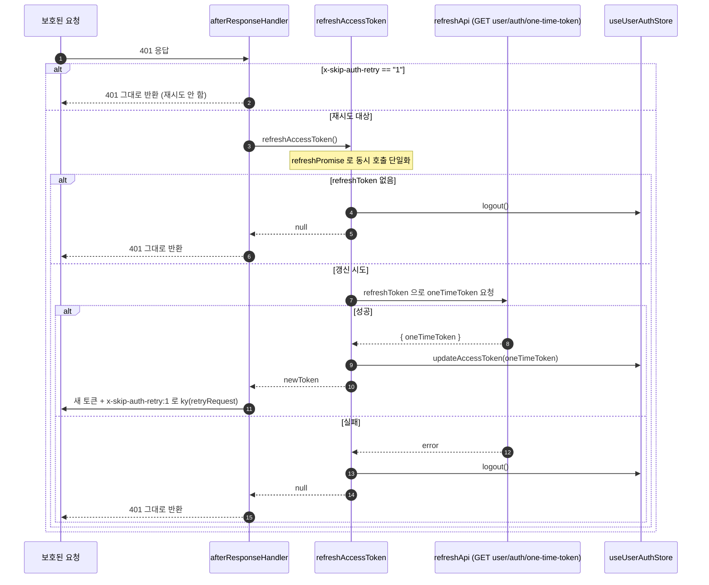
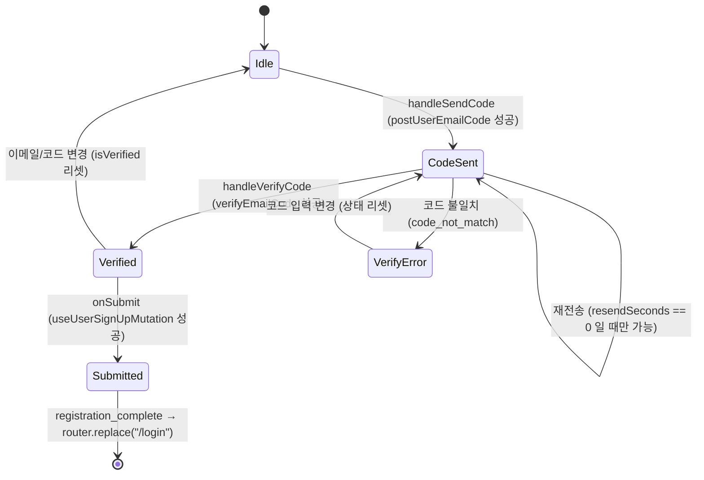

# 인증(Auth) 도메인

`apps/web`의 인증 도메인 통합 기술 문서. 이메일/비밀번호 로그인, 이메일 인증 기반 회원가입, SNS(Google) 3-step 로그인·가입, 그리고 401 응답 시 토큰 자동 갱신까지를 한 곳에서 다룬다. FSD(Feature-Sliced Design) 레이어를 따르며, 인증 상태는 `useUserAuthStore`(Zustand persist)에, SNS 가입 임시 컨텍스트는 `snsAuthStorage`(sessionStorage)에 보관된다.

이 문서는 **현재 실제 API가 연동된 동작** 기준으로 작성되었다. 화면 레이아웃/마크업 세부는 별도 UI 문서([`./login.md`](./login.md) · [`./signup.md`](./signup.md) · [`./find-password.md`](./find-password.md))를 참조한다. 단, 그 화면 문서들은 "API 미연동" 시절에 작성되어 일부 동작 서술이 현재와 다르므로, **동작의 정답은 본 문서**이고 화면 문서는 UI 레이아웃 참조용으로만 본다.

> **provider 범위**: 현재 구현된 SNS provider는 **Google only**. Apple/Kakao/Naver는 미구현이다. SNS 플로우의 상세 지도는 [`.claude/references/sns-auth-flow.md`](../../../.claude/references/sns-auth-flow.md)를 참고한다.

## 라우트

모든 인증 라우트는 `[locale]` 프리픽스를 가지며, `GuestOnly`(`@shared/lib/components/GuestOnly`)로 감싸 **로그인된 사용자의 접근을 차단**한다. `GuestOnly`는 hydration 전(`hasHydrated: false`) 또는 인증 상태일 때 `null`을 렌더해 폼 깜박임을 막고, hydration 후 인증되어 있으면 `redirectTo`(기본 `/`)로 `router.replace` 한다.

| 라우트 | 페이지(view) | 가드 | 설명 |
| --- | --- | --- | --- |
| `/login` | `views/login/ui/LoginPage.tsx` | GuestOnly | 이메일/비밀번호 로그인 + Google 로그인 진입점 |
| `/signup` | `views/signup/ui/SignupPage.tsx` | GuestOnly | 이메일 인증 기반 회원가입 |
| `/signup/sns` | `views/signup/ui/SnsSignupPage.tsx` | GuestOnly | SNS(Google) 신규 가입 전용 폼 (닉네임 + 마케팅 동의) |
| `/find-password` | `views/find-password/ui/FindPasswordPage.tsx` | GuestOnly | 비밀번호 찾기 (상세는 [`./find-password.md`](./find-password.md)) |

## 파일 구조

```
apps/web/src/
├── app/[locale]/
│   ├── login/page.tsx
│   ├── signup/page.tsx
│   ├── signup/sns/page.tsx
│   └── find-password/page.tsx
├── features/login/
│   ├── api/
│   │   ├── useUserLoginMutation.ts      # 이메일/비밀번호 로그인
│   │   ├── useGoogleLoginMutation.ts    # Google 1-step (분기 응답)
│   │   ├── useGoogleLinkMutation.ts     # Google 2-A (계정 연결)
│   │   └── useGoogleSignupMutation.ts   # Google 2-B (신규 가입)
│   ├── lib/
│   │   ├── googleIdentity.ts            # GIS 초기화 + idToken 요청
│   │   └── snsAuthStorage.ts            # signupToken/email sessionStorage
│   ├── model/schema.ts                  # loginFormResolver
│   └── ui/
│       ├── LoginForm.tsx                # 이메일/비번 폼
│       ├── SocialLoginButtons.tsx       # Google 버튼 + 응답 3분기 처리
│       └── GoogleLinkConfirmDialog.tsx  # 계정 연결 확인 다이얼로그
├── features/signup/
│   ├── api/
│   │   ├── usePostUserEmailCodeMutation.ts   # 가입용 이메일 코드 발송
│   │   ├── useVerifyEmailCodeMutation.ts     # 이메일 코드 검증
│   │   ├── usePostUserPhoneCodeMutation.ts   # 가입용 휴대폰 코드 발송 (현재 폼 미연동)
│   │   ├── useVerifyPhoneCodeMutation.ts     # 휴대폰 코드 검증 (현재 폼 미연동)
│   │   ├── usePostEmailCodeMutation.ts       # legacy (auth/email/code) 폴백
│   │   └── useUserSignUpMutation.ts          # 최종 가입 제출
│   ├── model/{schema.ts, snsSchema.ts}
│   └── ui/
│       ├── SignupForm.tsx               # 이메일 인증 기반 가입 폼
│       └── SnsSignupForm.tsx            # SNS 신규 가입 폼
└── shared/
    ├── services/
    │   ├── auth.ts                      # 모든 인증 API 함수 + payload/response 타입
    │   └── index.ts                     # ky 인스턴스 + 401 afterResponse + refreshAccessToken
    └── lib/
        ├── hooks/useUserAuthStore.ts    # Zustand persist 인증 스토어 (JWT decode)
        └── components/GuestOnly.tsx     # 게스트 전용 라우트 가드
```

## 핵심 흐름

### 1) 이메일 / 비밀번호 로그인

`LoginForm`이 `react-hook-form`(`loginFormResolver`)으로 검증 후 `useUserLoginMutation`을 호출한다. 훅이 `postUserLogin`(`POST user/auth/login`) 응답의 `token`/`refreshToken`을 받아 **훅 내부에서** `useUserAuthStore.login()`을 호출한다. 실패 시 `LoginForm`의 `onError`가 `login_failed` 토스트를 띄운다.



### 2) SNS Google 3-step (login / link / signup)

`SocialLoginButtons.handleGoogleClick`이 `requestGoogleIdToken()`으로 GIS 팝업을 띄워 idToken을 얻고, `useGoogleLoginMutation`으로 `POST user/auth/google/login`을 호출한다. 응답 `PostGoogleLoginResponse`는 **3분기**로 처리된다.

- **분기 C — 이미 연결된 계정**: `token && refreshToken` → 호출부(`SocialLoginButtons.onSuccess`)에서 직접 `login()` 호출.
- **분기 A — 연결 확인 필요**: `needsLinkConfirm && linkToken && email` → `linkPrompt` state로 `GoogleLinkConfirmDialog` 오픈 → "연결하기" 클릭 시 `useGoogleLinkMutation`(`POST user/auth/google/link`). 이 훅은 **훅 내부에서** `login()`을 호출한다. `linkToken`은 sessionStorage에 저장하지 않고 컴포넌트 state로만 보유(5분 만료).
- **분기 B — 신규 가입 필요**: `needsSignup && signupToken && email` → `saveSnsSignupContext()`로 sessionStorage에 저장 후 `/signup/sns`로 `router.push`. `SnsSignupForm`이 마운트 시 `readSnsSignupContext()`로 복원(없으면 `/login` replace), 닉네임+약관 입력 후 `useGoogleSignupMutation`(`POST user/auth/google/signup`)을 호출한다. 이 훅도 **내부에서** `login()`을 호출하며 `toastOnError: true`. 성공 시 `clearSnsSignupContext()` + 토스트 후 `/login` replace.

> `login()` 호출 위치가 일관되지 않음에 주의: 분기 C(login)는 **호출부**에서, 분기 A/B(link·signup)는 **훅 내부**에서 호출한다. (정리 후보는 SNS 레퍼런스 §8 참조)



### 3) 토큰 갱신 (401 → refresh → 재시도)

`shared/services/index.ts`의 메인 `api`(ky) 인스턴스는 `afterResponse` 훅에서 401을 가로챈다. `x-skip-auth-retry`(`SKIP_AUTH_RETRY_HEADER`) 헤더가 `"1"`이면(refresh 요청 자체이거나 이미 한 번 재시도된 요청) 추가 처리 없이 그대로 반환한다. 그 외 401은 `refreshAccessToken()`을 호출한다.

`refreshAccessToken()`은 모듈 스코프 `refreshPromise`로 **단일화**되어 동시 401이 와도 갱신 호출은 한 번만 발생한다. 갱신은 401 retry 훅이 없는 별도 인스턴스 `refreshApi`로 `GET user/auth/one-time-token`(refreshToken을 `Authorization` 헤더로 사용)을 호출해 새 `oneTimeToken`을 받고, `useUserAuthStore.updateAccessToken()`으로 store를 갱신한다(새 토큰의 `id`/`exp`도 재추출). `refreshToken`이 없거나 갱신이 실패하면 `logout()`을 호출하고 `null`을 반환한다.

새 토큰을 받으면 원 요청을 복제해 새 `Authorization`과 `x-skip-auth-retry: 1`을 붙여 `ky(retryRequest)`로 재시도한다. 갱신 실패(`newToken === null`) 시에는 원래의 401 응답을 그대로 반환한다.



### 4) 이메일 인증 회원가입 단계 (state machine)

`SignupForm`은 이메일 인증을 단계적으로 처리한다. `usePostUserEmailCodeMutation`(`POST user/auth/email/code`)으로 코드를 발송하면 `isCodeSent: true` + `resendSeconds = RESEND_INITIAL_SECONDS`로 재전송 타이머가 시작된다(1초 간격 `setInterval`로 감소). `useVerifyEmailCodeMutation`(`POST auth/email/verify`, legacy) 성공 시 `isVerified`가 true가 되고, 실패 시 `code_not_match` 에러 메시지를 표시한다. 이메일/코드 input이 변경되면 검증 상태가 리셋된다. 모든 검증(이메일 인증 + 닉네임 `available` + 비밀번호 + 약관)이 통과해야 `useUserSignUpMutation`(`POST user/auth/signup`)으로 제출하며, 성공 시 `registration_complete` 토스트 후 `/login` replace.



> **휴대폰 인증 관련 주의**: `usePostUserPhoneCodeMutation` / `useVerifyPhoneCodeMutation` 훅과 `postSignupPhoneCode` / `postSignupPhoneVerify` 등의 service 함수는 `auth.ts`에 정의되어 있으나, **현재 어떤 가입 폼에도 연결되어 있지 않다**. 실제 `SignupForm`은 이메일 인증만 수행한다. 휴대폰 인증은 추후 연동 대비로 준비된 계층이다.

## 주요 hook / service

| 이름 | 역할 | 파일 위치 |
| --- | --- | --- |
| `useUserLoginMutation` | 이메일/비번 로그인. 성공 시 훅 내부에서 `login()` | `features/login/api/useUserLoginMutation.ts` |
| `useGoogleLoginMutation` | Google 1-step. 분기 응답을 콜백으로만 전달(login은 호출부 책임) | `features/login/api/useGoogleLoginMutation.ts` |
| `useGoogleLinkMutation` | Google 계정 연결(2-A). 훅 내부에서 `login()` | `features/login/api/useGoogleLinkMutation.ts` |
| `useGoogleSignupMutation` | Google 신규 가입(2-B). 훅 내부에서 `login()` + `toastOnError` | `features/login/api/useGoogleSignupMutation.ts` |
| `requestGoogleIdToken` | GIS 초기화 후 prompt 트리거, idToken resolve. 취소/미표시 시 `GoogleSignInCancelledError` | `features/login/lib/googleIdentity.ts` |
| `saveSnsSignupContext` / `readSnsSignupContext` / `clearSnsSignupContext` | SNS 가입 `signupToken`+`email` sessionStorage 저장/복원/삭제 | `features/login/lib/snsAuthStorage.ts` |
| `usePostUserEmailCodeMutation` | 가입용 이메일 코드 발송. `toastOnError` | `features/signup/api/usePostUserEmailCodeMutation.ts` |
| `useVerifyEmailCodeMutation` | 이메일 코드 검증 (legacy `auth/email/verify`) | `features/signup/api/useVerifyEmailCodeMutation.ts` |
| `usePostUserPhoneCodeMutation` | 가입용 휴대폰 코드 발송 (현재 폼 미연동) | `features/signup/api/usePostUserPhoneCodeMutation.ts` |
| `useVerifyPhoneCodeMutation` | 휴대폰 코드 검증 (현재 폼 미연동) | `features/signup/api/useVerifyPhoneCodeMutation.ts` |
| `useUserSignUpMutation` | 최종 회원가입 제출. `toastOnError` | `features/signup/api/useUserSignUpMutation.ts` |
| `postUserLogin` / `postUserSignUp` | 로그인 / 가입 API 함수 | `shared/services/auth.ts` |
| `postGoogleLogin` / `postGoogleLink` / `postGoogleSignup` | Google 3-step API 함수 | `shared/services/auth.ts` |
| `getUserOneTimeToken` | one-time-token(access 재발급) API 함수 | `shared/services/auth.ts` |
| `refreshAccessToken` | 401 시 `refreshApi`로 토큰 갱신, `refreshPromise` 단일화 | `shared/services/index.ts` |
| `useUserAuthStore` | 인증 상태(accessToken/refreshToken/id/exp) Zustand persist. `login`/`logout`/`updateAccessToken` | `shared/lib/hooks/useUserAuthStore.ts` |
| `GuestOnly` | 로그인 사용자 접근 차단 라우트 가드 | `shared/lib/components/GuestOnly.tsx` |

## 토큰 / 상태 매트릭스

| 데이터 | 저장 위치 | 수명 | 비고 |
| --- | --- | --- | --- |
| `accessToken`, `refreshToken` | `useUserAuthStore` → localStorage (persist key `user-auth`) | 로그아웃까지 | 갱신 시 `updateAccessToken`이 새 토큰의 `id`/`exp` 재추출 |
| `id`, `exp` (JWT claims) | `useUserAuthStore` (persist 대상) | accessToken과 동일 | `decodeJWT`(`shared/lib/utils.ts`)로 추출 |
| `signupToken` + `email` | `snsAuthStorage` → sessionStorage (`sns:signupToken`, `sns:signupEmail`) | 탭 종료 / `clearSnsSignupContext()` | JWT 자체는 10분 만료 |
| `linkToken` + `email` | `SocialLoginButtons` 컴포넌트 state(`linkPrompt`) | 다이얼로그 닫힘 / unmount | sessionStorage 미저장, JWT 5분 만료 |

## 참고

- SNS 플로우 상세 지도: [`.claude/references/sns-auth-flow.md`](../../../.claude/references/sns-auth-flow.md)
- 화면(UI) 레이아웃 문서 (동작은 본 문서가 우선):
  - [`./login.md`](./login.md)
  - [`./signup.md`](./signup.md)
  - [`./find-password.md`](./find-password.md)
- 앱 가이드: [`apps/web/.claude/CLAUDE.md`](../.claude/CLAUDE.md)
</content>
</invoke>
