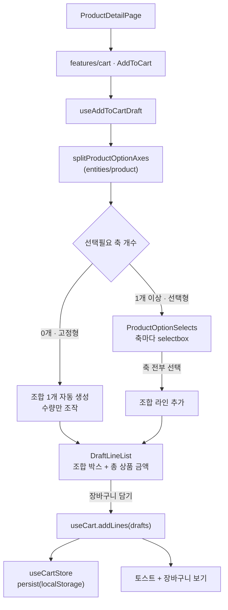
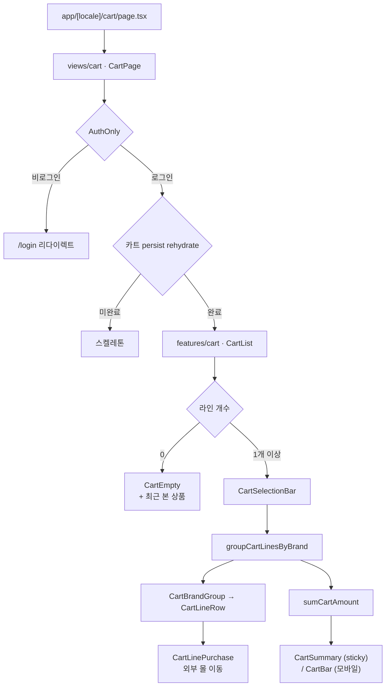
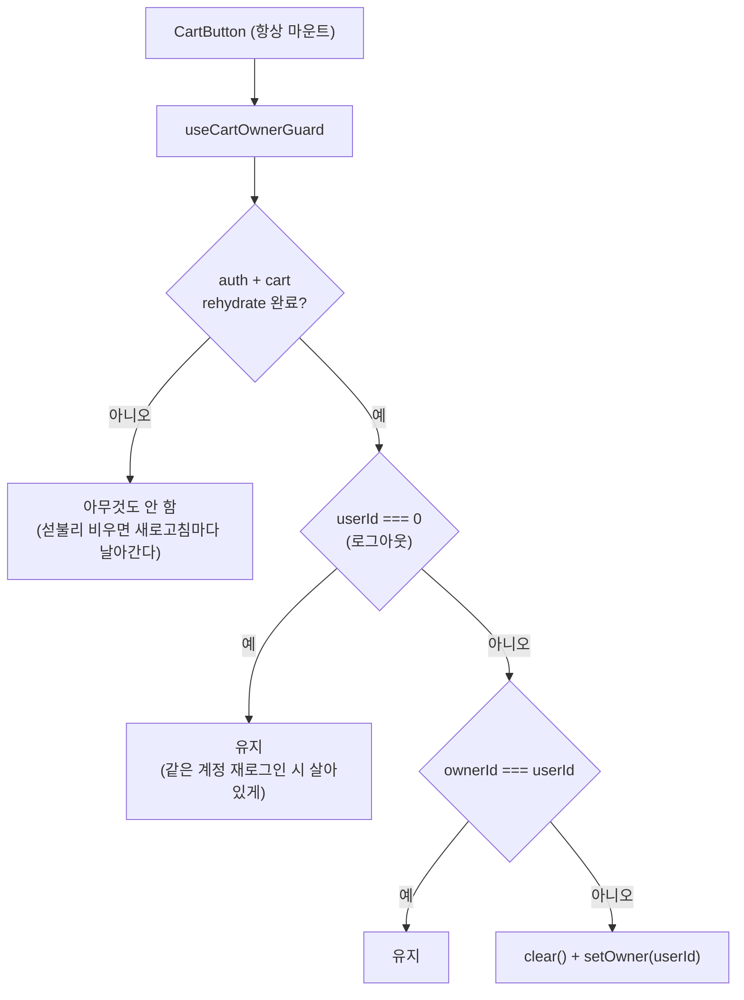

# 장바구니 (Cart) 도메인

`apps/web`의 장바구니 구현 문서. **담아두기** 성격이다 — 자체 결제와 주문서는 만들지 않고
수량 조절·선택 삭제·총 상품 금액까지만 다룬다. 실제 구매는 기존 외부 파트너 몰 링크
(`ProductExternalGroup`)가 계속 담당하고, `주문하기`·`구매하기`는 결제가 붙을 때 UI 재작업이
없도록 **비활성 자리**로만 렌더한다.

서버에 `user/cart` API가 아직 없으므로 **로컬 상태(zustand persist)** 로 동작한다. UI는 스토어를
직접 읽지 않고 `useCart` 경계만 쓰므로, API가 나오면 그 훅 내부만 갈아끼우면 된다.

- 장바구니 라우트: `apps/web/src/app/[locale]/cart/page.tsx` → `/[locale]/cart` (예: `/ko/cart`)
- 담기 진입점: 상품상세(`/product/[id]`) 우측 정보 컬럼(데스크톱) / 하단 고정 바 + 시트(모바일)

## 파일 구조

```
apps/web/src/
├── app/[locale]/cart/
│   └── page.tsx                        # 라우트 진입점 + generateMetadata (robots noindex)
├── views/cart/
│   └── ui/CartPage.tsx                 # "use client", AuthOnly + hydration 스켈레톤
├── features/cart/
│   ├── index.tsx                       # barrel (CartList, AddToCart, useCartSelection)
│   ├── lib/openExternal.ts             # isValidExternalUrl 통과분만 새 창
│   ├── model/
│   │   ├── useCartSelection.ts         # 선택 상태 (해제된 id 만 보관)
│   │   └── useAddToCartDraft.ts        # 축 선택 → 조합 라인 → 담기
│   └── ui/
│       ├── CartList.tsx                # 리스트 조립 + 삭제/되돌리기 토스트
│       ├── CartBrandGroup.tsx          # 브랜드 그룹 + 그룹 체크박스 + 소계
│       ├── CartSelectionBar.tsx        # 전체 선택 / 선택 삭제 / 전체 삭제
│       ├── CartSummary.tsx             # 데스크톱 sticky 합계 패널
│       ├── CartBar.tsx                 # 모바일 하단 고정 합계 바
│       ├── CartEmpty.tsx               # 빈 상태 + 최근 본 상품
│       ├── CartLinePurchase.tsx        # 라인 단위 외부 몰 이동
│       ├── AddToCart.tsx               # 상품상세 담기 (데스크톱 인라인 / 모바일 바+시트)
│       ├── ProductOptionSelects.tsx    # 선택필요 축만 selectbox
│       └── DraftLineList.tsx           # 조합 라인 박스 + 총 상품 금액
├── entities/cart/
│   ├── index.ts                        # barrel (useCartStore 는 노출하지 않는다)
│   ├── lib/cartLineId.ts               # 조합 id 생성 · 옵션 슬래시 표기
│   ├── model/
│   │   ├── types.ts                    # CartLine · CartLineDraft · CartBrandGroup
│   │   ├── useCartStore.ts             # zustand persist("user-cart") + ownerId + hasHydrated
│   │   ├── useCart.ts                  # UI 가 쓰는 유일한 경계
│   │   ├── useCartOwnerGuard.ts        # 계정 전환 시 비우기
│   │   └── selectors.ts                # 단가 · 합계 · 브랜드 그룹화
│   └── ui/CartLineRow.tsx              # 라인 프레젠테이션 (썸네일 120 / 100px)
├── entities/product/lib/optionAxes.ts  # 축 순서 · 라벨 키 · 선택필요/자동확정 분리
├── widgets/header/ui/CartButton.tsx    # 헤더 아이콘 + 배지 + 오너 가드 호출 지점
└── shared/
    ├── ui/checkbox.tsx                 # 네이티브 input (indeterminate)
    ├── ui/quantity-stepper.tsx         # 86x32 박스 (히트 영역 44px)
    └── lib/hooks/useFloatingOffset.ts  # 하단 바 높이를 --floating-offset 으로
```

## 핵심 흐름

### 담기 (상품상세 → 장바구니)



### 장바구니 화면



### 옵션 축 규칙

판별은 축 **이름이 아니라 값 개수**로 한다. `OptionType`에 `VOLUME`·`TEXTURE`가 뒤늦게 추가된
것처럼 축은 계속 늘어나고, `SIZE` 존재를 기준으로 삼으면 색이 여러 개인데 사이즈가 없는 상품
(립스틱)이 아무것도 고를 수 없는 상태가 된다.

| 모드       | 조건                 | 동작                                                                                         |
| ---------- | -------------------- | -------------------------------------------------------------------------------------------- |
| **선택형** | 값 2개 이상인 축 ≥ 1 | 축마다 selectbox · **전부 골라야** 조합 생성 · 라인 ✕ 로 제거 · 라인 0개면 담기 비활성       |
| **고정형** | 값 2개 이상인 축 = 0 | selectbox 영역 없음 · 조합 1개가 처음부터 존재 · **✕ 미렌더** · 수량만 조작 · 담기 항상 활성 |

- 값이 1개인 축은 **자동 확정**되어 노출되지 않지만 조합 라벨에는 포함된다
  (`레드 / 스탠다드 / S / 폴리에스터`). 고정형에서는 이게 유일한 정보다.
- 조합 라벨과 장바구니 라인의 옵션 표기는 같은 `formatCartLineOptions`를 쓴다.
- 축 순서는 `OPTION_AXIS_ORDER` 상수가 정한다. 서버 JSON 키 순서에 의존하면 서버가 필드 순서를
  바꿀 때 화면 순서가 조용히 따라 흔들린다.
- 축 라벨은 서버가 주지 않으므로 `OPTION_AXIS_LABEL_KEY`로 i18n 키에 매핑한다. **매핑에 없는 축은
  렌더하지 않는다** — raw `MATERIAL`이 화면에 뜨지 않게.

### 계정 스코프 (`useCartOwnerGuard`)

저장은 로컬인데 접근은 로그인 필수라, 다른 계정으로 로그인했을 때 이전 사용자의 장바구니가
보이면 안 된다. persist `name`은 스토어 생성 시 고정이라 `cart:${userId}`로 쪼갤 수 없어
상태에 `ownerId`를 두고 감시한다.



> `GlobalQueryHandler`(`shared/lib/components`)에 카트 클리어를 넣는 방법은 쓰지 않는다 —
> shared가 entities를 import하는 FSD 역방향 위반이다.

## 주요 hook / service

### Hook

| Hook                | 위치                  | 역할                                                                                                                               |
| ------------------- | --------------------- | ---------------------------------------------------------------------------------------------------------------------------------- |
| `useCart`           | `entities/cart/model` | **UI가 쓰는 유일한 경계.** `lines` · `lineCount` · `isHydrated` + `addLines`/`updateQuantity`/`removeLines`/`restoreLines`/`clear` |
| `useCartStore`      | `entities/cart/model` | zustand persist 스토어. **배럴에 노출하지 않는다** (UI 직접 접근 차단)                                                             |
| `useCartHydrated`   | `entities/cart/model` | persist rehydrate 완료 여부. 배지·페이지가 이 값으로 보호된다                                                                      |
| `useCartOwnerGuard` | `entities/cart/model` | 계정 전환 감시. `CartButton`에서 1회 호출                                                                                          |
| `useCartSelection`  | `features/cart/model` | 선택 상태. **해제된 id만** 보관해 새로 담긴 라인이 자동 선택되고 삭제된 id가 남지 않는다                                           |
| `useAddToCartDraft` | `features/cart/model` | 축 선택 → 조합 라인 → `addLines`. 로그인 게이트와 상한 토스트 포함                                                                 |
| `useFloatingOffset` | `shared/lib/hooks`    | 하단 고정 바 높이를 `--floating-offset`으로 노출                                                                                   |

### Service

**없다.** 서버 `user/cart` API가 아직 없어 전부 `localStorage`(`user-cart`)에서 동작한다.
API가 생기면 `useCart.ts` 내부를 `useAppQuery`/`useAppMutation`으로 교체한다 —
키는 `["user","cart",{ languageCode }, id]`, 패턴은 `shared/services/userLike.ts`를 따른다.
컴포넌트는 수정하지 않는다.

### 상수

| 상수                | 값            | 위치                                  |
| ------------------- | ------------- | ------------------------------------- |
| `MAX_LINE_QUANTITY` | 99            | `entities/cart/model/useCartStore.ts` |
| `MAX_CART_LINES`    | 100           | 동일                                  |
| persist key         | `"user-cart"` | 동일                                  |

`GetProductDetailRes`에 `stock`·`sku`·최대주문수량이 없어 **재고 검증은 하지 않는다.**
수량 상한은 위 클라이언트 상수뿐이다.

## 데이터 모델

```ts
export interface CartLine {
  lineId: string; // `${productId}:${정렬된 optionValueId join "-"}`
  productId: number;
  quantity: number;
  addedAt: number;
  // ↓ 담은 시점 스냅샷
  productName: string;
  brandId: string;
  brandName: string;
  brandProfileImg: string;
  imageUrl: string;
  price: number;
  discountPrice: number;
  options: CartOptionSelection[];
  external: External[];
}
```

`lineId`는 `optionValueId`를 **정렬해서** 만든다. 색상 → 사이즈 순으로 고르든 그 반대든 같은
라인으로 합쳐져야 한다.

**스냅샷인 이유**: `getProductList`에 id 배열 필터가 없어 담긴 상품을 한 번에 재조회할 수 없고,
라인마다 `getProductDetail`을 치면 N+1이다. 대신 표시에 필요한 값을 복사하고 화면에
"담은 시점 가격 기준" 각주를 둔다. 서버 API 전환 시 자연히 해소된다.

## 설계 결정 (ADR)

| 결정                                                               | 대안                            | 근거                                                                                                                                                                                  | 재검토 시점                              |
| ------------------------------------------------------------------ | ------------------------------- | ------------------------------------------------------------------------------------------------------------------------------------------------------------------------------------- | ---------------------------------------- |
| **자체 결제 없음.** `주문하기`·`구매하기`는 `disabled`             | 버튼 자체를 제거                | 3버튼 레이아웃과 마크업을 지금 만들어 두면 결제가 붙을 때 UI 재작업이 없다. 실제 구매는 외부 몰이 담당                                                                                | 결제 PG 확정 시                          |
| **로컬 저장 + 로그인 필수**                                        | 서버 API 대기 / 비로그인 허용   | API가 없어 UI를 먼저 만들되, 접근 정책은 좋아요와 일치시켰다                                                                                                                          | `user/cart` swagger 확정 시              |
| **`ownerId` 오너 가드.** 로그아웃은 비우지 않고 계정 전환만 비운다 | 로그아웃 시 무조건 비우기       | persist `name`이 고정이라 사용자별로 쪼갤 수 없다. 같은 계정 재로그인 시 담아둔 것이 살아있어야 한다                                                                                  | 서버 전환 시 로컬→서버 머지 지점         |
| **축 판별은 값 개수 기준**                                         | `SIZE` 존재 여부                | 축이 계속 늘어나고(`VOLUME`·`TEXTURE` 추가), 이름 기반은 립스틱(색 여러 개 + 사이즈 없음)에서 깨진다                                                                                  | 서버가 축 메타를 내려주면                |
| **축 선택 후 picked를 리셋하지 않는다**                            | 조합 완성 시 리셋               | 리셋하면 Radix Select의 controlled value만 비워져 같은 값 재선택에 `onValueChange`가 오지 않아 두 번째 조합이 안 생긴다. 리셋 없는 쪽이 실제 흐름(색상 고정 + 사이즈만 변경)에도 맞다 | —                                        |
| **모바일 시트 안에도 3버튼 행**                                    | 디자인대로 시트 아래 바만       | vaul Drawer가 `bottom-0`을 덮어 시트가 열린 동안 하단 바가 포인터 이벤트를 못 받는다                                                                                                  | vaul가 하단 여백 옵션을 제공하면         |
| **selectbox에 축 이름 유지** (`사이즈 · M`)                        | 값만 표시 (디자인)              | 디자인은 2축 전제였고 실제 상품은 4축이다. `S` 옆에 `폴리에스터`만 있으면 무엇의 값인지 알 수 없다                                                                                    | —                                        |
| **체크박스는 네이티브 `input`**                                    | `@radix-ui/react-checkbox` 추가 | 폼 안이 아니라 상태 토글이고, Radix가 필요한 이유(포털·포커스 트랩)가 해당 없다. 네이티브가 키보드·스크린리더·`indeterminate`를 공짜로 준다                                           | —                                        |
| **체크 색은 black**                                                | brand orange                    | 디자인에서 `#f37b2a`는 할인율·별점 전용이고 선택·주요 액션은 전부 black이다                                                                                                           | —                                        |
| **배송비를 합계에서 제외**                                         | 브랜드별 배송비 합산            | `shippingCost`는 **상품 단위** 값이라 브랜드로 합산하면 부정확하다. "브랜드별 별도"로 정직하게 적는다                                                                                 | 주문서에서 브랜드별 산정 규칙 확정 시    |
| **삭제는 collapse 모션 대신 되돌리기**                             | 애니메이션                      | Operate 화면에서는 실수 복구가 모션보다 가치 있고, 로컬 상태라 공짜로 된다                                                                                                            | —                                        |
| **선택 상태는 해제된 id만 보관**                                   | 선택된 id 보관 / URL(nuqs)      | 새로 담긴 라인이 자동 선택되고, 삭제된 라인 id를 따로 정리할 필요가 없다. URL에 두면 유령 id가 남는다                                                                                 | —                                        |
| **`unoptimized` 이미지**                                           | `next/image` 최적화             | 코드베이스 관행이고, 라인이 `imageUrl`을 스냅샷으로 들고 있어 호스트가 바뀌면 `next/image`가 던지며 페이지를 죽인다                                                                   | 이미지 호스트가 `next.config`에 고정되면 |

## 알려진 제약 / TODO

- **서버 API 없음.** 기기 간 동기화가 되지 않고 localStorage를 지우면 사라진다.
- **가격이 stale해질 수 있다.** 담은 시점 스냅샷이라 가격이 바뀌면 화면 값이 과거다. 라인을 누르면
  상세로 이동해 실제 가격을 본다.
- **재고 검증 없음.** API에 `stock`이 없다.
- **주문/결제 미구현.** `주문하기`·`구매하기`가 비활성이다. 시안은
  [`order-mockup.html`](./order-mockup.html)(레포에 커밋되지 않음 — 로컬 산출물)에 있다.
- **E2E 미작성.** 유닛 테스트는 `entities/cart`(29개)와 `useAddToCartDraft`(12개)에 있다.
- **i18n 키는 시트가 SSOT.** `pnpm dev:web`이 매 시작마다 `i18n:sync`를 돌려 JSON을 전체
  덮어쓴다. 장바구니 키 35개는 `language-pack` 시트에 등록되어 있으므로 sync 후에도 유지된다.
  **새 키를 추가할 때는 시트에 먼저 넣어야 한다.**

## 참고

- 상품 도메인: [product.md](./product.md) — 옵션 축(`DetailOption`)의 출처
- 마이페이지: [mypage.md](./mypage.md) — 좋아요 목록과의 시각적 대비, `useGetUserRecentListQuery`
- 디자인 시스템: [`apps/web/DESIGN.md`](../DESIGN.md)
- Figma 상품상세 담기: `1536:9910`(PC) · `1536:10065`/`10170`/`10279`(MO)
  — 파일 `G1QY7B17G2KWHa9nLLLCaL`. `/cart` 화면은 디자인이 없어 위 어휘를 상속해 설계했다.
