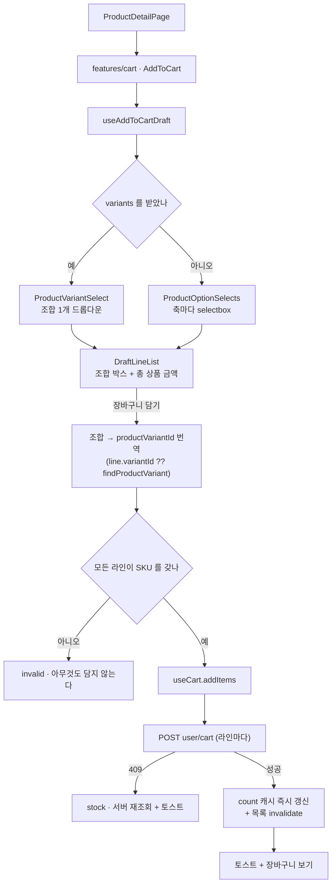
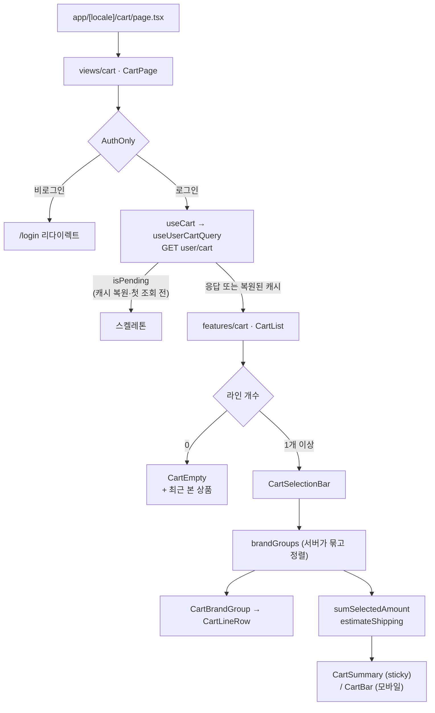

# 장바구니 (Cart) 도메인

`apps/web`의 장바구니 구현 문서. **담아두기** 성격이다 — 자체 결제와 주문서는 아직 만들지 않고
수량 조절·선택 삭제·금액 요약까지만 다룬다. `주문하기`·`구매하기`는 결제가 붙을 때 UI 재작업이
없도록 **비활성 자리**로만 렌더한다.

읽기도 쓰기도 **서버(`user/cart`)** 다. 화면이 그리는 값은 TanStack Query 캐시이고, 낙관적
반영은 그 캐시를 직접 고쳐서 한다. UI는 `useCart` 경계만 쓴다.

- 장바구니 라우트: `apps/web/src/app/[locale]/cart/page.tsx` → `/[locale]/cart` (예: `/ko/cart`)
- 담기 진입점: 상품상세(`/product/[id]`) 우측 정보 컬럼(데스크톱) / 하단 고정 바 + 시트(모바일)

## 파일 구조

```
apps/web/src/
├── app/[locale]/cart/
│   └── page.tsx                        # 라우트 진입점 + generateMetadata (robots noindex)
├── views/cart/
│   └── ui/CartPage.tsx                 # "use client", AuthOnly + 첫 조회 스켈레톤
├── features/cart/
│   ├── index.tsx                       # barrel (CartList, AddToCart, useCartSelection)
│   ├── lib/draftLine.ts                # 담기 전 조합의 키 생성 · 옵션 슬래시 표기
│   ├── model/
│   │   ├── useCartSelection.ts         # 선택 상태 (해제된 cartItemId 만 보관)
│   │   └── useAddToCartDraft.ts        # 축·조합 선택 → SKU 로 번역 → 담기
│   └── ui/
│       ├── CartList.tsx                # 리스트 조립 + 삭제/되돌리기 토스트
│       ├── CartBrandGroup.tsx          # 브랜드 그룹 + 그룹 체크박스 + 선택 소계
│       ├── CartSelectionBar.tsx        # 전체 선택 / 선택 삭제 / 전체 삭제
│       ├── CartSummary.tsx             # 데스크톱 sticky 금액 패널
│       ├── CartBar.tsx                 # 모바일 하단 고정 금액 바
│       ├── CartEmpty.tsx               # 빈 상태 + 최근 본 상품
│       ├── AddToCart.tsx               # 상품상세 담기 (데스크톱 인라인 / 모바일 바+시트)
│       ├── ProductVariantSelect.tsx    # 조합(SKU) 단일 selectbox
│       ├── ProductOptionSelects.tsx    # variants 가 없을 때 축별 selectbox
│       └── DraftLineList.tsx           # 담기 전 조합 라인 박스 + 총 상품 금액
├── entities/cart/
│   ├── index.ts                        # barrel
│   ├── api/
│   │   ├── queryKey.ts                 # userCartQueryKeys (userId·languageCode 포함)
│   │   └── useUserCart.ts              # 조회/담기/수량/삭제 + 낙관적 캐시 갱신
│   ├── lib/cartError.ts                # 409(재고 부족) 판정
│   ├── model/
│   │   ├── types.ts                    # 서버 DTO 재노출 + CartItemDraft · AddCartItemsOutcome
│   │   ├── cartPolicy.ts               # MAX_LINE_QUANTITY · LOW_STOCK_THRESHOLD · 수량 clamp
│   │   ├── cartSelectors.ts            # 선택 합계 · 배송비 예상 · 품절/저재고 판정
│   │   ├── useCart.ts                  # UI 가 쓰는 유일한 경계
│   │   └── useCartBadgeCount.ts        # 헤더 배지 수
│   └── ui/CartLineRow.tsx              # 라인 프레젠테이션 (썸네일 120 / 100px)
├── entities/product/lib/               # optionAxes · productVariant · optionAvailability
├── widgets/header/ui/CartButton.tsx    # 헤더 아이콘 + 배지
└── shared/
    ├── lib/query/persister.ts          # 쿼리 캐시 localStorage 영속화
    ├── ui/checkbox.tsx                 # 네이티브 input (indeterminate)
    ├── ui/quantity-stepper.tsx         # 86x32 박스 (히트 영역 44px)
    └── lib/hooks/useFloatingOffset.ts  # 하단 바 높이를 --floating-offset 으로
```

## 핵심 흐름

### 담기 (상품상세 → 장바구니)



### 장바구니 화면



### 낙관적 반영과 되돌리기

조작마다 즉시 반응해야 하지만 옳은 값을 아는 쪽은 서버다. 그래서 **되돌릴 값을 들고 다니는
대신 서버에서 다시 읽는다**.

| 조작 | 낙관적 반영 위치 | 실패 시 |
| --- | --- | --- |
| 담기 | 하지 않음 (서버가 매기는 `cartItemId` 를 알 수 없다). 응답의 `totalCount` 로 배지만 즉시 갱신 | 409 면 재조회 + 재고 토스트, 그 밖에는 실패 토스트 |
| 수량 | `useSetCartItemQuantity` — PATCH 를 400ms 모으므로 화면 반영을 전송에서 떼어 놓았다 | `onSettled` 무효화로 서버 값 복귀. 409 면 재조회 + 재고 토스트 |
| 삭제 | `useDeleteUserCartItemsMutation.onMutate` — 캐시에서 걷어내고 빈 브랜드 묶음까지 정리 | `onError` 에서 스냅샷 복원 |
| 되돌리기 | 없음 — 되돌리기는 곧 다시 담기다(새 `cartItemId` 를 받는다) | 담기와 동일 |

### 캐시 영속화

새로고침 직후 서버 응답 전에 빈 장바구니를 그리면 화면이 깜박인다. 쿼리 캐시를 그대로
localStorage 에 남겨 첫 페인트를 메운다(`shared/lib/query/persister.ts`).

- 저장 대상은 `useAppQuery({ persist: true })` 로 표시한 쿼리뿐이다. 쿼리 키로 걸러내면 shared 가
  도메인 키를 알아야 해서 FSD 역방향 참조가 된다.
- 복원이 끝날 때까지 `useIsRestoring()` 이 true 이고, 이 값은 서버·클라이언트 첫 렌더가 같아서
  hydration 불일치가 나지 않는다.
- 계정 전환 노출은 쿼리 키의 `userId` 가 막고, 로그아웃 시에는 `useClearAllQueries` 가
  캐시와 localStorage 사본을 함께 지운다.

### 옵션 축 규칙

판별은 축 **이름이 아니라 값 개수**로 한다. `OptionType`에 `VOLUME`·`TEXTURE`가 뒤늦게 추가된
것처럼 축은 계속 늘어나고, `SIZE` 존재를 기준으로 삼으면 색이 여러 개인데 사이즈가 없는 상품
(립스틱)이 아무것도 고를 수 없는 상태가 된다.

상품상세 v1이 `variants`(SKU 목록)를 주면 **조합 드롭다운 1개**로 고르고, 못 받으면 아래
축별 선택으로 폴백한다.

| 모드       | 조건                 | 동작                                                                                         |
| ---------- | -------------------- | -------------------------------------------------------------------------------------------- |
| **조합형** | `variants` 있음      | 조합 selectbox 1개 · 조합마다 재고·품절 표기 · 고른 조합이 그대로 SKU                        |
| **선택형** | 값 2개 이상인 축 ≥ 1 | 축마다 selectbox · **전부 골라야** 조합 생성 · 라인 ✕ 로 제거 · 라인 0개면 담기 비활성       |
| **고정형** | 값 2개 이상인 축 = 0 | selectbox 영역 없음 · 조합 1개가 처음부터 존재 · **✕ 미렌더** · 수량만 조작 · 담기 항상 활성 |

- 값이 1개인 축은 **자동 확정**되어 노출되지 않지만 조합 라벨에는 포함된다
  (`레드 / 스탠다드 / S / 폴리에스터`). 고정형에서는 이게 유일한 정보다.
- 축 순서는 `OPTION_AXIS_ORDER` 상수가 정한다. 서버 JSON 키 순서에 의존하면 서버가 필드 순서를
  바꿀 때 화면 순서가 조용히 따라 흔들린다.
- 축 라벨은 서버가 주지 않으므로 `OPTION_AXIS_LABEL_KEY`로 i18n 키에 매핑한다. **매핑에 없는 축은
  렌더하지 않는다** — raw `MATERIAL`이 화면에 뜨지 않게.
- 장바구니 라인의 옵션 표기는 서버 `optionText`(`IVORY / M`)를 그대로 쓴다. 담기 **전** 화면만
  `formatDraftLineOptions` 로 같은 어휘를 만든다.

## 주요 hook / service

### Hook

| Hook                          | 위치                  | 역할                                                                                                                     |
| ----------------------------- | --------------------- | ------------------------------------------------------------------------------------------------------------------------ |
| `useCart`                     | `entities/cart/model` | **UI가 쓰는 유일한 경계.** 서버 금액·`brandGroups`·`isPending` + `addItems`/`updateQuantity`/`removeItems`/`restoreItems` |
| `useUserCartQuery`            | `entities/cart/api`   | `GET user/cart`. `persist: true` 로 캐시를 localStorage 에 남긴다                                                        |
| `useUserCartCountQuery`       | `entities/cart/api`   | `GET user/cart/count` (헤더 배지)                                                                                        |
| `useSetCartItemQuantity`      | `entities/cart/api`   | 수량을 캐시에만 먼저 반영. 전송은 `useCart` 가 모아서 한다                                                               |
| `useFetchUserCart`            | `entities/cart/api`   | 409 뒤 즉시 재조회. 상품상세에는 목록 구독자가 없어 무효화만으로는 아무도 다시 읽지 않는다                               |
| `useCartBadgeCount`           | `entities/cart/model` | 배지 수 + 캐시 복원 대기(`useIsRestoring`)                                                                               |
| `useCartSelection`            | `features/cart/model` | 선택 상태. **해제된 `cartItemId` 만** 보관해 새 라인이 자동 선택되고 삭제된 id가 남지 않는다                             |
| `useAddToCartDraft`           | `features/cart/model` | 조합 선택 → SKU 번역 → `addItems`. 로그인 게이트 포함                                                                    |
| `useFloatingOffset`           | `shared/lib/hooks`    | 하단 고정 바 높이를 `--floating-offset`으로 노출                                                                         |

### Service — `shared/services/userCart.ts`

| 함수                    | 엔드포인트                | 비고                                              |
| ----------------------- | ------------------------- | ------------------------------------------------- |
| `createUserCartItem`    | `POST user/cart`          | 이미 담긴 SKU 면 라인을 늘리지 않고 수량을 더한다 |
| `getUserCart`           | `GET user/cart`           | 브랜드 묶음 · 금액 · 배송비 예상값 · 재고/품절    |
| `getUserCartCount`      | `GET user/cart/count`     | 헤더 배지                                         |
| `updateUserCartItem`    | `PATCH user/cart/{id}`    | 재고 초과면 409                                   |
| `deleteUserCartItems`   | `DELETE user/cart?ids=`   | **ids 를 생략하면 전체 비우기**                   |

쿼리 키는 `["user","cart","list",userId,languageCode]` / `["user","cart","count",userId]`.
`userId` 를 키에 넣어 계정 전환 시 이전 사용자 캐시가 노출되지 않게 한다.

### 상수

| 상수                  | 값                | 위치                                 |
| --------------------- | ----------------- | ------------------------------------ |
| `MAX_LINE_QUANTITY`   | 99                | `entities/cart/model/cartPolicy.ts`  |
| `LOW_STOCK_THRESHOLD` | 10                | 동일                                 |
| `QUANTITY_SYNC_DELAY` | 400ms             | `entities/cart/model/useCart.ts`     |
| 캐시 저장 키          | `"query-cache"`   | `shared/lib/query/persister.ts`      |

수량 상한은 정책 천장(99)과 서버 `stockQuantity` 중 작은 쪽이다(`getMaxLineQuantity`).

## 데이터 모델

화면이 읽는 값은 서버 응답 그대로다(`shared/services/userCart.ts`).

```ts
export interface UserCartItem {
  cartItemId: number;        // 라인 식별자. 수량 변경·삭제가 이 값을 쓴다
  productItemId: number;     // 상품 상세 링크
  productVariantId: number;  // 되돌리기(재담기)가 이 값을 쓴다
  productName: string;
  optionText: string;        // "IVORY / M"
  imageUrl: string;
  price: number;
  discountPrice?: number;
  quantity: number;
  totalPrice: number;        // 적용가 × 수량
  stockQuantity: number;
  isSoldOut: boolean;
  isAvailable: boolean;      // false 인 라인은 서버 금액 합계에서 제외된다
}
```

**선택 합계는 프론트가 계산한다.** 서버의 `totalProductAmount`·`estimatedShippingFee`·
`amountToFreeShipping` 은 장바구니 **전체** 기준이라 일부만 고르면 화면 금액과 어긋난다.
라인 금액은 서버 `totalPrice` 를 그대로 더하고(`sumSelectedAmount`), 배송비는 규칙
(본섬 기준 · 기준액 이상 무료)을 선택 합계에 다시 적용한다(`estimateShipping`). 확정은
주문서에서 한다.

## 설계 결정 (ADR)

| 결정                                                               | 대안                            | 근거                                                                                                                                                                                  | 재검토 시점                              |
| ------------------------------------------------------------------ | ------------------------------- | ------------------------------------------------------------------------------------------------------------------------------------------------------------------------------------- | ---------------------------------------- |
| **서버가 단일 진실 원천.** 로컬 zustand 카트를 제거                | 로컬 + 서버 write-through 유지  | 담기가 이미 로그인 필수라 로컬에는 비로그인 라인이 생기지 않는다 — 서버의 중복 사본일 뿐이었다. 사본이 사라지면서 담은 시점 스냅샷의 stale 문제와 `lineId`↔`cartItemId` 이중 키도 함께 사라진다 | —                                        |
| **깜박임은 `persistQueryClient` 로 막는다**                        | zustand persist 유지 / 스켈레톤 | 로컬 카트를 지우면 새로고침 직후 첫 페인트가 빈다. 쿼리 캐시를 그대로 저장하면 사본이 늘지 않고 복원 대기(`useIsRestoring`)가 hydration 방어까지 겸한다                                | 서버 세션 캐시가 생기면                  |
| **저장 대상은 `meta.persist` 표식으로 고른다**                     | 쿼리 키 prefix 로 필터          | shared 가 도메인 키를 알면 FSD 역방향 참조다. 표식을 쿼리 쪽에서 붙이면 shared 는 도메인을 몰라도 된다                                                                                | —                                        |
| **라인 단위 외부 몰 버튼 제거**                                    | 라인마다 `getProductDetail` 조회 | 서버 장바구니 응답에 `external` 이 없다. 라인 수만큼 상세를 치면 N+1이고, 상품명을 누르면 상세에서 같은 동선을 탄다                                                                   | 응답에 `external` 이 추가되면            |
| **선택 합계 기준으로 배송비를 다시 계산**                          | 서버 값을 그대로 표시           | 서버 값은 카트 전체 기준이라 일부만 고르면 금액과 어긋난다. 규칙이 단순하고 확정은 주문서에서 한다                                                                                    | 배송비 규칙이 복잡해지면                 |
| **자체 결제 없음.** `주문하기`·`구매하기`는 `disabled`             | 버튼 자체를 제거                | 마크업을 지금 만들어 두면 결제가 붙을 때 UI 재작업이 없다                                                                                                                             | 결제 PG 확정 시                          |
| **SKU 를 못 정한 조합은 담기 실패**                                | 로컬에만 담기 / 일부만 담기     | 서버 장바구니가 유일한 저장소라 담을 방법이 없다. 일부만 담으면 사용자는 무엇이 빠졌는지 알 수 없다                                                                                   | 서버가 옵션 조합 담기를 지원하면         |
| **실패 시 스냅샷 대신 서버 재조회**                                | 이전 값 롤백                    | 409 는 "그 수량은 존재할 수 없다"는 확정 답변이고, 남은 재고도 어차피 다시 읽어야 스테퍼 상한이 맞는다                                                                                | —                                        |
| **축 판별은 값 개수 기준**                                         | `SIZE` 존재 여부                | 축이 계속 늘어나고(`VOLUME`·`TEXTURE` 추가), 이름 기반은 립스틱(색 여러 개 + 사이즈 없음)에서 깨진다                                                                                  | 서버가 축 메타를 내려주면                |
| **축 선택 후 picked를 리셋하지 않는다**                            | 조합 완성 시 리셋               | 리셋하면 Radix Select의 controlled value만 비워져 같은 값 재선택에 `onValueChange`가 오지 않아 두 번째 조합이 안 생긴다. 리셋 없는 쪽이 실제 흐름(색상 고정 + 사이즈만 변경)에도 맞다 | —                                        |
| **모바일 시트 안에도 3버튼 행**                                    | 디자인대로 시트 아래 바만       | vaul Drawer가 `bottom-0`을 덮어 시트가 열린 동안 하단 바가 포인터 이벤트를 못 받는다                                                                                                  | vaul가 하단 여백 옵션을 제공하면         |
| **체크박스는 네이티브 `input`**                                    | `@radix-ui/react-checkbox` 추가 | 폼 안이 아니라 상태 토글이고, Radix가 필요한 이유(포털·포커스 트랩)가 해당 없다. 네이티브가 키보드·스크린리더·`indeterminate`를 공짜로 준다                                           | —                                        |
| **체크 색은 black**                                                | brand orange                    | 디자인에서 `#f37b2a`는 할인율·별점 전용이고 선택·주요 액션은 전부 black이다                                                                                                           | —                                        |
| **삭제는 collapse 모션 대신 되돌리기**                             | 애니메이션                      | Operate 화면에서는 실수 복구가 모션보다 가치 있다                                                                                                                                     | —                                        |
| **선택 상태는 해제된 id만 보관**                                   | 선택된 id 보관 / URL(nuqs)      | 새로 담긴 라인이 자동 선택되고, 삭제된 라인 id를 따로 정리할 필요가 없다. URL에 두면 유령 id가 남는다                                                                                 | —                                        |
| **`unoptimized` 이미지**                                           | `next/image` 최적화             | 코드베이스 관행이고, 브랜드가 올린 외부 호스트 이미지라 호스트가 바뀌면 `next/image`가 던지며 페이지를 죽인다                                                                         | 이미지 호스트가 `next.config`에 고정되면 |

## 알려진 제약 / TODO

- **비로그인 담기 불가.** 담기 자체가 로그인 필수라 로컬 임시 장바구니가 없다. 비로그인 담기를
  허용하려면 로컬 보관과 로그인 시 서버 병합을 함께 설계해야 한다.
- **주문/결제 미구현.** `주문하기`·`구매하기`가 비활성이다. `shared/services/userOrder.ts` 는
  이미 있으나 호출부가 없다. 시안은 [`order-mockup.html`](./order-mockup.html).
- **배송비는 예상값.** 배송지가 없으므로 본섬 기준이고, 외섬 여부는 주문서에서 확정된다.
- **E2E 미작성.** 유닛 테스트는 `entities/cart`(19개)와 `features/cart`(35개)에 있다.
- **i18n 키는 시트가 SSOT.** `pnpm dev:web`이 매 시작마다 `i18n:sync`를 돌려 JSON을 전체
  덮어쓴다. **새 키를 추가할 때는 시트에 먼저 넣어야 한다.**

## 참고

- 상품 도메인: [product.md](./product.md) — 옵션 축(`DetailOption`)·`variants`의 출처
- 마이페이지: [mypage.md](./mypage.md) — 좋아요 목록과의 시각적 대비, `useGetUserRecentListQuery`
- 디자인 시스템: [`apps/web/DESIGN.md`](../DESIGN.md)
- Figma 상품상세 담기: `1536:9910`(PC) · `1536:10065`/`10170`/`10279`(MO)
  — 파일 `G1QY7B17G2KWHa9nLLLCaL`. `/cart` 화면은 디자인이 없어 위 어휘를 상속해 설계했다.
