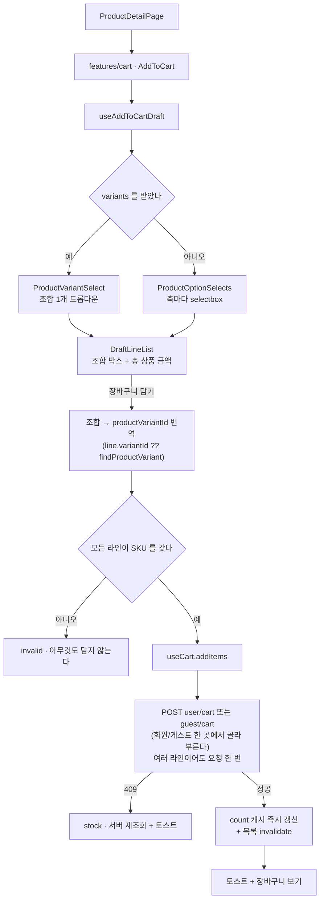
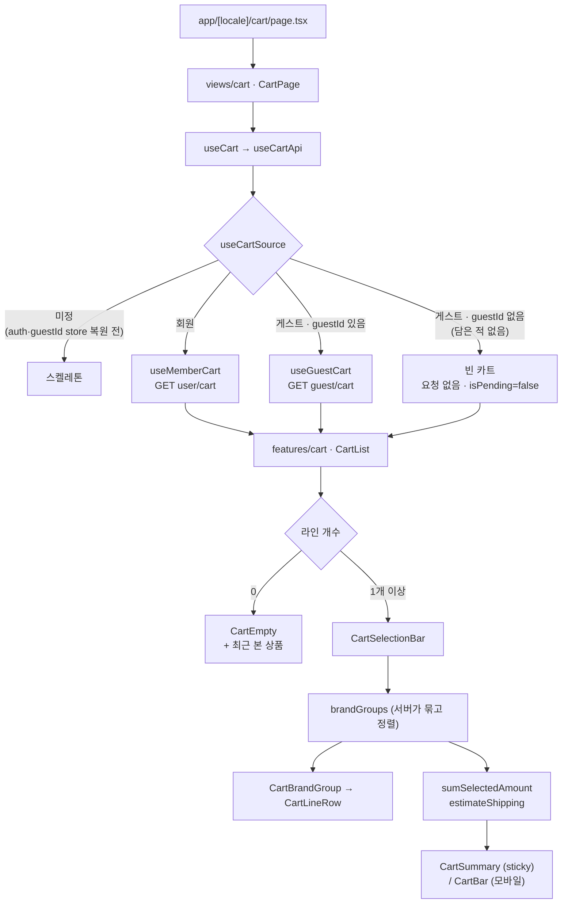

# 장바구니 (Cart) 도메인

`apps/web`의 장바구니 구현 문서. 수량 조절·선택 삭제·금액 요약에 더해 주문서 진입까지
다룬다. `주문하기`(장바구니)·`구매하기`(상품상세)는 더 이상 `disabled` 로만 렌더하는 자리가
아니다 — 고른 라인이 있으면 실제로 주문서(`/order`) 로 이동한다. 회원 전용이라 게스트는
버튼이 활성이어도 누르면 로그인이 필요하다는 토스트만 뜨고 이동하지 않는다 — 요청하지
않은 로그인 화면으로 보내는 것은 그 거절에 비해 과한 인터럽트다. 아직 없는 것은
주문서 화면 자체가 아니라 그 안의
**주문 생성(결제 확정)** 호출이다 — `shared/services/userOrder.ts` 의 `createUserOrder` 는
정의돼 있지만 호출부가 없다(아래 "알려진 제약" 참고).

읽기도 쓰기도 서버다 — 회원은 **`user/cart`**, 비로그인 게스트는 **`guest/cart`** 다. 지금
어느 카트가 유효한지는 `useCartSource` 가 정하고, **어댑터를 고르는** 분기는 `useCartApi`
한 곳에 있다. 다만 게스트 흔적이 남는 곳은 그 한 곳만이 아니다 — `cartOrderHref.ts` 의
"게스트면 로그인 토스트" 분기와, 그 분기를 먹이려고 `CartList.tsx` 가 `useCartSource()` 를
한 번 더 부르는 자리까지 합쳐 세 곳이다(심사 후 제거 절차 참고). 화면이 그리는 값은
TanStack Query 캐시이고, 낙관적 반영은 그 캐시를 직접 고쳐서 한다. UI는 `useCart` 경계만
쓴다 — 회원인지 게스트인지는 이 경계 아래에 숨는다.

- 장바구니 라우트: `apps/web/src/app/[locale]/cart/page.tsx` → `/[locale]/cart` (예: `/ko/cart`)
- 담기 진입점: 상품상세(`/product/[id]`) 우측 정보 컬럼(데스크톱) / 하단 고정 바 + 시트(모바일)

## 파일 구조

```
apps/web/src/
├── app/[locale]/cart/
│   └── page.tsx                        # 라우트 진입점 + generateMetadata (robots noindex)
├── views/cart/
│   └── ui/
│       ├── CartPage.tsx                 # "use client", 첫 조회 스켈레톤 (진입 게이트 없음)
│       └── CartSessionGuard.tsx         # 헤드리스. 인증이 끊기면 /login 으로 보낸다
├── features/cart/
│   ├── index.tsx                       # barrel (CartList, AddToCart, useCartSelection)
│   ├── lib/draftLine.ts                # 담기 전 조합의 키 생성 · 옵션 슬래시 표기
│   ├── model/
│   │   ├── useCartSelection.ts         # 선택 상태 (해제된 productVariantId 만 보관)
│   │   └── useAddToCartDraft.ts        # 축·조합 선택 → SKU 로 번역 → 담기
│   └── ui/
│       ├── CartList.tsx                # 리스트 조립 + 삭제/되돌리기 토스트
│       ├── CartBrandGroup.tsx          # 브랜드 그룹 + 그룹 체크박스 + 선택 소계
│       ├── CartSelectionBar.tsx        # 전체 선택 / 선택 삭제 / 전체 삭제
│       ├── CartSummary.tsx             # 데스크톱 sticky 금액 패널
│       ├── CartBar.tsx                 # 모바일 하단 고정 금액 바
│       ├── CartEmpty.tsx               # 빈 상태 + 최근 본 상품
│       ├── AddToCart.tsx               # 상품상세 담기 (데스크톱 인라인 / 모바일 바+시트)
│       ├── ProductVariantSelect.tsx    # 조합(SKU) 단일 selectbox
│       ├── ProductOptionSelects.tsx    # variants 가 없을 때 축별 selectbox
│       └── DraftLineList.tsx           # 담기 전 조합 라인 박스 + 총 상품 금액
├── entities/cart/
│   ├── index.ts                        # barrel
│   ├── api/
│   │   ├── queryKey.ts                 # userCartQueryKeys · guestCartQueryKeys
│   │   ├── useCartSource.ts            # auth·guestId 두 store 를 읽어 CartSource 산정
│   │   ├── useCartApi.ts               # 회원/게스트 어댑터 선택(분기는 여기 한 곳) + useCartCount
│   │   ├── useMemberCart.ts            # 회원 어댑터. 조회/담기/수량/삭제 + 낙관적 캐시 갱신
│   │   └── useGuestCart.ts             # 게스트 어댑터. 같은 계약을 productVariantId 로 구현
│   ├── lib/cartError.ts                # 409(재고 부족) · 404(게스트 카트 소멸) 판정
│   ├── model/
│   │   ├── types.ts                    # CartApi · CartLine · CartBrandGroup · GetCartRes · CartItemDraft 등
│   │   ├── cartPolicy.ts               # MAX_LINE_QUANTITY · LOW_STOCK_THRESHOLD · 수량 clamp
│   │   ├── cartSelectors.ts            # 선택 합계 · 배송비 예상 · 품절/저재고 판정
│   │   ├── cartSource.ts               # CartSource 타입 + 순수 판정 함수(resolveCartSource)
│   │   ├── guestId.ts                  # 게스트 ID persist(zustand). 첫 담기 응답으로만 발급
│   │   ├── cartOrderHref.ts            # `주문하기` CTA 판정(link/guest/disabled). 게스트는 토스트
│   │   ├── useCart.ts                  # UI 가 쓰는 유일한 경계
│   │   └── useCartBadgeCount.ts        # 헤더 배지 수
│   └── ui/
│       ├── CartLineRow.tsx             # 라인 프레젠테이션 (썸네일 120 / 100px)
│       └── GuestCartReset.tsx          # 로그인 전환 시 guestId 폐기 (헤드리스)
├── entities/product/lib/               # optionAxes · productVariant · optionAvailability
├── widgets/header/ui/CartButton.tsx    # 헤더 아이콘 + 배지
└── shared/
    ├── lib/query/persister.ts          # 쿼리 캐시 localStorage 영속화
    ├── ui/checkbox.tsx                 # 네이티브 input (indeterminate)
    ├── ui/quantity-stepper.tsx         # 86x32 박스 (히트 영역 44px)
    └── lib/hooks/useFloatingOffset.ts  # 하단 바 높이를 --floating-offset 으로
```

## 핵심 흐름

### 담기 (상품상세 → 장바구니)



### 장바구니 화면



`CartPage` 자체에는 더 이상 로그인 게이트가 없다 — `AuthOnly` 는 지웠다. 비로그인이어도
`/cart` 는 들어오고, 담은 적 있는 게스트라면 그 내용을 그린다. 대신 `CartSessionGuard`
(헤드리스)를 그 자리에 둔다 — 회원으로 `/cart` 를 보던 중 인증이 끊기면(refresh token 만료
등) 회원이 그대로 게스트로 읽혀 "장바구니가 비었습니다"만 보이는 사고를 막고 `/login` 으로
보낸다. `AuthOnly` 처럼 진입 자체를 막지는 않는다는 점이 다르다. 회원 전용으로 남은 것은
"주문하기" 하나뿐이다(아래 참고).

### 낙관적 반영과 되돌리기

조작마다 즉시 반응해야 하지만 옳은 값을 아는 쪽은 서버다. 그래서 **되돌릴 값을 들고 다니는
대신 서버에서 다시 읽는다**.

이 표는 **회원** 어댑터(`useMemberCart`) 기준이다. ADR("게스트는 어댑터로 분리")이 두 경로를
"동등 실드"라 부르지만 실제로 동등한 것은 계약(같은 `CartApi` 모양)이지 구현이 아니다 —
게스트 삭제는 낙관적이지 않다(아래 표 뒤 설명 참고).

| 조작 | 낙관적 반영 위치 | 실패 시 |
| --- | --- | --- |
| 담기 | 하지 않음 (서버가 매기는 `cartItemId` 를 알 수 없다). 응답의 `totalCount` 로 배지만 즉시 갱신 | 409 면 재조회 + 재고 토스트, 그 밖에는 실패 토스트 |
| 수량 | `useSetCartItemQuantity` — PATCH 를 400ms 모으므로 화면 반영을 전송에서 떼어 놓았다 | `onSettled` 무효화로 서버 값 복귀. 409 면 재조회 + 재고 토스트 |
| 삭제(회원) | `useDeleteUserCartItemsMutation.onMutate` — 캐시에서 걷어내고 빈 브랜드 묶음까지 정리 | `onError` 에서 스냅샷 복원 |
| 삭제(게스트) | **없음.** 서버 API 에 선택 삭제가 없어 라인마다 `DELETE guest/cart/{productVariantId}` 를 보내고, 끝난 뒤 `invalidate()` 로 다시 읽어야 라인이 사라진다 | 하나라도 실패하면 재조회 + 실패 토스트. `onMutate` 스냅샷이 없으니 되돌릴 것도 없다 |
| 되돌리기 | 없음 — 되돌리기는 곧 다시 담기다(새 `cartItemId` 를 받는다) | 담기와 동일 |

게스트 삭제가 낙관적이지 않다는 점은 화면에서도 보인다 — `CartList.handleRemove`/
`handleRemoveAll` 이 되돌리기(undo) 토스트를 **즉시** 띄우지만, 게스트 라인은 그 토스트가
떠 있는 동안에도 재조회가 끝나기 전까지 화면에 남아 있다가 한 박자 늦게 사라진다.

### 캐시 영속화

새로고침 직후 서버 응답 전에 빈 장바구니를 그리면 화면이 깜박인다. 쿼리 캐시를 그대로
localStorage 에 남겨 첫 페인트를 메운다(`shared/lib/query/persister.ts`).

- 저장 대상은 `useAppQuery({ persist: true })` 로 표시한 쿼리뿐이다. 쿼리 키로 걸러내면 shared 가
  도메인 키를 알아야 해서 FSD 역방향 참조가 된다.
- 복원이 끝날 때까지 `useIsRestoring()` 이 true 이고, 이 값은 서버·클라이언트 첫 렌더가 같아서
  hydration 불일치가 나지 않는다.
- 계정 전환 노출은 쿼리 키의 `userId` 가 막고, 로그아웃 시에는 `useClearAllQueries` 가
  캐시와 localStorage 사본을 함께 지운다.

### 옵션 축 규칙

판별은 축 **이름이 아니라 값 개수**로 한다. `OptionType`에 `VOLUME`·`TEXTURE`가 뒤늦게 추가된
것처럼 축은 계속 늘어나고, `SIZE` 존재를 기준으로 삼으면 색이 여러 개인데 사이즈가 없는 상품
(립스틱)이 아무것도 고를 수 없는 상태가 된다.

상품상세 v1이 `variants`(SKU 목록)를 주면 **조합 드롭다운 1개**로 고르고, 못 받으면 아래
축별 선택으로 폴백한다.

| 모드       | 조건                 | 동작                                                                                         |
| ---------- | -------------------- | -------------------------------------------------------------------------------------------- |
| **조합형** | `variants` 있음      | 조합 selectbox 1개 · 조합마다 재고·품절 표기 · 고른 조합이 그대로 SKU                        |
| **선택형** | 값 2개 이상인 축 ≥ 1 | 축마다 selectbox · **전부 골라야** 조합 생성 · 라인 ✕ 로 제거 · 라인 0개면 담기 비활성       |
| **고정형** | 값 2개 이상인 축 = 0 | selectbox 영역 없음 · 조합 1개가 처음부터 존재 · **✕ 미렌더** · 수량만 조작 · 담기 항상 활성 |

- 값이 1개인 축은 **자동 확정**되어 노출되지 않지만 조합 라벨에는 포함된다
  (`레드 / 스탠다드 / S / 폴리에스터`). 고정형에서는 이게 유일한 정보다.
- 축 순서는 `OPTION_AXIS_ORDER` 상수가 정한다. 서버 JSON 키 순서에 의존하면 서버가 필드 순서를
  바꿀 때 화면 순서가 조용히 따라 흔들린다.
- 축 라벨은 서버가 주지 않으므로 `OPTION_AXIS_LABEL_KEY`로 i18n 키에 매핑한다. **매핑에 없는 축은
  렌더하지 않는다** — raw `MATERIAL`이 화면에 뜨지 않게.
- 장바구니 라인의 옵션 표기는 서버 `optionText`(`IVORY / M`)를 그대로 쓴다. 담기 **전** 화면만
  `formatDraftLineOptions` 로 같은 어휘를 만든다.

## 주요 hook / service

### Hook

| Hook                          | 위치                  | 역할                                                                                                                     |
| ----------------------------- | --------------------- | ------------------------------------------------------------------------------------------------------------------------ |
| `useCart`                     | `entities/cart/model` | **UI가 쓰는 유일한 경계 — 회원·게스트 어느 카트가 지금 유효한지 가리지 않는다.** 서버 금액·`brandGroups`·`isPending` + `addItems`/`updateQuantity`/`removeItems`/`restoreItems`. 400ms 수량 디바운스·409 재조회 정정·실패 토스트·`restoreItems` 를 여기 한 곳에서만 다룬다 |
| `useCartApi`                  | `entities/cart/api`   | `useCartSource` 결과로 `useMemberCart`/`useGuestCart` 중 하나를 고른다. **어댑터를 고르는 분기는 이 파일에 있다** — 헤더 배지용 `useCartCount` 도 같은 파일에 있다. 다만 게스트 분기 자체는 여기 하나로 끝나지 않는다: `cartOrderHref.ts` 의 "게스트면 로그인 토스트" 와, 그걸 먹이려고 `CartList.tsx` 가 `useCartSource()` 를 한 번 더 부르는 자리까지 총 세 곳이 심사 후 제거 대상이다 |
| `useCartSource`               | `entities/cart/api`   | 인증 store 와 게스트 ID store 를 읽어 `{ kind: "member" }` / `{ kind: "guest", guestId }` / `null`(두 store 모두 복원 전)을 만든다 |
| `useMemberCart`                | `entities/cart/api`   | 회원 어댑터(구 `useUserCart.ts`). 화면이 쓰는 `productVariantId` 를 서버가 요구하는 `cartItemId` 로 번역 — 그 번역은 이 훅 밖으로 새지 않는다. `useUserCartQuery`·`useUserCartCountQuery`·`useSetCartItemQuantity`·`useFetchUserCart` 도 이 파일에 있다 |
| `useGuestCart`                | `entities/cart/api`   | 게스트 어댑터. 첫 담기 응답으로만 `guestId` 를 발급받아 이후 요청에 `x-guest-id` 헤더로 싣는다(동시 첫 담기는 모듈 스코프 promise 로 직렬화). 선택 삭제가 서버에 없어 라인마다 병렬 호출 + `Promise.allSettled`. 404 면 `guestId` 를 버리고 빈 카트로 정정한다 |
| `useCartBadgeCount`           | `entities/cart/model` | 배지 수 + 캐시 복원 대기(`useIsRestoring`). 회원/게스트 중 무엇을 볼지는 `useCartApi.ts` 의 `useCartCount` 가 정한다               |
| `useCartSelection`            | `features/cart/model` | 선택 상태. **해제된 `productVariantId` 만** 보관해 새 라인이 자동 선택되고 삭제된 id가 남지 않는다                       |
| `useAddToCartDraft`           | `features/cart/model` | 조합 선택 → SKU 번역 → `addItems`. **담기 자체에는 더 이상 로그인 게이트가 없다** — 로그인 없이도 `useCart.addItems` 가 게스트 카트로 담는다. 로그인 게이트가 남은 것은 `toDirectItems`(상품상세 "구매하기")뿐이다 |
| `useFloatingOffset`           | `shared/lib/hooks`    | 하단 고정 바 높이를 `--floating-offset`으로 노출                                                                         |

### Service — `shared/services/userCart.ts`

| 함수                    | 엔드포인트                | 비고                                              |
| ----------------------- | ------------------------- | ------------------------------------------------- |
| `createUserCartItem`    | `POST user/cart`          | 이미 담긴 SKU 면 라인을 늘리지 않고 수량을 더한다 |
| `getUserCart`           | `GET user/cart`           | 브랜드 묶음 · 금액 · 배송비 예상값 · 재고/품절    |
| `getUserCartCount`      | `GET user/cart/count`     | 헤더 배지                                         |
| `updateUserCartItem`    | `PATCH user/cart/{id}`    | 재고 초과면 409                                   |
| `deleteUserCartItems`   | `DELETE user/cart?ids=`   | **ids 를 생략하면 전체 비우기**                   |

쿼리 키는 `["user","cart","list",userId,languageCode]` / `["user","cart","count",userId]`.
`userId` 를 키에 넣어 계정 전환 시 이전 사용자 캐시가 노출되지 않게 한다.

### Service — `shared/services/guestCart.ts`

| 함수                   | 엔드포인트                             | 비고                                                |
| ---------------------- | -------------------------------------- | --------------------------------------------------- |
| `createGuestCartItems` | `POST guest/cart`                      | `guestId` 없이 보내면 서버가 새로 발급해 응답에 담는다 |
| `getGuestCart`         | `GET guest/cart`                       | 회원 조회와 **같은 응답 모양**                       |
| `getGuestCartCount`    | `GET guest/cart/count`                 | `guestId` 가 없거나 담은 적 없으면 404 대신 `0`      |
| `updateGuestCartItem`  | `PATCH guest/cart/{productVariantId}`  | 경로가 라인 ID 가 아니라 SKU ID. 재고 초과면 409     |
| `deleteGuestCartItem`  | `DELETE guest/cart/{productVariantId}` |                                                       |
| `deleteGuestCart`      | `DELETE guest/cart`                    | **선택 삭제가 없어** 언제나 전체 비우기. 담은 적 없어도 204 |

주인은 `x-guest-id` 헤더다 — 회원 카트의 `Authorization` 자리를 대신한다. 값은 **첫 담기
응답으로만 발급**되므로 클라이언트가 보관했다가(`entities/cart/model/guestId.ts`, zustand
persist) 이후 요청마다 실어 보낸다. 다른 발급 경로는 없다.

쿼리 키는 `["guest","cart","list",guestId,languageCode]` / `["guest","cart","count",guestId]`.
회원 키의 `userId` 자리를 `guestId` 가 대신한다 — ID 가 바뀌면(첫 발급·404 폐기) 이전 카트의
캐시가 그대로 보이면 안 되기 때문이다.

### 상수

| 상수                  | 값                | 위치                                 |
| --------------------- | ----------------- | ------------------------------------ |
| `MAX_LINE_QUANTITY`   | 99                | `entities/cart/model/cartPolicy.ts`  |
| `LOW_STOCK_THRESHOLD` | 10                | 동일                                 |
| `QUANTITY_SYNC_DELAY` | 400ms             | `entities/cart/model/useCart.ts`     |
| 캐시 저장 키          | `"query-cache"`   | `shared/lib/query/persister.ts`      |

수량 상한은 정책 천장(99)과 서버 `stockQuantity` 중 작은 쪽이다(`getMaxLineQuantity`).

## 데이터 모델

화면이 실제로 읽는 라인 타입은 `CartLine`이다(`entities/cart/model/types.ts`) — 서버
`UserCartItem` 을 그대로 감싸되 `cartItemId` 만 `number | null` 로 넓힌다. 게스트 라인은
서버 스펙상 라인 ID 가 없어 항상 `null` 이다.

```ts
export interface CartLine extends Omit<UserCartItem, "cartItemId"> {
  cartItemId: number | null; // 게스트 라인은 항상 null
}
```

**라인을 가리키는 값은 `productVariantId` 다.** 화면(선택·수량 변경·삭제·되돌리기)이 쓰는
식별자는 이것 하나뿐이고, 회원·게스트 어느 쪽도 라인당 SKU 가 유일해 안전하다. `cartItemId`
는 회원 어댑터(`useMemberCart`) 안에만 남아 — 캐시에서 `productVariantId` 로 라인을 다시
찾아 서버가 요구하는 `PATCH`/`DELETE user/cart/{id}` 호출에만 쓰인다. 그 번역은 어댑터 밖으로
새지 않는다. 게스트는 애초에 라인 ID 가 없으므로 `PATCH`/`DELETE guest/cart/{productVariantId}`
를 곧장 부른다.

서버 DTO 원본은 이렇다(`shared/services/userCart.ts`).

```ts
export interface UserCartItem {
  cartItemId: number;
  productItemId: number;     // 상품 상세 링크
  productVariantId: number;
  productName: string;
  optionText: string;        // "IVORY / M"
  imageUrl: string;
  price: number;
  discountPrice?: number;
  quantity: number;
  totalPrice: number;        // 적용가 × 수량
  stockQuantity: number;
  isSoldOut: boolean;
  isAvailable: boolean;      // false 인 라인은 서버 금액 합계에서 제외된다
}
```

**선택 합계는 프론트가 계산한다.** 서버의 `totalProductAmount`·`estimatedShippingFee`·
`amountToFreeShipping` 은 장바구니 **전체** 기준이라 일부만 고르면 화면 금액과 어긋난다.
라인 금액은 서버 `totalPrice` 를 그대로 더하고(`sumSelectedAmount`, `productVariantId` 기준
선택 판정), 배송비는 규칙(본섬 기준 · 기준액 이상 무료)을 선택 합계에 다시 적용한다
(`estimateShipping`). 확정은 주문서에서 한다.

## 설계 결정 (ADR)

| 결정                                                               | 대안                            | 근거                                                                                                                                                                                  | 재검토 시점                              |
| ------------------------------------------------------------------ | ------------------------------- | ------------------------------------------------------------------------------------------------------------------------------------------------------------------------------------- | ---------------------------------------- |
| **서버가 단일 진실 원천.** 로컬 zustand 카트를 제거                | 로컬 + 서버 write-through 유지  | 담기가 이미 로그인 필수라 로컬에는 비로그인 라인이 생기지 않는다 — 서버의 중복 사본일 뿐이었다. 사본이 사라지면서 담은 시점 스냅샷의 stale 문제와 `lineId`↔`cartItemId` 이중 키도 함께 사라진다 | —                                        |
| **깜박임은 `persistQueryClient` 로 막는다**                        | zustand persist 유지 / 스켈레톤 | 로컬 카트를 지우면 새로고침 직후 첫 페인트가 빈다. 쿼리 캐시를 그대로 저장하면 사본이 늘지 않고 복원 대기(`useIsRestoring`)가 hydration 방어까지 겸한다                                | 서버 세션 캐시가 생기면                  |
| **저장 대상은 `meta.persist` 표식으로 고른다**                     | 쿼리 키 prefix 로 필터          | shared 가 도메인 키를 알면 FSD 역방향 참조다. 표식을 쿼리 쪽에서 붙이면 shared 는 도메인을 몰라도 된다                                                                                | —                                        |
| **라인 단위 외부 몰 버튼 제거**                                    | 라인마다 `getProductDetail` 조회 | 서버 장바구니 응답에 `external` 이 없다. 라인 수만큼 상세를 치면 N+1이고, 상품명을 누르면 상세에서 같은 동선을 탄다                                                                   | 응답에 `external` 이 추가되면            |
| **선택 합계 기준으로 배송비를 다시 계산**                          | 서버 값을 그대로 표시           | 서버 값은 카트 전체 기준이라 일부만 고르면 금액과 어긋난다. 규칙이 단순하고 확정은 주문서에서 한다                                                                                    | 배송비 규칙이 복잡해지면                 |
| **주문서 진입까지만 구현, 주문 생성은 아직.** `주문하기`·`구매하기`는 실제로 `/order` 로 이동한다 | 주문 생성까지 한 번에 구현      | 주문서(미리보기·배송·결제수단 선택 UI)는 이번 범위지만 `POST` 로 실제 주문을 만드는 `createUserOrder` 호출은 결제 PG 확정 전이라 보류했다. 화면을 지금 만들어 두면 그때 UI 재작업이 없다 | 결제 PG 확정 시                          |
| **SKU 를 못 정한 조합은 담기 실패**                                | 로컬에만 담기 / 일부만 담기     | 서버 장바구니가 유일한 저장소라 담을 방법이 없다. 일부만 담으면 사용자는 무엇이 빠졌는지 알 수 없다                                                                                   | 서버가 옵션 조합 담기를 지원하면         |
| **실패 시 스냅샷 대신 서버 재조회**                                | 이전 값 롤백                    | 409 는 "그 수량은 존재할 수 없다"는 확정 답변이고, 남은 재고도 어차피 다시 읽어야 스테퍼 상한이 맞는다                                                                                | —                                        |
| **축 판별은 값 개수 기준**                                         | `SIZE` 존재 여부                | 축이 계속 늘어나고(`VOLUME`·`TEXTURE` 추가), 이름 기반은 립스틱(색 여러 개 + 사이즈 없음)에서 깨진다                                                                                  | 서버가 축 메타를 내려주면                |
| **축 선택 후 picked를 리셋하지 않는다**                            | 조합 완성 시 리셋               | 리셋하면 Radix Select의 controlled value만 비워져 같은 값 재선택에 `onValueChange`가 오지 않아 두 번째 조합이 안 생긴다. 리셋 없는 쪽이 실제 흐름(색상 고정 + 사이즈만 변경)에도 맞다 | —                                        |
| **모바일 시트 안에도 3버튼 행**                                    | 디자인대로 시트 아래 바만       | vaul Drawer가 `bottom-0`을 덮어 시트가 열린 동안 하단 바가 포인터 이벤트를 못 받는다                                                                                                  | vaul가 하단 여백 옵션을 제공하면         |
| **체크박스는 네이티브 `input`**                                    | `@radix-ui/react-checkbox` 추가 | 폼 안이 아니라 상태 토글이고, Radix가 필요한 이유(포털·포커스 트랩)가 해당 없다. 네이티브가 키보드·스크린리더·`indeterminate`를 공짜로 준다                                           | —                                        |
| **체크 색은 black**                                                | brand orange                    | 디자인에서 `#f37b2a`는 할인율·별점 전용이고 선택·주요 액션은 전부 black이다                                                                                                           | —                                        |
| **삭제는 collapse 모션 대신 되돌리기**                             | 애니메이션                      | Operate 화면에서는 실수 복구가 모션보다 가치 있다                                                                                                                                     | —                                        |
| **선택 상태는 해제된 id만 보관**                                   | 선택된 id 보관 / URL(nuqs)      | 새로 담긴 라인이 자동 선택되고, 삭제된 라인 id를 따로 정리할 필요가 없다. URL에 두면 유령 id가 남는다                                                                                 | —                                        |
| **`unoptimized` 이미지**                                           | `next/image` 최적화             | 코드베이스 관행이고, 브랜드가 올린 외부 호스트 이미지라 호스트가 바뀌면 `next/image`가 던지며 페이지를 죽인다                                                                         | 이미지 호스트가 `next.config`에 고정되면 |
| **게스트는 어댑터로 분리 (`cartSource`)**                          | 기존 훅마다 게스트 분기 추가    | 쿼리 키·낙관적 캐시·409 정정이 6개 훅에서 두 갈래가 되면 같은 분기가 흩어지고, 심사 후 제거할 때 6곳을 헤집어야 한다                                                                  | —                                         |
| **라인 키를 `productVariantId` 로 통일**                           | 합성 키 도입 / 게스트 전용 화면 | 두 카트 모두 라인당 SKU 가 유일하다. 합성 키는 개념이 하나 더 늘 뿐이고, 화면을 갈라놓으면 곧 어긋난다                                                                                | —                                         |
| **로그인 시 게스트 카트 폐기 (병합 없음)**                          | 프론트가 `POST user/cart` 로 병합 | 심사용 일회성 모듈이다. 병합은 얼마 안 되는 코드지만 재고 부족·부분 실패 정책을 새로 정해야 하고, 그 정책이 검증될 무렵이면 모듈이 사라진다                                          | 게스트 카트가 상시 기능이 되면            |
| **`DELETE guest/cart` 를 부르지 않고 로컬 ID 만 폐기**              | 로그인 시 서버 카트도 비우기    | 서버 TTL 7일이 정리한다. 로그인 직후 실패할 수 있는 요청을 하나 더 만들 이유가 없다                                                                                                   | —                                         |
| **게스트 선택 삭제는 N 건 병렬 호출**                               | 게스트에서 선택 삭제 UI 숨김    | 화면을 회원과 다르게 만들면 "동등 실드"가 깨지고 `CartSelectionBar`가 두 벌이 된다. 선택 삭제는 한 번에 몇 건 수준이다                                                                | 삭제 건수가 커지면                        |
| **주문·구매하기는 회원 전용 유지**                                  | 게스트 주문서 진입 후 로그인 요구 | 서버가 게스트 주문을 지원하지 않는다. 다만 요청하지 않은 로그인 화면으로 보내는 것은 과한 인터럽트라, 버튼은 활성으로 두고 누르면 `login_required` 토스트만 띄운다(`/order` 이동 없음) | 비회원 주문이 생기면                      |
| **게스트 카트 E2E 없음**                                            | 게스트 해피패스 1개 추가        | 곧 삭제할 임시 모듈이고 카트 E2E 하네스 자체가 아직 없다. 비로그인 담기 경로는 계약 스위트(`useCart.test.tsx`, `describe.each`)가 덮는다                                             | 게스트 카트가 상시 기능이 되면            |

## 알려진 제약 / TODO

- **게스트 카트는 서버에 7일만 남는다.** Redis TTL 만료 후 첫 조작은 404 를 받고, 클라이언트는
  로컬 `guestId` 를 버린 뒤 빈 카트로 돌아간다.
- **로그인하면 게스트가 담아둔 것은 병합 없이 사라진다.** 서버가 게스트→회원 이관 엔드포인트를
  제공하지 않고, 프론트도 대신 병합하지 않는다 — 의도된 동작이다(위 ADR 참고).
- **게스트는 주문·결제로 이어지지 않는다.** 게스트 라인은 `cartItemId` 가 없어 주문서로 넘길
  방법이 없다. `주문하기` 버튼은 활성이지만 누르면 `login_required` 토스트만 뜨고 이동하지
  않는다 — 요청하지 않은 로그인 화면으로 보내는 것은 이 거절에 비해 과한 인터럽트다.
- **게스트 모듈은 심사가 끝나면 통째로 제거될 임시 코드다.** 제거 절차는 설계 문서의
  ["심사 후 제거 절차"](../../../docs/superpowers/specs/2026-09-21-guest-cart-design.md#심사-후-제거-절차)
  를 따른다 — 실제 `grep -rn 'uest' apps/web/src` 기준의 전체 체크리스트가 거기 있다.
  요약하면 `shared/services/guestCart.ts`·`useGuestCart.ts`·`guestId.ts`·`GuestCartReset.tsx`
  삭제, `useCartSource`/`useCartApi`/`cartOrderHref.ts`/`CartList.tsx`의 게스트 분기
  되돌리기, `CartPage`에 `AuthOnly`를 되돌리고 그 자리를 대신하던 `CartSessionGuard`
  제거, `Header.tsx`의 데스크톱 카트 아이콘·`CartButton`의 비로그인 숨김·
  `useAddToCartDraft`의 담기 게이트 복구, `entities/cart/index.ts`의 게스트 export ·
  `api/queryKey.ts`의 게스트 키 · `lib/cartError.ts`의 `isGuestCartGoneError` 삭제,
  계약 스위트의 `describe.each`를 회원 한 줄로 되돌리는 것까지가 대상이다. 라인 키를
  `productVariantId`로 통일한 것은 되돌리지 않는다.
- **주문 생성(결제 확정)은 미구현.** `주문하기`·`구매하기`는 이제 실제로 주문서
  화면(`/order`)까지 이동한다 — 미리보기·배송지·결제수단 선택은 동작한다. 다만
  `shared/services/userOrder.ts`의 `createUserOrder`(실제 주문 생성 `POST`)는 정의만
  있고 호출부가 없다 — 결제 PG가 붙기 전까지 확정 버튼의 마지막 한 걸음이 비어 있다.
  시안은 [`order-mockup.html`](./order-mockup.html).
- **배송비는 예상값.** 배송지가 없으므로 본섬 기준이고, 외섬 여부는 주문서에서 확정된다.
- **E2E 미작성.** 유닛 테스트는 `entities/cart`(54개)와 `features/cart`(49개)에 있다.
- **라인 키(`productVariantId`)는 "라인당 SKU 가 유일하다"는 가정 위에 있다.** 서버가
  같은 `productVariantId`로 라인을 두 개 이상 돌려주면 React 키가 겹치고, 화면의
  삭제·되돌리기(undo)가 어느 라인을 가리키는지 어긋난다. 설계가 이 가정을 전제하고
  있을 뿐 프론트에 런타임 가드는 없다 — 다음에 이 코드를 만지는 사람은 이 가정이
  깨지지 않았는지부터 확인해야 한다.
- **i18n 키는 시트가 SSOT.** `pnpm dev:web`이 매 시작마다 `i18n:sync`를 돌려 JSON을 전체
  덮어쓴다. **새 키를 추가할 때는 시트에 먼저 넣어야 한다.**

## 참고

- 상품 도메인: [product.md](./product.md) — 옵션 축(`DetailOption`)·`variants`의 출처
- 마이페이지: [mypage.md](./mypage.md) — 좋아요 목록과의 시각적 대비, `useGetUserRecentListQuery`
- 디자인 시스템: [`apps/web/DESIGN.md`](../DESIGN.md)
- Figma 상품상세 담기: `1536:9910`(PC) · `1536:10065`/`10170`/`10279`(MO)
  — 파일 `G1QY7B17G2KWHa9nLLLCaL`. `/cart` 화면은 디자인이 없어 위 어휘를 상속해 설계했다.
