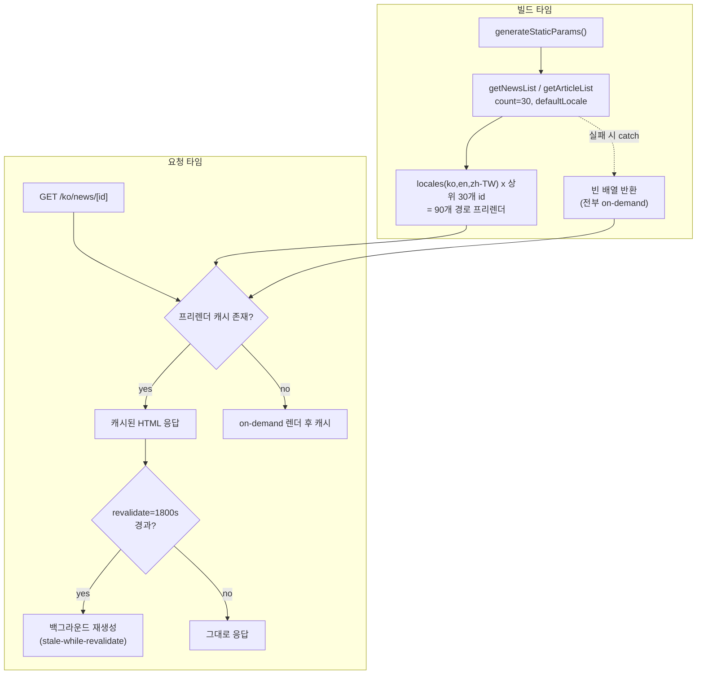
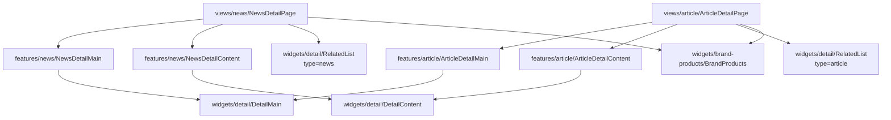
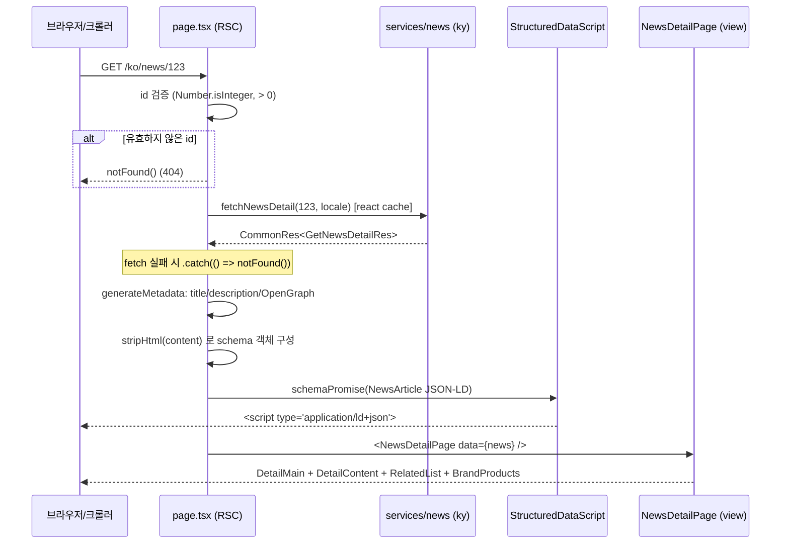

# 콘텐츠 도메인 (News / Article / Magazine)

`apps/web`의 콘텐츠 도메인 구현 문서. News·Article·Magazine 세 콘텐츠가 동일한 상세 레이아웃을 **공유 detail 위젯**(`@widgets/detail`)으로 렌더한다는 점이 핵심이다. FSD(Feature-Sliced Design) 레이어를 따른다.

News·Article 상세 페이지는 **SSG + ISR** 전략을 쓴다. 빌드 타임에 `generateStaticParams`로 상위 30개 콘텐츠 × 3개 로케일(ko, en, zh-TW)을 프리렌더하고, 이후 `revalidate = 1800`(30분) 주기로 재검증한다. 프리렌더되지 않은 id는 첫 요청 시 on-demand로 렌더된 뒤 캐시된다. 상세 페이지는 SEO를 위해 `<head>` 메타데이터(`generateMetadata` → title/description/OpenGraph)와 Schema.org JSON-LD(`StructuredDataScript`)를 함께 주입한다. News는 `NewsArticle`, Article은 `Article` 타입을 사용한다. Magazine은 현재 목록 페이지만 구현되어 있고 상세 페이지(`MagazineDetailPage`)는 빈 스텁이다.

- 라우트
  - `/[locale]/news` — 뉴스 랜딩 (예: `/ko/news`)
  - `/[locale]/news/[id]` — 뉴스 상세 (SSG + ISR)
  - `/[locale]/article/[id]` — 아티클 상세 (SSG + ISR)
  - `/[locale]/magazine` — 매거진 랜딩
  - `/[locale]/magazine/[id]` — 매거진 상세 (현재 빈 스텁)

## 파일 구조

```
apps/web/src/
├── app/[locale]/
│   ├── news/
│   │   ├── page.tsx                       # 랜딩 라우트 (pass-through)
│   │   └── [id]/
│   │       ├── page.tsx                   # SSG+ISR, generateStaticParams/Metadata, NewsArticle JSON-LD
│   │       └── error.tsx                  # PageError(fallbackPath="/")
│   ├── article/[id]/
│   │   ├── page.tsx                       # SSG+ISR, Article JSON-LD
│   │   └── error.tsx                      # PageError(fallbackPath="/")
│   └── magazine/
│       ├── page.tsx                       # 랜딩 라우트 (pass-through)
│       └── [id]/page.tsx                  # MagazineDetailPage (스텁)
├── views/
│   ├── news/ui/{NewsPage,NewsDetailPage}.tsx
│   ├── article/ui/{ArticleDetailPage,ArticleDetailLoading}.tsx
│   └── magazine/ui/{MagazinePage,MagazineDetailPage}.tsx
├── features/
│   ├── news/ui/{NewsDetailMain,NewsDetailContent}.tsx       # @widgets/detail 얇은 래퍼
│   └── article/ui/{ArticleDetailMain,ArticleDetailContent}.tsx
├── widgets/detail/ui/
│   ├── DetailMain.tsx                     # 공유 히어로(배너+제목+요약+작성자)
│   ├── DetailContent.tsx                  # 공유 본문 섹션 렌더
│   ├── RelatedList.tsx                    # 연관 콘텐츠(type: "news" | "article")
│   └── RelatedEmpty.tsx
├── entities/
│   ├── news/{ui/NewsCard,FeaturedNewsCard, model/hooks/useNews}
│   ├── article/{ui/ArticleCard,StyleCard, model/hooks/useArticle}
│   ├── magazine/ui/{MagazineMainCard,MagazineCardInfo}
│   └── megazine/ui/MegazineCard            # 레거시(오타) 슬라이스
└── shared/ui/structured-data-script.tsx   # Schema.org JSON-LD 주입 RSC
```

## 핵심 흐름

### SSG / ISR 렌더 흐름



### 공유 detail 위젯 구조



features의 `*DetailMain`은 `@widgets/detail`의 `DetailMain`을 props 그대로 전달하는 얇은 래퍼다. 이를 통해 News·Article은 동일한 히어로/본문 위젯을 공유하면서, FSD 규칙(view → features → widgets) 안에서 도메인별 진입점을 유지한다.

### 상세 페이지 요청 → 데이터 fetch → JSON-LD 주입 → 렌더



`generateMetadata`와 본문 렌더는 동일한 `fetchNewsDetail`을 호출하지만, 이 함수가 React `cache()`로 감싸여 있어 단일 요청 내에서 중복 fetch가 제거된다.

## 주요 컴포넌트 / 위젯 / entity

| 이름 | 역할 | 위치 |
| --- | --- | --- |
| `NewsDetail` (default) | 뉴스 상세 RSC. id 검증, fetch, NewsArticle JSON-LD 구성 | `app/[locale]/news/[id]/page.tsx` |
| `ArticleDetail` (default) | 아티클 상세 RSC. Article JSON-LD 구성 | `app/[locale]/article/[id]/page.tsx` |
| `StructuredDataScript` | `schemaPromise`를 await 후 `application/ld+json` script 주입 (async RSC) | `shared/ui/structured-data-script.tsx` |
| `NewsPage` | 뉴스 랜딩 합성(NewsUpdate, EditorPickSlide, HotKeywordList, LifeStyleList) | `views/news/ui/NewsPage.tsx` |
| `NewsDetailPage` | `"use client"`. main props 매핑 후 DetailMain/Content/RelatedList/BrandProducts 합성 | `views/news/ui/NewsDetailPage.tsx` |
| `ArticleDetailPage` (default) | News와 동일 구조. `section`/`lastArticle` 널 가드 후 합성 | `views/article/ui/ArticleDetailPage.tsx` |
| `MagazinePage` | 매거진 랜딩(MagazineFeatured, LookbookSection, NewsList) | `views/magazine/ui/MagazinePage.tsx` |
| `MagazineDetailPage` | 빈 스텁(`<></>`) | `views/magazine/ui/MagazineDetailPage.tsx` |
| `NewsDetailMain` / `ArticleDetailMain` | `DetailMain`을 props 그대로 전달하는 얇은 래퍼 | `features/{news,article}/ui/` |
| `NewsDetailContent` / `ArticleDetailContent` | `DetailContent` 래퍼 | `features/{news,article}/ui/` |
| `DetailMain` | 공유 히어로: 배너 이미지 + 카테고리 + 제목 + 요약 + 날짜/작성자 | `widgets/detail/ui/DetailMain.tsx` |
| `DetailContent` | 공유 본문: `NewsSection[]` 또는 `ArticleSection[]`을 4개 섹션 레이아웃으로 렌더 | `widgets/detail/ui/DetailContent.tsx` |
| `RelatedList` | 연관 콘텐츠 리스트. `type`(`"news"`/`"article"`)로 분기 | `widgets/detail/ui/RelatedList.tsx` |
| `useNews` / `useArticle` | `useSuspenseQuery` 기반 목록 조회 (queryKey에 languageCode/count 포함) | `entities/{news,article}/model/hooks/` |
| `NewsCard` / `FeaturedNewsCard` | 뉴스 카드 entity UI | `entities/news/ui/` |
| `ArticleCard` / `StyleCard` | 아티클 카드 entity UI | `entities/article/ui/` |
| `MagazineMainCard` / `MagazineCardInfo` | 매거진 카드 entity UI | `entities/magazine/ui/` |

## 참고

- FSD 레이어 규칙, API 레이어(ky), i18n 규칙: `apps/web/.claude/CLAUDE.md`
- **레거시 주의**: entities에 `magazine`과 `megazine`(오타) 슬라이스가 공존한다. `megazine`은 레거시이며 신규 코드는 `magazine`을 사용한다 (`apps/web/.claude/CLAUDE.md` Architecture 섹션 명시). 단, `RelatedList`는 여전히 `@widgets/megazine-slide`를 의존하므로 정리 시 함께 검토.
- API 패턴: `.claude/references/api.md` (Web 섹션)
