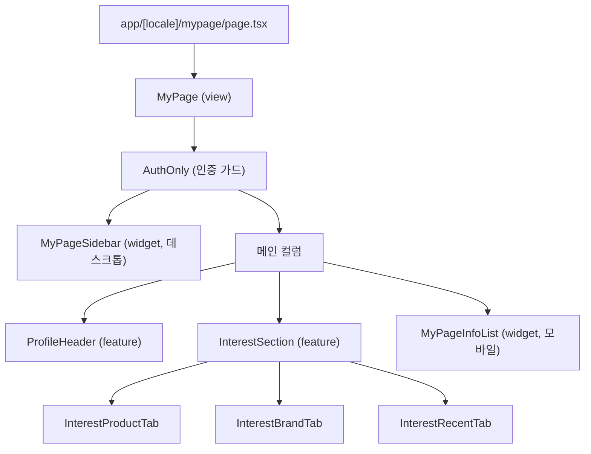
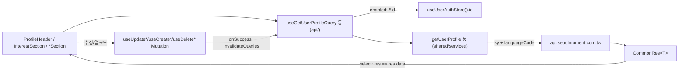
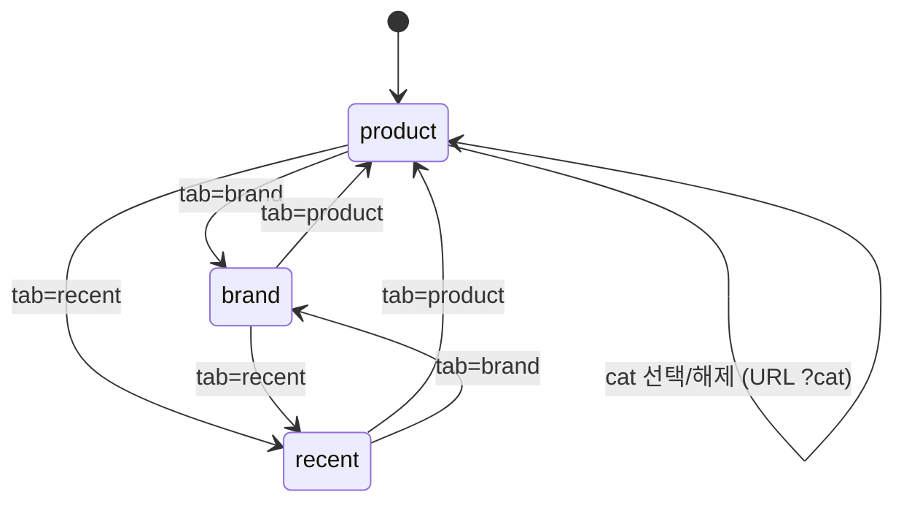

# 마이페이지 (`/mypage`)

`apps/web`의 마이페이지(Mypage) 도메인 구현 문서. FSD(Feature-Sliced Design) 레이어를 따르며, 로그인한 사용자의 프로필·관심(찜)·최근 조회·개인 맞춤 정보를 한 곳에서 관리한다.

## 개요

마이페이지는 로그인 사용자의 계정 영역으로 다음 4개 기능군을 담당한다.

- **프로필** — 닉네임/이름/성별/생년월일/지역 등 기본 정보 조회·수정과 프로필 이미지 업로드/삭제
- **관심(찜)** — 찜한 상품 목록(카테고리 필터), 찜한 브랜드 목록(무한 스크롤), 최근 조회 상품
- **로그인 정보** — 이메일/휴대폰 번호 확인 및 본인 인증, 마케팅/알림 수신 동의 관리
- **개인 맞춤 정보(Fit)** — 키·몸무게 등 사이즈 정보 등록·수정

모든 라우트는 `@shared/lib/components/AuthOnly`로 감싸져 있어 **비로그인 시 접근이 차단**된다. 또한 모든 데이터 조회 hook은 `useUserAuthStore`의 `id`(JWT claim에서 디코딩) 유무를 `enabled` 조건으로 사용하므로, 로그인 전에는 요청 자체가 발생하지 않는다.

### 라우트 목록 (모두 AuthOnly)

| 라우트                  | view 컴포넌트     | 핵심 feature 섹션                        |
| ----------------------- | ----------------- | ---------------------------------------- |
| `/mypage`               | `MyPage`          | `ProfileHeader` + `InterestSection` + `MyPageInfoList` |
| `/mypage/interest`      | `MyPageInterest`  | `InterestSection`                        |
| `/mypage/profile`       | `MyPageProfile`   | `ProfileSection`                         |
| `/mypage/login-info`    | `MyPageLoginInfo` | `LoginInfoSection`                       |
| `/mypage/custom-info`   | `MyPageCustomInfo`| `CustomInfoSection`                      |

> 예: `/ko/mypage`, `/ko/mypage/profile`. locale prefix는 미들웨어가 부착하며, 내부 이동은 `@/i18n/navigation`의 `Link`/`useRouter`를 사용한다.

## 파일 구조

```
apps/web/src/
├── app/[locale]/mypage/
│   ├── page.tsx                     # /mypage          → <MyPage />
│   ├── interest/page.tsx            # /mypage/interest → <MyPageInterest />
│   ├── profile/page.tsx             # /mypage/profile  → <MyPageProfile />
│   ├── login-info/page.tsx          # /mypage/login-info → <MyPageLoginInfo />
│   └── custom-info/page.tsx         # /mypage/custom-info → <MyPageCustomInfo />
├── views/mypage/
│   ├── index.tsx                    # barrel (5개 view export)
│   └── ui/
│       ├── MyPage.tsx               # "use client", AuthOnly + 사이드바 + 메인 합성
│       ├── MyPageInterest.tsx
│       ├── MyPageProfile.tsx
│       ├── MyPageLoginInfo.tsx
│       └── MyPageCustomInfo.tsx
├── features/mypage/
│   ├── index.tsx                    # 섹션 컴포넌트 barrel
│   ├── api/                         # React Query hook 래퍼 (조회 + CRUD mutation)
│   ├── model/                       # useMyPageTab, useInterestProductCategory, useProfileImageUpload
│   ├── lib/                         # adapters, cropImage, imageValidation, regions, sizeOptions 등
│   └── ui/                          # ProfileHeader, ProfileSection, InterestSection, *Tab, *Dialog 등
└── widgets/
    ├── mypage-sidebar/              # 데스크톱 좌측 네비게이션 (SIDEBAR_GROUPS)
    │   ├── index.tsx
    │   ├── model/navigation.ts
    │   └── ui/MyPageSidebar.tsx
    └── mypage-info-list/            # 모바일 전용 프로필 메뉴 리스트
        ├── index.tsx
        └── ui/MyPageInfoList.tsx
```

## 핵심 흐름

### 1) 페이지 합성 구조

`MyPage` view가 `AuthOnly` 안에서 위젯과 feature 섹션을 합성한다. 데스크톱은 좌측 `MyPageSidebar` + 우측 메인 컬럼, 모바일에서는 사이드바가 숨겨지고(`max-sm:hidden`) 메인 하단에 `MyPageInfoList`(`sm:hidden`)가 노출된다.



### 2) 데이터 흐름과 인증 가드

조회 hook은 `useAppQuery` / `useAppInfiniteQuery` 래퍼를 통해 service 함수를 호출하고, service는 `ky`로 API를 호출해 `CommonRes<T>`를 받은 뒤 `select`에서 `res.data`만 추출해 컴포넌트로 전달한다. 모든 hook은 `useUserAuthStore().id`를 `enabled` 조건에 포함한다.



> 변경 계열 hook(`useUpdateUserProfileMutation`, `useCreateUserFitMutation` 등)은 `useAppMutation`(`toastOnError: true`)을 쓰며, 성공 시 `queryClient.invalidateQueries`로 해당 query key(`["user","profile"]`, `["user","info"]`, `["user","fit"]`)를 무효화해 화면을 갱신한다.

### 3) 관심(Interest) 탭 상태 전이

관심 섹션의 탭은 `useMyPageTab`(nuqs `useQueryState`, key `tab`)이 URL 쿼리로 관리하며 기본값은 `product`다. 상품 탭의 카테고리 필터는 별도로 `useInterestProductCategory`(nuqs, key `cat`)가 URL에 보존한다.



- `product` — `useGetUserLikeProductListQuery`(페이지네이션, 카테고리 필터)
- `brand` — `useGetUserLikeBrandListQuery`(`useAppInfiniteQuery` 무한 스크롤)
- `recent` — `useGetUserRecentListQuery`(최근 조회 목록)

## 주요 hook / service

### 조회 (Query) — `features/mypage/api/`

| hook                                | 역할                                            | service / 위치                                    |
| ----------------------------------- | ----------------------------------------------- | ------------------------------------------------- |
| `useGetUserProfileQuery`            | 프로필(닉네임·이미지·기본정보) 조회             | `getUserProfile` (`@shared/services/user`)        |
| `useGetUserInfoQuery`               | 계정 정보(이메일·휴대폰·수신동의) 조회          | `getUserInfo` (`@shared/services/user`)           |
| `useGetUserFitQuery`                | 사이즈/Fit 정보 조회                            | `getUserFit` (`@shared/services/user`)            |
| `useGetUserLikeProductListQuery`    | 찜한 상품 목록(카테고리 필터·페이지네이션)      | `getUserProductLikeList` (`@shared/services/userLike`) |
| `useGetUserLikeBrandListQuery`      | 찜한 브랜드 목록(무한 스크롤)                   | `getUserBrandLikeList` (`@shared/services/userLike`) |
| `useGetUserRecentListQuery`         | 최근 조회 상품 목록                             | `getUserRecentList` (`@shared/services/userRecent`) |
| `useGetUserRecentRecommendListQuery`| 최근 조회 기반 추천 목록                        | `getUserRecentRecommendList` (`@shared/services/userRecent`) |

### 변경 (Mutation) — `features/mypage/api/`

| hook                                  | 역할                                  | service / 위치                                  |
| ------------------------------------- | ------------------------------------- | ----------------------------------------------- |
| `useUpdateUserProfileMutation`        | 프로필 전체 수정                      | `updateUserProfile` (`@shared/services/user`)   |
| `useUpdateUserProfileNicknameMutation`| 닉네임 단건 수정                      | `updateUserProfileNickname` (`@shared/services/user`) |
| `useUpdateUserProfileNameMutation`    | 이름 단건 수정                        | `updateUserProfileName` (`@shared/services/user`) |
| `useUploadUserImageFileMutation`      | 이미지 파일 업로드(`folder: "profile"`) | `uploadUserImageFile` (`@shared/services/userImage`) |
| `useCreateUserProfileImageMutation`   | 업로드된 이미지를 프로필로 등록       | `createUserProfileImage` (`@shared/services/user`) |
| `useDeleteUserProfileImageMutation`   | 프로필 이미지 삭제                    | `deleteUserProfileImage` (`@shared/services/user`) |
| `useUpdateUserInfoMutation`           | 수신동의 등 계정 정보 수정            | `updateUserInfo` (`@shared/services/user`)      |
| `useCreateUserFitMutation`            | 사이즈/Fit 정보 신규 등록             | `createUserFit` (`@shared/services/user`)       |
| `useUpdateUserFitMutation`            | 사이즈/Fit 정보 수정                  | `updateUserFit` (`@shared/services/user`)       |
| `useDeleteUserFitMutation`            | 사이즈/Fit 정보 삭제                  | `deleteUserFit` (`@shared/services/user`)       |
| `usePostInfoPhoneCodeMutation`        | 휴대폰 인증코드 발송                  | `postInfoPhoneCode` (`@shared/services/auth`)   |
| `usePostInfoPhoneVerifyMutation`      | 휴대폰 인증코드 검증                  | `postInfoPhoneVerify` (`@shared/services/auth`) |

### model (상태 hook) — `features/mypage/model/`

| hook                        | 역할                                                          |
| --------------------------- | ------------------------------------------------------------- |
| `useMyPageTab`              | 관심 탭 상태(`product`/`brand`/`recent`)를 URL `?tab`으로 관리 |
| `useInterestProductCategory`| 찜 상품 카테고리 필터를 URL `?cat`(정수)으로 관리              |
| `useProfileImageUpload`     | 파일 선택 → 검증 → 크롭 다이얼로그 → 업로드 → 프로필 등록 플로우 캡슐화 |

### 주요 UI 컴포넌트 — `features/mypage/ui/`

| 컴포넌트                | 책임                                                                 |
| ----------------------- | -------------------------------------------------------------------- |
| `ProfileHeader`         | `/mypage` 상단 요약(아바타·닉네임·이메일) + 프로필 설정 진입 버튼     |
| `ProfileSection`        | 프로필 폼(닉네임 실시간 검증, 성별/생년월일/지역) + 이미지 변경/삭제  |
| `InterestSection`       | `favorites` 탭 컨테이너(상품/브랜드/최근 조회 `Tabs`)                 |
| `InterestProductTab`    | 찜 상품 리스트 + `InterestCategoryChips` 카테고리 필터                |
| `InterestBrandTab`      | 찜 브랜드 무한 스크롤 리스트                                         |
| `InterestRecentTab`     | 최근 조회 상품 리스트                                                |
| `LoginInfoSection`      | 휴대폰 본인 인증(`PhoneVerificationFlow`) + 마케팅 수신동의 폼        |
| `CustomInfoSection`     | 사이즈/Fit 폼(`CustomInfoForm`, 신규/수정 분기)                      |
| `ProfileImageCropDialog`| 선택 이미지 크롭 후 `File` 반환 (상세는 별도 문서)                    |
| `DeleteProfileImageDialog` | 프로필 이미지 삭제 확인 다이얼로그                                 |

## 참고

- 프로필 이미지 크롭(크롭 다이얼로그, `cropImage`, 검증 로직) 상세: [profile-image-crop 문서](./profile-image-crop.md)
- FSD 레이어 규칙·API(ky)·Query 래퍼 컨벤션: `apps/web/.claude/CLAUDE.md`
- 문서 톤·구조 참고: [Login 문서](./login.md)
