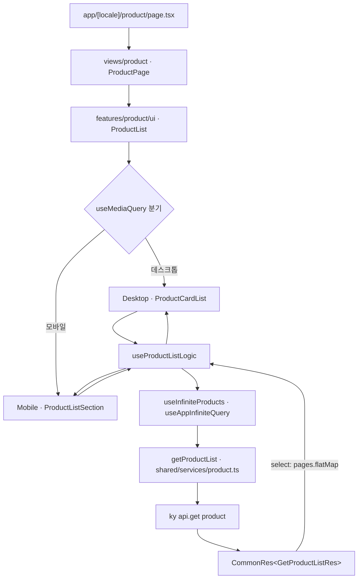
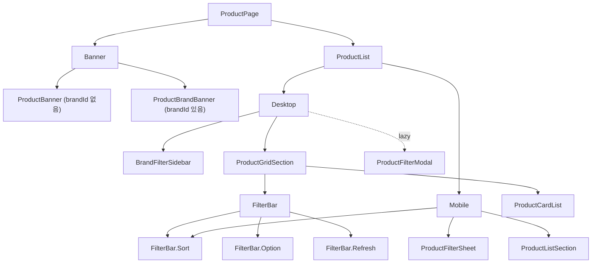
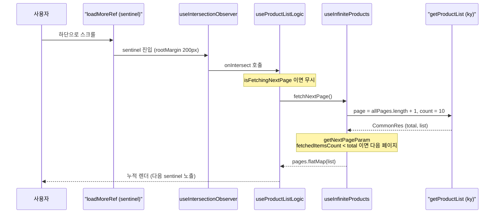

# 상품 (Product) 도메인

`apps/web`의 상품 도메인 구현 문서. FSD(Feature-Sliced Design) 레이어를 따르며, 상품 목록(필터 + 무한 스크롤)과 상품 상세 두 개의 라우트를 담당한다.

상품 목록 화면(`/product`)은 카테고리 탭, 검색, 브랜드/옵션/정렬 필터를 URL 쿼리스트링(`nuqs`)으로 관리하고, `IntersectionObserver` 기반 무한 스크롤로 페이지를 누적 로딩한다. 상품 상세 화면(`/product/[id]`)은 서버에서 메타데이터를 선조회(SEO/OG)한 뒤, 갤러리·가격·옵션·연관 상품·외부 링크를 렌더한다.

- 목록 라우트: `apps/web/src/app/[locale]/product/page.tsx` → `/[locale]/product` (예: `/ko/product`)
- 상세 라우트: `apps/web/src/app/[locale]/product/[id]/page.tsx` → `/[locale]/product/123`

## 파일 구조

```
apps/web/src/
├── app/[locale]/product/
│   ├── page.tsx                          # 목록 라우트 진입점 + generateMetadata
│   └── [id]/page.tsx                     # 상세 라우트 진입점 + generateMetadata(OG)
├── views/product/
│   └── ui/
│       ├── ProductPage.tsx               # "use client", Banner + ProductList 합성
│       └── ProductDetailPage.tsx         # "use client", 상세 화면 합성
├── features/product/
│   ├── index.tsx                         # barrel (ProductList, BrandProductList, Banner, ProductExternalGroup)
│   ├── lib/getOptionMetaById.ts          # optionId → { group, type } 매핑
│   ├── model/
│   │   ├── useInfiniteProducts.ts        # 상품 목록 무한 쿼리
│   │   ├── useProductListLogic.ts        # 무한 쿼리 + IntersectionObserver 결합
│   │   ├── useProducts.ts                # 단일 페이지 상품 목록 쿼리
│   │   ├── useProductFilter.ts           # nuqs 필터 상태
│   │   ├── useProductSearch.ts           # 검색어 갱신
│   │   ├── useValidateProductFilter.ts   # 잘못된 쿼리 파라미터 정리
│   │   ├── useCategories.ts              # 카테고리 탭
│   │   ├── useProductCategory.ts         # 상품 카테고리 칩
│   │   ├── useProductBanner.ts           # 기본 배너
│   │   ├── useBrandFilter.ts             # 브랜드 사이드바 필터
│   │   ├── useProductFilterList.ts       # 옵션 필터 목록
│   │   └── useProductSortFilter.ts       # 정렬 옵션
│   └── ui/
│       ├── Banner/                       # ProductBanner / ProductBrandBanner 분기
│       ├── ProductList/                  # Desktop / Mobile 반응형 분기
│       ├── FilterBar/                    # Sort / Option / Refresh 합성 컴포넌트
│       ├── ProductFilterModal.tsx        # 데스크톱 필터 모달(lazy)
│       ├── ProductFilterSheet/           # 모바일 필터 시트
│       ├── Options/                      # GridOption / RadioOption 렌더러
│       ├── BrandProductList.tsx          # 연관 상품 리스트
│       └── ProductExternalGroup.tsx      # 외부 구매 링크 그룹
└── shared/
    ├── services/product.ts               # ky API 레이어
    └── lib/hooks/
        ├── useIntersectionObserver.ts    # 무한 스크롤 옵저버
        └── query/useAppInfiniteQuery.ts  # useInfiniteQuery 래퍼
```

## 핵심 흐름

### 데이터 흐름 (라우트 → API)



### 컴포넌트 합성



### 무한 스크롤 시퀀스



### 필터 상태 (nuqs `useQueryStates`)

`useProductFilter`는 모든 필터를 URL 쿼리스트링으로 관리한다. `normalized`에서 `null` 값을 `undefined`로 변환해 API 요청에 그대로 전달하고, `filterCount`로 활성 필터 개수를 계산한다.

| 키 | 파서 | 의미 |
| --- | --- | --- |
| `search` | `parseAsString` | 검색어 |
| `brandId` | `parseAsInteger` | 브랜드 ID (있으면 브랜드 배너로 전환) |
| `sort` | `parseAsString` | 정렬 방향 (`ASC` / `DESC`) |
| `categoryId` | `parseAsInteger` | 카테고리 탭 ID |
| `productCategoryId` | `parseAsInteger` | 상품 카테고리 칩 ID |
| `sortColumn` | `parseAsString` | 정렬 기준 컬럼 (예: `createDate`, `price`) |
| `optionIdList` | `parseAsArrayOf(parseAsInteger)` | 선택한 옵션 ID 배열 (기본값 `[]`) |

> `getProductList`는 `optionIdList` 배열을 `searchParams`에 항목별로 `push`하여 반복 쿼리 키(`optionIdList=1&optionIdList=2` 형태)로 직렬화한다. `useValidateProductFilter`는 마운트 시 `brandId`/`categoryId`/`productCategoryId`가 숫자가 아니면 해당 키를 정리한다.

## 주요 hook / service

### Hook

| 이름 | 역할 | 파일 위치 |
| --- | --- | --- |
| `useInfiniteProducts` | 상품 목록 무한 쿼리(`useAppInfiniteQuery`), `getNextPageParam`로 누적 개수 < total 판정, `select`로 list 평탄화 (LIMIT 10) | `apps/web/src/features/product/model/useInfiniteProducts.ts` |
| `useProductListLogic` | 무한 쿼리 + `useIntersectionObserver`(rootMargin 200px) 결합, `loadMoreRef`/`isEmpty`/`isLoading` 제공 | `apps/web/src/features/product/model/useProductListLogic.ts` |
| `useProducts` | 단일 페이지 상품 목록 쿼리(`useAppQuery`) | `apps/web/src/features/product/model/useProducts.ts` |
| `useProductFilter` | `nuqs useQueryStates` 필터 상태 + `normalized`/`count`/`handleUpdateFilter`/`handleResetFilter`/`handleClearFilter` | `apps/web/src/features/product/model/useProductFilter.ts` |
| `useProductSearch` | `useProductFilter` 위에서 `search` 갱신(`handleSearch`) | `apps/web/src/features/product/model/useProductSearch.ts` |
| `useValidateProductFilter` | 잘못된(NaN) 쿼리 파라미터 정리 | `apps/web/src/features/product/model/useValidateProductFilter.ts` |
| `useCategories` | 카테고리 탭 목록(`useSuspenseQuery`) | `apps/web/src/features/product/model/useCategories.ts` |
| `useProductCategory` | 상품 카테고리 칩 목록(`useSuspenseQuery`) | `apps/web/src/features/product/model/useProductCategory.ts` |
| `useProductBanner` | 기본 상품 배너(`useSuspenseQuery`) | `apps/web/src/features/product/model/useProductBanner.ts` |
| `useBrandFilter` | 브랜드 사이드바 필터, 알파벳 그룹 라벨 매핑(`useSuspenseQuery`) | `apps/web/src/features/product/model/useBrandFilter.ts` |
| `useProductFilterList` | 옵션 필터 목록(`useAppQuery`, `categoryId` 있을 때만 enabled) | `apps/web/src/features/product/model/useProductFilterList.ts` |
| `useProductSortFilter` | 정렬 옵션 목록 + `sortMap` 구성(`useSuspenseQuery`) | `apps/web/src/features/product/model/useProductSortFilter.ts` |
| `useIntersectionObserver` | 공용 `IntersectionObserver` 훅 (`target`/`onIntersect`/`enabled`/`rootMargin`/`threshold`) | `apps/web/src/shared/lib/hooks/useIntersectionObserver.ts` |
| `useAppInfiniteQuery` | `@tanstack/react-query`의 `useInfiniteQuery` 래퍼 | `apps/web/src/shared/lib/hooks/query/useAppInfiniteQuery.ts` |

### Service (`apps/web/src/shared/services/product.ts`)

모든 함수는 `ky`로 호출하고 `.json<CommonRes<T>>()`를 반환한다. locale-aware 요청은 `PublicLanguageCode`를 확장해 `languageCode`를 쿼리로 전달한다.

| 이름 | 엔드포인트 | 역할 |
| --- | --- | --- |
| `getProductList` | `GET product` | 상품 목록 (페이지/필터/옵션 직렬화) |
| `getProductDetail` | `GET product/{id}` | 상품 상세 |
| `getProductBanner` | `GET product/banner` | 기본 배너 |
| `getProductBrandBanner` | `GET product/banner/brand` | 브랜드 배너 |
| `getProductCategory` | `GET product/category` | 상품 카테고리 |
| `getProductSortFilter` | `GET product/sort/filter` | 정렬 옵션 |
| `getProductFilter` | `GET product/filter` | 옵션 필터 목록 |
| `getProductOptions` | `GET product/option` | 옵션 타입 목록 |
| `getProdctionOptionValue` | `GET product/option/value` | 옵션 값 목록 |

> 상세 라우트의 `generateMetadata`는 `react`의 `cache`로 감싼 `fetchProductDetail`을 사용해 `getProductDetail`을 호출하고, `product.name`/`brand.name`/`subImage[0]`로 title·description·OG 이미지를 구성한다. 잘못된 `id`는 `notFound()`로 처리한다.

## 참고

- 앱 전역 컨벤션·FSD 레이어·API 레이어: [`apps/web/.claude/CLAUDE.md`](../.claude/CLAUDE.md)
- 동일 톤의 관련 문서: [`login.md`](./login.md), [`signup.md`](./signup.md), [`find-password.md`](./find-password.md)
