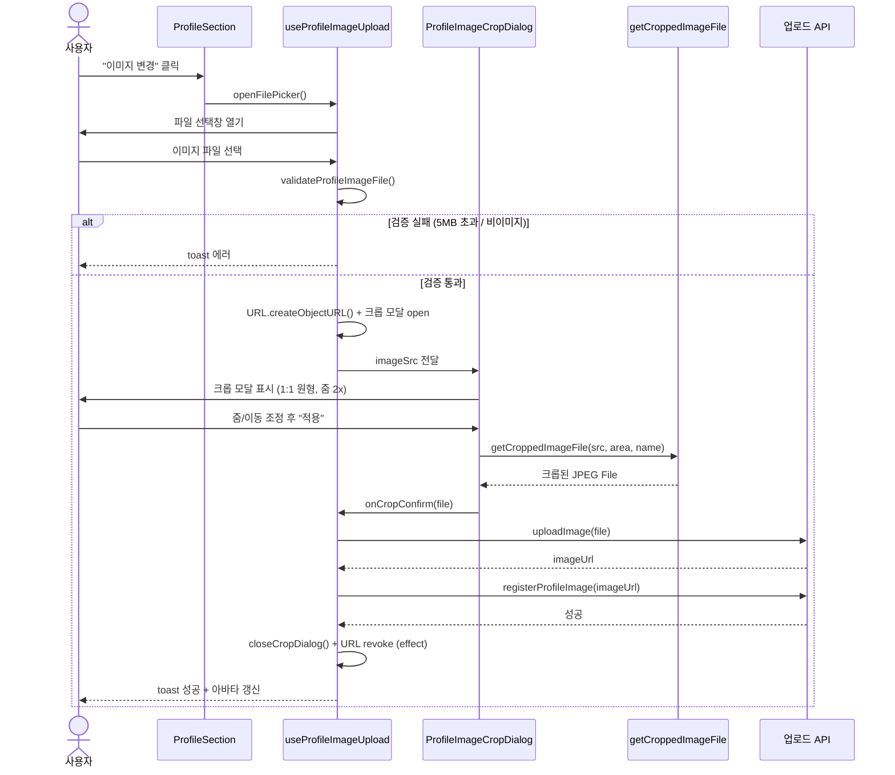
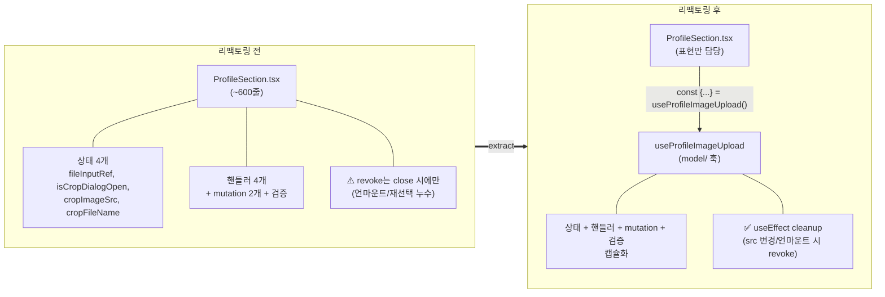
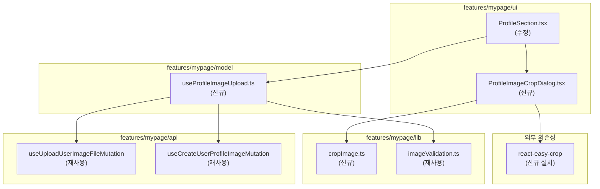

# 프로필 이미지 크롭

마이페이지 > 프로필 관리에서 "이미지 변경" 시, 파일 선택과 업로드 사이에 **크롭 단계**를 둔다. 사용자는 모달에서 줌/이동으로 1:1(원형 가이드) 영역을 조정한 뒤 잘라낸 이미지를 업로드한다.

## 사용자 플로우

## 리팩토링 전후 구조

## 파일 구성 (FSD 레이어)

## 주요 파일

| 파일 | 역할 |
| --- | --- |
| `features/mypage/ui/ProfileSection.tsx` | 프로필 섹션 (표현). 훅을 소비해 크롭 모달 연결 |
| `features/mypage/ui/ProfileImageCropDialog.tsx` | 크롭 모달 (react-easy-crop, 줌 슬라이더, max-sm 반응형) |
| `features/mypage/model/useProfileImageUpload.ts` | 이미지 상태·핸들러·mutation·검증 캡슐화 + object URL 라이프사이클 |
| `features/mypage/lib/cropImage.ts` | `getCroppedImageFile` — canvas로 크롭 영역을 JPEG `File`로 변환 |
| `features/mypage/lib/imageValidation.ts` | `validateProfileImageFile` — 타입/5MB 검증 (재사용) |

## 비고

- 크롭 비율은 1:1 고정, 초기 줌 2배, 출력은 `image/jpeg`(품질 0.9).
- object URL은 `useEffect` cleanup에서 해제하여 재선택·언마운트 시 누수를 방지한다.
- i18n 키(`crop_profile_image`, `zoom`, `image_crop_failed`)는 Google Sheets에 등록 후 `pnpm i18n:sync`로 반영한다.
