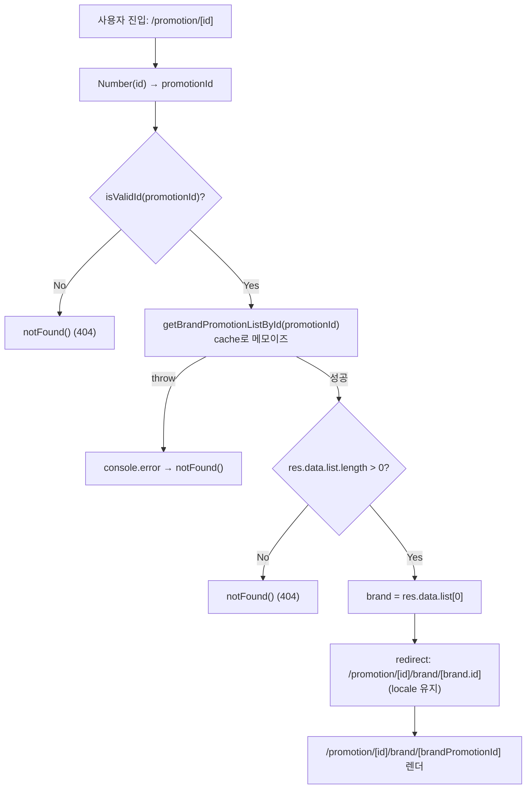
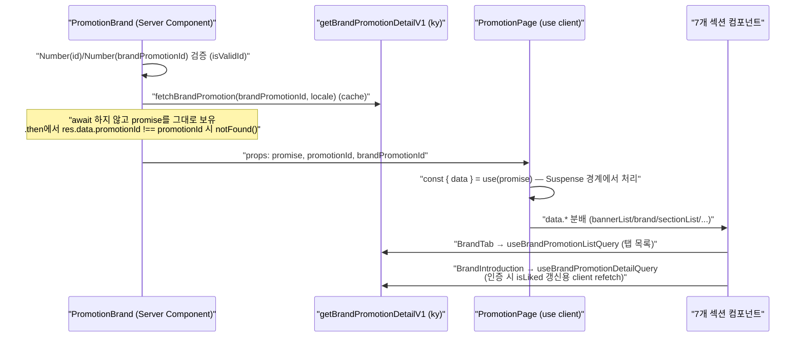
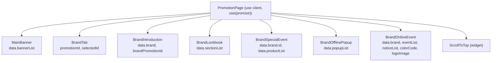

# 프로모션 페이지 (`/promotion/[id]/brand/[brandPromotionId]`)

`apps/web`의 프로모션(브랜드 기획전) 도메인 구현 문서. FSD(Feature-Sliced Design) 레이어를 따르며, 라우트 진입점에서 리스트 조회 후 첫 브랜드로 redirect 하는 2단 라우트 구조와 Server Component → Client `use(promise)` 데이터 전달 패턴을 사용한다.

## 개요

프로모션은 하나의 기획전(`promotionId`) 안에 여러 브랜드(`brandPromotionId`)가 탭으로 묶여 있는 도메인이다. 사용자가 기획전 URL(`/promotion/[id]`)로 진입하면, 해당 기획전에 속한 브랜드 목록을 조회한 뒤 **첫 번째 브랜드의 상세 페이지로 redirect** 한다. 실제 브랜드 기획전 상세는 `/promotion/[id]/brand/[brandPromotionId]` 중첩 동적 라우트에서 렌더된다. 상단 `BrandTab`을 통해 같은 기획전 내 다른 브랜드로 이동할 수 있다.

라우트 구조:

- `/[locale]/promotion/[id]` — 리다이렉트 전용. 브랜드 리스트를 조회하고 첫 브랜드로 redirect. 자체 UI 없음.
- `/[locale]/promotion/[id]/brand/[brandPromotionId]` — 실제 브랜드 기획전 상세. Server Component가 상세 조회 promise를 만들어 Client `PromotionPage`에 넘긴다.

여기서 `id`는 기획전 아이디(`promotionId`), `brandPromotionId`는 그 기획전 내 개별 브랜드 프로모션 아이디다. 두 페이지 모두 `isValidId`로 숫자 검증을 거치고, 유효하지 않거나 조회 실패 시 `notFound()`로 404 처리한다. 상세 페이지에서는 조회된 `res.data.promotionId`가 URL의 `promotionId`와 일치하는지 추가 검증해, 다른 기획전의 브랜드 아이디로 접근하는 경우를 차단한다.

## 파일 구조

```
apps/web/src/
├── app/[locale]/promotion/[id]/
│   ├── page.tsx                                  # 리스트 조회 후 첫 brand로 redirect (UI 없음)
│   └── brand/[brandPromotionId]/page.tsx         # Server Component: generateMetadata + 상세 조회 promise 생성
├── views/promotion/
│   ├── index.tsx                                 # barrel (PromotionPage 재노출)
│   └── ui/PromotionPage.tsx                      # "use client", use(promise) + 7개 섹션 합성
├── features/promotion/
│   ├── index.tsx                                 # 7개 섹션 컴포넌트 barrel
│   ├── model/
│   │   ├── useBrandPromotionListQuery.ts         # 리스트 조회 hook (일반/Suspense)
│   │   └── useBrandPromotionDetailQuery.ts       # 상세 조회 hook (일반/Suspense)
│   └── ui/
│       ├── MainBanner.tsx                        # 상단 메인 배너
│       ├── BrandTab.tsx                           # 기획전 내 브랜드 탭 네비게이션
│       ├── BrandIntroduction.tsx                 # 브랜드 소개 + 좋아요/공유
│       ├── BrandLookbook/index.tsx               # 룩북 섹션 (ImageContents 합성)
│       ├── BrandSpecialEvent.tsx                 # 기획전 상품 그리드
│       ├── BrandOfflinePopup/index.tsx           # 오프라인 팝업 (탭/슬라이더/지도/정보)
│       └── BrandOnlineEvent/index.tsx            # 온라인 이벤트 쿠폰/공지/링크
└── shared/services/brandPromotion.ts             # ky 서비스 + 응답 타입 정의
```

## 핵심 흐름

### 1. 라우트 진입 → redirect (flowchart)



### 2. Server Component promise 생성 → Client use(promise) (sequenceDiagram)



> Server Component(`brand/[brandPromotionId]/page.tsx`)는 `getBrandPromotionDetailV1` 호출 promise를 `await` 하지 않고 그대로 `PromotionPage`에 넘긴다. Client 컴포넌트는 `use(promise)`로 해당 promise를 unwrap 하며, 상위 Suspense 경계가 pending 상태를 처리한다. `generateMetadata`도 동일한 `cache`된 `fetchBrandPromotion`을 재사용하므로 SEO 메타데이터 조회와 본문 렌더가 중복 fetch 되지 않는다.

### 3. PromotionPage 섹션 합성 (graph)



각 섹션 컴포넌트는 `@features/promotion` barrel에서 named export 되며, `PromotionPage`가 `use(promise)`로 얻은 `data`의 필드를 props로 분배한다.

| 섹션 | 책임 | 주요 입력 |
| --- | --- | --- |
| `MainBanner` | 상단 메인 배너 1장 노출 (모바일/데스크톱 이미지 분기) | `bannerList` |
| `BrandTab` | 기획전 내 브랜드 탭. 클릭 시 다른 브랜드로 `navigate.push`, hover/focus 시 prefetch | `promotionId`, `selectedId` (= `brandPromotionId`) |
| `BrandIntroduction` | 브랜드 소개, 좋아요(`useBrandLikeToggle`)·공유 모달, 브랜드/상점 링크 | `brand`, `brandPromotionId` |
| `BrandLookbook` | 룩북 섹션 리스트. `section.type`별 `ImageContents` 렌더 | `sectionList` |
| `BrandSpecialEvent` | 기획전 상품 그리드. `useProductListLogic`로 추가 로드 | `brandId`, `products` |
| `BrandOfflinePopup` | 오프라인 팝업 탭 + 슬라이더 + 정보 + 지도 | `popupList` |
| `BrandOnlineEvent` | 온라인 이벤트 쿠폰/공지/브랜드 링크 섹션 합성 | `brand`, `eventList`, `noticeList`, `colorCode`, `logoImage` |

## 주요 hook / service

| 이름 | 역할 | 파일 위치 |
| --- | --- | --- |
| `getBrandPromotionListById` | 기획전 내 브랜드 목록 조회 (`brand/promotion/{id}/brand`) | `apps/web/src/shared/services/brandPromotion.ts` |
| `getBrandPromotionDetailV1` | 브랜드 기획전 상세 조회 (`brand/promotion/v1/{brandPromotionId}`, `Accept-language` 헤더) | `apps/web/src/shared/services/brandPromotion.ts` |
| `useBrandPromotionListQuery` | 브랜드 목록 조회 hook (`useAppQuery`). queryKey: `["brandPromotionList", id]` | `apps/web/src/features/promotion/model/useBrandPromotionListQuery.ts` |
| `useSuspenseBrandPromotionListQuery` | 위의 Suspense 변형 (`useSuspenseQuery`) | `apps/web/src/features/promotion/model/useBrandPromotionListQuery.ts` |
| `useBrandPromotionDetailQuery` | 브랜드 기획전 상세 조회 hook (`useAppQuery`). queryKey: `["brandPromotionDetail", brandPromotionId, lang]` | `apps/web/src/features/promotion/model/useBrandPromotionDetailQuery.ts` |
| `useSuspenseBrandPromotionDetailQuery` | 위의 Suspense 변형 (`useSuspenseQuery`) | `apps/web/src/features/promotion/model/useBrandPromotionDetailQuery.ts` |

> 두 model 파일 모두 일반(`useApp*`) 변형과 Suspense(`useSuspense*`) 변형을 함께 export 한다. 현재 화면 합성에서는 Server Component가 만든 promise를 `PromotionPage`가 `use(promise)`로 unwrap 하고, 부가적으로 `BrandTab`이 `useBrandPromotionListQuery`, `BrandIntroduction`이 `useBrandPromotionDetailQuery`(인증 사용자의 `isLiked` 갱신용 client refetch)를 사용한다.

## 참고

- FSD 레이어 규칙, API(ky) 레이어, 쿼리 훅 래퍼(`useAppQuery`) 규칙: `apps/web/.claude/CLAUDE.md`
- 응답 타입 전체 정의(`GetBrandPromotionResponse` 등): `apps/web/src/shared/services/brandPromotion.ts`
