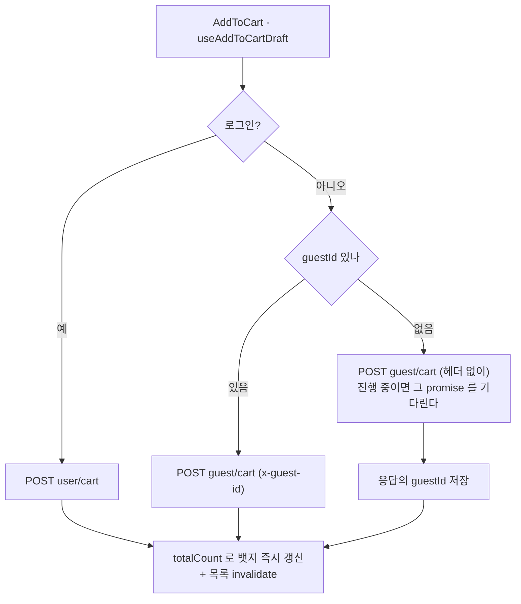

# 비회원(게스트) 장바구니 — 설계

- 대상: `apps/web`
- 작성: 2026-09-21
- 상태: 설계 확정, 구현 전

## 배경

장바구니는 읽기도 쓰기도 서버(`user/cart`)이고, 담기 자체가 로그인 필수다. 비로그인 사용자는
상품상세에서 `장바구니 담기`를 눌러도 `login_required` 토스트만 받고 `/cart` 는 `AuthOnly` 가
`/login` 으로 돌려보낸다. 헤더의 장바구니 아이콘조차 렌더되지 않는다.

서버에 **게스트 장바구니 API** (`guest/cart`, 태그 `GuestCart`) 가 추가되어 로그인 없이 담고
보는 것이 가능해졌다. 이 문서는 그것을 `apps/web` 에 붙이는 설계다.

기존 장바구니 구현은 [`apps/web/docs/cart.md`](../../../apps/web/docs/cart.md) 를 참조한다.

## 범위

**포함** — 비로그인 상태의 담기 · 조회 · 수량 변경 · 라인 삭제 · 전체 삭제 · 헤더 뱃지.

**제외**

- **비회원 주문·결제.** 서버가 지원하지 않는다. 주문은 회원 전용이다.
- **로그인 시 게스트 → 회원 장바구니 병합.** 서버가 해주지 않고, 프론트가 대신 구현하지도
  않는다. 로그인하면 게스트가 담아둔 것은 버린다 (아래 ADR 참조).

## 서버 API

`shared/services/guestCart.ts` 로 이미 생성되어 있다.

| 함수                    | 엔드포인트                            | 비고                                            |
| ----------------------- | ------------------------------------- | ----------------------------------------------- |
| `createGuestCartItems`  | `POST guest/cart`                     | `guestId` 없이 보내면 서버가 발급해 응답에 담는다 |
| `getGuestCart`          | `GET guest/cart`                      | 회원 조회와 **같은 응답 모양**                  |
| `getGuestCartCount`     | `GET guest/cart/count`                | ID 가 없으면 404 가 아니라 `0`                  |
| `updateGuestCartItem`   | `PATCH guest/cart/{productVariantId}` | 재고 초과 409                                   |
| `deleteGuestCartItem`   | `DELETE guest/cart/{productVariantId}` |                                                |
| `deleteGuestCart`       | `DELETE guest/cart`                   | 전체 비우기 (선택 삭제 없음)                    |

서버 스펙이 못박은 제약 다섯 가지 — 설계는 전부 이것에서 파생된다.

1. **주인은 `x-guest-id` 헤더**다. 회원 카트의 `Authorization` 자리를 대신한다.
2. **ID 는 첫 담기 응답으로만 발급**된다. 다른 발급 경로가 없다.
3. **라인 ID 가 없다.** 수량 변경·삭제는 `productVariantId` 로 한다. 응답의 `cartItemId` 는
   항상 `null` 이다.
4. **선택 삭제가 없다.** `DELETE guest/cart` 는 언제나 전체 비우기다.
5. **Redis TTL 7일**이고 **회원 카트로 옮겨주는 기능이 없다**. 심사가 끝나면 서버에서 모듈을
   통째로 삭제한다 (스펙 설명에 `[심사용]` 으로 명시).

## 아키텍처

어려운 로직(수량 디바운스, 409 재조회 정정, 실패 토스트, `AddCartItemsOutcome` 판정)은
`useCart` 에 **한 벌만** 둔다. 회원/게스트 차이는 얇은 어댑터 하나에 가둔다.
`entities/order/model/orderSource.ts` 가 주문서의 두 경로(`cartItemIds` XOR `items`)를 다루는
방식과 같은 어휘다 — 화면은 타입 하나만 들고 다니고 분기는 한 곳에만 있다.

```
entities/cart/
├── model/
│   ├── cartSource.ts        # (신규) CartSource 타입 + 순수 판정 함수
│   ├── guestId.ts           # (신규) zustand persist. 담기 응답의 guestId 보관
│   ├── types.ts             # CartLine 추가 (cartItemId: number | null)
│   └── useCart.ts           # 경계 그대로. 내부에서 useCartApi 만 본다
├── api/
│   ├── useCartSource.ts     # (신규) store 를 읽어 CartSource 를 만드는 훅
│   ├── useCartApi.ts        # (신규) source 로 둘 중 하나 선택 ← 분기는 여기 한 곳
│   ├── useMemberCart.ts     # 기존 useUserCart.ts 를 이름만 바꿔 이동
│   └── useGuestCart.ts      # (신규) 같은 인터페이스의 게스트 구현
└── ui/
    └── GuestCartReset.tsx   # (신규) 로그인 전환 시 guestId 폐기 (헤드리스)
```

두 어댑터가 만족할 인터페이스는 지금 `useCart` 가 이미 쓰고 있는 모양 그대로다.

```ts
interface CartApi {
  data?: GetUserCartRes | GetGuestCartRes;
  isPending: boolean;
  isError: boolean;
  refetch(): unknown;
  fetchCart(): Promise<GetUserCartRes | GetGuestCartRes | null>; // 409 뒤 정정용 즉시 재조회
  addItems(items: CartItemDraft[]): Promise<...>;
  setLineQuantity(productVariantId: number, quantity: number): void; // 캐시에만 반영
  updateQuantity(productVariantId: number, quantity: number): Promise<unknown>;
  removeItems(productVariantIds: number[]): void;
  removeAll(): void;
}
```

훅 규칙상 두 구현을 조건부로 호출할 수 없으므로 둘 다 호출하되, 각 쿼리의 `enabled` 가 자기
차례가 아닐 때 꺼진다 (지금 `enabled: !!id` 와 같은 방식).

### 라인 키는 `productVariantId` 로 통일한다

게스트 라인에는 `cartItemId` 가 없다(`null`). 화면·선택·합계가 쓰는 식별자를 회원/게스트 공통인
`productVariantId` 로 바꾼다. **회원 카트도 같은 SKU 를 수량 합산하므로 라인당 SKU 가 유일하다.**
`cartItemId` 는 회원 어댑터가 `PATCH`/`DELETE user/cart/{id}` 를 부를 때만 쓰는 내부 값으로
내려간다.

닿는 곳은 네 파일뿐이다.

| 파일                                    | 변경                                                      |
| --------------------------------------- | --------------------------------------------------------- |
| `features/cart/model/useCartSelection.ts` | 선택 집합의 키를 SKU 로. API 이름도 함께 (`selectedVariantIds`) |
| `features/cart/ui/CartList.tsx`         | 삭제 스냅샷·주문 링크·선택 콜백의 키                      |
| `features/cart/ui/CartBrandGroup.tsx`   | `key`·토글·수량·삭제 콜백의 키                            |
| `entities/cart/model/cartSelectors.ts`  | `sumSelectedAmount` 의 선택 판정 (43행)                   |

덤으로 삭제 되돌리기 후 서버가 새 `cartItemId` 를 매겨도 라인 키가 그대로라 선택 상태가
살아남는다.

## 데이터 흐름

### 어느 카트인지 정한다 (`useCartSource`)

| 상태                                | source   | 화면                        |
| ----------------------------------- | -------- | --------------------------- |
| auth·guestId store 복원 전          | 미정     | 스켈레톤 (`isPending`)      |
| 복원 후 · 로그인됨                  | `member` | 지금과 동일                 |
| 복원 후 · 비로그인 + guestId 있음   | `guest`  | 게스트 카트                 |
| 복원 후 · 비로그인 + guestId 없음   | `guest`  | 빈 장바구니 (**요청 없음**) |

마지막 줄이 중요하다. 담은 적 없는 게스트는 네트워크 요청 없이 빈 카트를 그리고, 이때
`isPending` 은 반드시 `false` 여야 한다 — TanStack Query 의 비활성 쿼리는 상태가 `pending` 으로
남으므로 그대로 흘리면 `CartPage` 가 스켈레톤에서 빠져나오지 못한다.

### 담기



### 뱃지

`widgets/header/ui/CartButton.tsx:36` 의 비로그인 숨김을 제거하고 항상 렌더한다. 게스트는
`GET guest/cart/count` 를 쓰고, guestId 가 없으면 요청 없이 0 이다. 복원 대기(`useIsRestoring`)
로직은 그대로 둔다.

### 주문 동선

주문·결제가 회원 전용이라는 서버 정책을 그대로 따른다.

- 장바구니 `주문하기` — 회원은 지금 그대로 주문서로 간다. 게스트는 같은 자리에서 `/login` 으로
  보낸다. 게스트 라인은 `cartItemId` 가 `null` 이라 타입 차원에서도 주문서로 갈 수 없다.
- 상품상세 `구매하기` — 지금의 `login_required` 토스트를 유지한다
  (`useAddToCartDraft.ts:301`). 푸는 것은 `장바구니 담기` 게이트뿐이다 (같은 파일 322행).
- `views/cart/ui/CartPage.tsx:44` 의 `AuthOnly` 를 제거한다.

### 로그인 / 로그아웃 전환

- **로그아웃** — 손댈 것이 없다. `GlobalQueryHandler` 가 전체 캐시를 지우고, guestId 는 남아
  있으므로 이전에 게스트로 담아둔 것이 있으면 그 카트로 돌아온다.
- **로그인** — 게스트 카트를 버린다. 로컬 `guestId` 만 지우면 되고 `DELETE guest/cart` 는 부르지
  않는다 (서버 TTL 7일이 알아서 정리한다). `GlobalQueryHandler` 에 넣지 않는 이유는 FSD 다 —
  `shared` 가 `entities/cart` 의 store 를 알면 역방향 참조가 된다. 대신 `entities/cart` 가 주는
  헤드리스 `GuestCartReset` 을 `app/[locale]/layout.tsx:134` 의 `GlobalQueryHandler` 옆에
  나란히 마운트한다.

## 에러 · 엣지 케이스

| 상황                       | 처리                                                              | 왜                                                                                                          |
| -------------------------- | ----------------------------------------------------------------- | ----------------------------------------------------------------------------------------------------------- |
| **최초 담기 동시 2회**     | guestId 없는 담기는 하나의 promise 로 직렬화                      | 병렬로 나가면 서버가 게스트 ID 를 둘 발급해 카트가 갈라진다. `AddToCart` 의 `isSubmitting` 은 그 버튼만 막는다 |
| **guestId 만료 (7일)**     | `PATCH`/`DELETE` 가 404 면 guestId 폐기 + 재조회 → 빈 카트        | 죽은 ID 로 계속 요청하면 모든 조작이 조용히 실패한다                                                        |
| **409 재고 부족**          | 기존 `reconcileAfterStockConflict` 그대로. 라인 식별만 SKU 키로   | 두 카트가 같은 `CONFLICT` 코드라 `isNotEnoughStockError` 가 그대로 듣는다                                   |
| **게스트 선택 삭제**       | N 건 병렬 `DELETE` + `Promise.allSettled`. 하나라도 실패하면 재조회 + 실패 토스트 | 게스트 API 에 선택 삭제가 없다. 낙관적으로 이미 걷어낸 뒤라 정정은 재조회로 한다               |
| **게스트 전체 삭제**       | `DELETE guest/cart` 한 번                                          | —                                                                                                            |
| **되돌리기(undo)**         | `POST guest/cart` 재담기 — 회원과 동일                            | 키가 SKU 라 되돌린 라인의 키가 그대로여서 선택 상태까지 살아남는다                                          |
| **SSR / hydration**        | guestId store 는 `useUserAuthStore` 와 같은 패턴 (SSR 에서 `storage: undefined`) | 첫 렌더가 서버·클라이언트에서 같아야 한다                                                    |
| **캐시 영속화**            | 게스트 목록·카운트도 `persist: true`, 쿼리 키에 `guestId` 포함    | 새로고침 깜박임 방지. 키에 ID 가 있어 다른 게스트의 캐시가 노출되지 않는다                                  |
| **`Accept-language`**      | 손댈 것 없음                                                      | `GET guest/cart` 의 필수 헤더는 기존 ky `beforeRequest` 훅이 `languageCode` 쿼리에서 만들어 준다            |

## 테스트 전략

**1. 계약 스위트를 양쪽에 돌린다 (핵심).** 두 어댑터가 같은 인터페이스를 만족한다는 것이 설계의
전제이므로 테스트로 고정한다. 기존 `entities/cart/model/useCart.test.tsx` 를
`describe.each([member, guest])` 로 감싸 같은 시나리오를 두 번 돌린다 — 담기, 수량 디바운스,
409 정정, 삭제, 되돌리기. 이미 가짜 서버 카트(in-memory 배열 + `vi.mock` 된 서비스 함수)를 두고
`useCart` 경계만 통해 검증하는 구조라 그대로 쓸 수 있다.

**2. 게스트 고유 동작 (신규 유닛).**

- 첫 담기 응답의 `guestId` 저장 → 다음 요청에 헤더로 실린다
- guestId 없는 동시 담기 2회 → `POST guest/cart` 가 헤더 없이 **한 번만** 나간다
- guestId 없음 → 요청 0건 + `isPending: false` + 빈 카트
- 404 → guestId 폐기 후 빈 카트로 정정
- 선택 삭제 N 건 중 1건 실패 → 재조회 + 실패 토스트
- 로그인 전환 → guestId 폐기, source 가 `member` 로 바뀐다

**3. 기존 54개 테스트 수정.** 라인 키 개명이 `useCartSelection.test.ts`,
`CartBrandGroup.test.tsx`, `cartSelectors.test.ts` 에 닿는다. 기계적이지만 **되돌리기 후 선택이
유지되는 것**은 새 동작이므로 명시적으로 검증한다.

**4. E2E 는 넣지 않는다.** `apps/web/e2e` 에 카트 스펙이 아직 없고, 게스트 모듈은 심사가 끝나면
통째로 지울 코드다. 곧 삭제할 대상에 새 E2E 하네스를 세우는 비용 대비 회귀 방어 가치가 낮다.
비로그인 담기 경로는 계약 스위트가 덮는다.

## 설계 결정 (ADR)

| 결정                                          | 대안                                  | 근거                                                                                                                                          | 재검토 시점                    |
| --------------------------------------------- | ------------------------------------- | --------------------------------------------------------------------------------------------------------------------------------------------- | ------------------------------ |
| **어댑터로 분리 (`cartSource`)**              | 기존 훅마다 게스트 분기 추가          | 쿼리 키·낙관적 캐시·409 정정이 6개 훅에서 두 갈래가 되면 같은 분기가 흩어지고, 심사 후 제거할 때 6곳을 헤집어야 한다                          | —                              |
| **라인 키를 `productVariantId` 로 통일**      | 합성 키 도입 / 게스트 전용 화면       | 두 카트 모두 라인당 SKU 가 유일하다. 합성 키는 개념이 하나 더 늘 뿐이고, 화면을 갈라놓으면 곧 어긋난다                                        | —                              |
| **로그인 시 게스트 카트 폐기 (병합 없음)**    | 프론트가 `POST user/cart` 로 병합     | 심사용 일회성 모듈이다. 병합은 40줄이지만 재고 부족·부분 실패 정책을 새로 정해야 하고, 그 정책이 검증될 무렵이면 모듈이 사라진다               | 게스트 카트가 상시 기능이 되면 |
| **`DELETE guest/cart` 를 부르지 않고 로컬 ID 만 폐기** | 로그인 시 서버 카트도 비우기 | 서버 TTL 7일이 정리한다. 로그인 직후 실패할 수 있는 요청을 하나 더 만들 이유가 없다                                                            | —                              |
| **게스트 선택 삭제는 N 건 병렬 호출**         | 게스트에서 선택 삭제 UI 숨김          | 화면을 회원과 다르게 만들면 "동등 실드" 가 깨지고 `CartSelectionBar` 가 두 벌이 된다. 선택 삭제는 한 번에 몇 건 수준이다                       | 삭제 건수가 커지면             |
| **주문·구매하기는 회원 전용 유지**            | 게스트 주문서 진입 후 로그인 요구     | 서버가 게스트 주문을 지원하지 않는다. 빈 주문서로 보내는 것보다 `/login` 이 정직하다                                                          | 비회원 주문이 생기면           |
| **E2E 없음**                                  | 게스트 해피패스 1개 추가              | 곧 삭제할 임시 모듈이고 카트 E2E 하네스 자체가 아직 없다                                                                                       | 게스트 카트가 상시 기능이 되면 |

## 심사 후 제거 절차

게스트 흔적이 회원 카트 코드에 남지 않도록 제거 경로를 설계에 포함한다. 아래는 구현이
끝난 뒤 실제 `grep -rn '게스트\|Guest\|guestId\|guest/cart\|x-guest-id' apps/web/src` 로
다시 뽑은 전체 목록이다 — 설계 시점의 계획(파일 3개)보다 훨씬 넓다. `GuestOnly`
(`shared/lib/components/GuestOnly.tsx`, 로그인·회원가입 화면을 비로그인 전용으로 가두는
기존 컴포넌트)는 이름이 같은 "게스트"를 쓸 뿐 이 모듈과 무관하므로 대상이 아니다.

**1. 파일째 삭제한다.**

- `shared/services/guestCart.ts`
- `entities/cart/api/useGuestCart.ts` (+ `useGuestCart.test.tsx`)
- `entities/cart/model/guestId.ts` (+ `guestId.test.ts`)
- `entities/cart/ui/GuestCartReset.tsx` (+ `GuestCartReset.test.tsx`)
- `entities/cart/model/cartSource.ts` (+ `cartSource.test.ts`) — `useCartSource` 를
  `member` 고정으로 되돌리면 이 판정 함수 자체가 필요 없어진다
- `views/cart/ui/CartSessionGuard.tsx` (+ `CartSessionGuard.test.tsx`) — `CartPage` 에
  `AuthOnly` 를 되돌리면 세션 만료를 따로 잡아줄 이유가 없어진다(아래 4번)

**2. 분기를 걷어낸다.**

- `entities/cart/api/useCartApi.ts` — `useGuestCart`/`useGuestCartCountQuery` 호출과
  `source.kind` 분기 제거, 회원 어댑터만 반환
- `entities/cart/api/useCartSource.ts` — `guestId` store 참조를 지우고 `member` 고정으로
- `entities/cart/model/cartOrderHref.ts` — `source.kind === "guest"` 면 `/login` 으로
  보내는 분기 제거
- `features/cart/ui/CartList.tsx` — 주문 링크를 만들려고 `useCartSource()` 를 다시 부르는
  자리 제거
- `entities/cart/lib/cartError.ts` — `isGuestCartGoneError` 제거
- `entities/cart/api/queryKey.ts` — `GUEST_CART_QUERY_KEY`, `guestCartQueryKeys` 제거
- `entities/cart/index.ts` — 배럴에 게스트 관련 export 가 없는 상태(이미 최소화돼 있다)를
  유지·확인
- `widgets/header/ui/CartButton.tsx` — 비로그인 숨김 복구("게스트도 장바구니를 쓴다" 주석이
  가리키는 그 분기)
- `widgets/header/ui/Header.tsx:146-150` — 데스크톱 카트 아이콘을 다시 회원 전용으로
  가린다. **Task 8 에서 Critical 로 지적됐던 바로 그 자리** — 게스트 모듈을 걷어낼 때도
  똑같이 놓치기 쉬우므로 명시해 둔다
- `views/cart/ui/CartPage.tsx` — `CartSessionGuard` 를 떼고 `AuthOnly` 를 되돌린다
- `app/[locale]/layout.tsx` — `GuestCartReset` import 와 마운트 제거
- `features/cart/model/useAddToCartDraft.ts` — 담기 게이트(로그인 필수) 복구

**3. 주석만 정리한다** (동작은 그대로, "회원·게스트" 서술만 회원 전용으로) —
`entities/cart/model/cartSelectors.ts`, `entities/cart/model/types.ts`,
`entities/cart/model/useCartBadgeCount.ts`, `entities/cart/model/useCart.ts`,
`features/cart/ui/CartEmpty.tsx`.

**4. 테스트.**

- `entities/cart/model/useCart.test.tsx` — 계약 스위트의 `describe.each` 를 회원 한 줄로
- `entities/cart/model/cartOrderHref.test.ts` — 게스트 케이스 제거
- `widgets/header/ui/Header.test.tsx` — `guestId` 관련 `setState` 제거
- `features/cart/model/useAddToCartDraft.test.tsx` — 게스트 담기 케이스 제거

라인 키(`productVariantId`) 통일은 **되돌리지 않는다.** 회원 카트만 있어도 옳은 선택이고,
이중 키(`lineId` ↔ `cartItemId`)를 없앴던 흐름과 같은 방향이다.

## 알려진 제약

- 게스트 카트는 서버에 7일만 남는다. 만료 후 첫 조작에서 빈 카트가 된다.
- 로그인하면 게스트가 담아둔 것은 사라진다. 의도된 동작이다.
- 게스트는 주문·결제로 이어지지 않는다.
- i18n 키를 새로 쓰면 **시트에 먼저 넣어야 한다** — `pnpm dev:web` 이 매 시작마다
  `i18n:sync` 로 JSON 을 전체 덮어쓴다.

## 참고

- 기존 장바구니: [`apps/web/docs/cart.md`](../../../apps/web/docs/cart.md)
- 두 경로를 타입 하나로 다루는 선례: `apps/web/src/entities/order/model/orderSource.ts`
